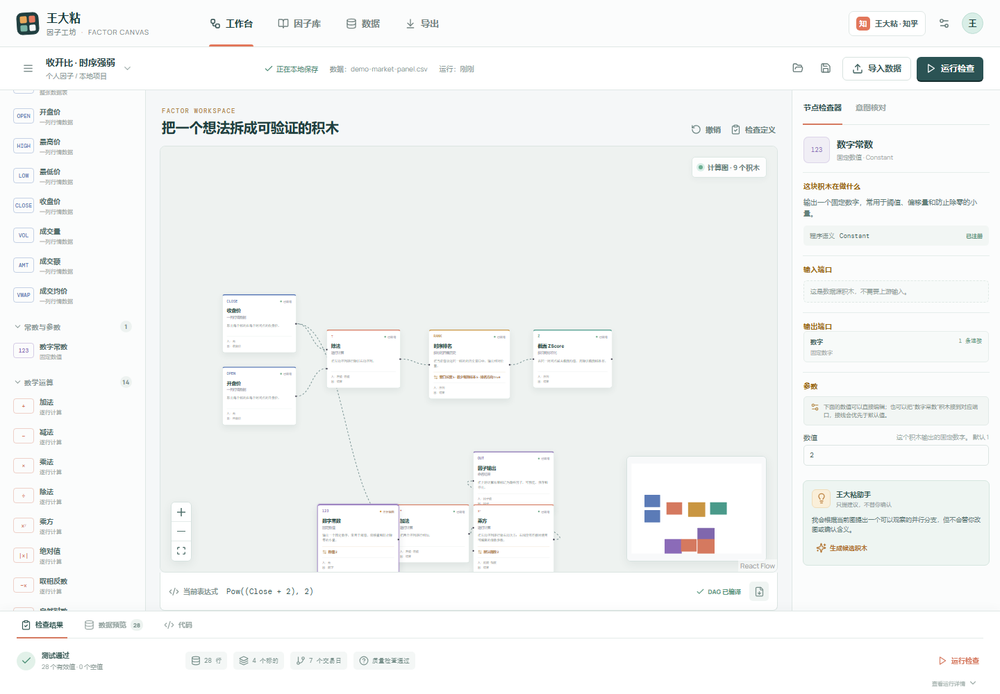
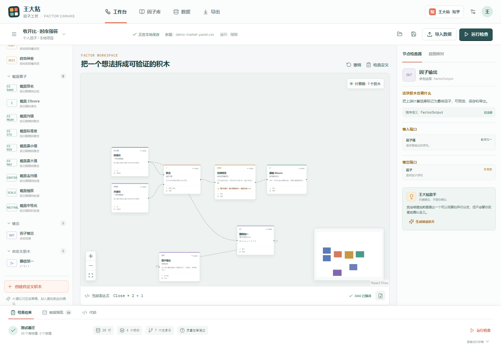

# 王大粘 · 因子工坊

> 把因子研究从“会不会写代码”，还给“有没有想法”。

王大粘 · 因子工坊是一个面向量化研究的**因子学习与创新画布**：用 Scratch / ComfyUI 式的积木和端口，把数学、统计和时序逻辑拆成可以理解、可以调整、可以组合的基本操作。

它的目标不是替用户做出一个不可解释的黑盒策略，而是让用户能够：

- 看懂已有因子是由哪些基本操作组成的；
- 用自然语言获得搭建建议，再由自己确认逻辑和含义；
- 通过图形化连接组合新因子，并直接修改窗口长度、阈值、幂次等参数；
- 导入自己的数据，检查字段、缺失值、非法数字和时间序列质量；
- 在本地执行因子计算，查看有效值、空值、警告和结果预览；
- 导出不依赖交易框架的纯 Python / NumPy 表达，复制到自己的量化系统中继续回测。

## 为什么做它

很多量化研究员每天大量时间都花在寻找、清洗和表达因子上。真正稀缺的往往不是某一段 Python 语法，而是对市场问题的观察、对因子含义的判断，以及把想法表达成可验证计算的能力。

这个工具适合：

- 有一定量化基础，但不想每次都从零搭流程的进阶玩家；
- 有经验、有直觉，却缺少规范数学和编程表达能力的老股民；
- 刚进入量化研究、希望通过拆解已有因子学习的学生。

对数学本身没有兴趣的人，看到时序窗口、排名、标准化和缺失值处理可能仍然会觉得有门槛。这是刻意保留的部分：工具降低的是表达和实现门槛，不把因子的含义藏在黑盒里。创意可以低门槛进入，研究判断仍然由人来确认。

## 因子拆解专栏

项目内已经开始整理配套的知乎专栏文章：[王大粘因子拆解](articles/知乎专栏/README.md)。

目前已经完成三章：第一章拆 Alpha158 的 9 个 K 线结构因子，第二章拆 MA、STD、RANK、RSV、MAX、MIN、RSQR、RESI 这 8 组历史窗口因子，第三章拆 ROC、BETA、QTLU、QTLD、IMAX、IMIN、IMXD 这 7 组趋势、分位与极值时点因子。每篇都配有手算示意图和真实 DAG 截图，并分别说明它在算什么、为什么有人这样设计，以及什么情况下容易失效。第三章另列出核对过的 Qlib 源码提交及预热、缺失值口径。

## 画布预览

### 从基础积木理解因子


端口连接表达的是因子内部的计算关系，例如：

```text
收盘价 -> 除法.left
开盘价 -> 除法.right
除法 -> 时序排名
时序排名 -> 截面 ZScore
截面 ZScore -> 因子输出
```

画布会同步生成可读的数学表达式，例如：

```text
Cs_ZScore(Ts_Rank((Close / Open), 5), min_samples=5)
```

### 数学计算可直接运行



基础数学积木支持参数化配置，包括加减乘除、乘方、绝对值、相反数、对数、指数、平方根、符号、最大值、最小值和范围限制等。数字不再是写死的展示文本，而是可以在检查器中修改，或连接数字常数积木覆盖。

### 自定义计算也能进入积木库



用户可以创建自己的公式积木，用 `x` 表示输入序列，例如：

```text
x * 2 + 1
```

创建后会进入本地积木库，可以再次加入画布，并参与检查、测试、表达式生成和代码导出。

## 当前能力

### 因子画布

- Scratch / ComfyUI 风格的节点画布；
- 数据字段、数字常数、数学、比较、逻辑、条件、缺失值、时序、截面和输出积木；
- 端口级 DAG 连接，连接代表真正的计算输入关系；
- 通用节点检查器：中文解释、输入输出端口、连接关系、参数和程序语义；
- 可读的数学表达式和纯 Python 导出；
- 循环连接、缺少必需输入和不支持执行的算子会被明确提示。

### 已有因子学习

- 已登记 Qlib Alpha158 和 Alpha360 因子；
- 因子包含源码表达式、中文说明和原子 DAG 展开；
- 每个已登记因子经过表达式解析和图构建测试；
- 可以从已有因子出发修改窗口、替换操作、增加条件，形成自己的变体。

### 数据导入与本地测试

- 支持 CSV / TSV 导入；
- 自动识别日期、证券代码和行情字段；
- 检查非法数字、缺失值、重复键、排序和字段问题；
- 保留原始数据与清洗副本；
- 支持删除缺失、前值填充、固定值填充、排序和撤销切换；
- 本地执行当前画布，展示有效值、空值、警告和最近输出预览。

这里的测试是因子计算和数据质量测试，不替代用户在自己的交易平台中进行的完整回测、交易成本建模和实盘验证。

### 自然语言辅助

自然语言助手负责三类工作：

1. 根据研究想法推荐可能的积木和连接方式；
2. 帮助发现字段、参数、缺失值和表达式问题；
3. 把已经由用户确认的 DAG 翻译成数学表达和目标环境代码。

助手提供建议，不替用户确认因子含义。最终的逻辑、数据口径、参数和导出结果都应由用户检查。

## 本地运行

要求：Node.js 18 或更高版本。

```powershell
cd E:\wangdazhan-factor-canvas
npm install --cache E:\wangdazhan-factor-canvas\.cache\npm --prefer-offline
npm run dev
```

打开终端显示的本地地址即可使用。开发服务器默认绑定 `127.0.0.1`。

常用命令：

```powershell
npm test
npm run build
npm run preview
```

## 本地保存与项目文件

知乎 AI Work 页面本身不承担项目保存。工作台会优先把最近项目保存到浏览器 IndexedDB，受限时回退到 `localStorage`。

使用“保存项目文件”可以下载一个带 `schemaVersion` 的 `.wdz-factor.json` 文件；使用“打开本地项目”可以在另一个浏览器或设备继续工作。项目文件会保存：

- 画布节点、连线和选中状态；
- 因子参数、页面状态和检查面板状态；
- 导入数据的快照、字段识别和质量报告；
- 清洗规则、原始 / 清洗版本和最近运行状态；
- 自定义积木库、意图描述和确认状态。

GitHub 仓库负责源码、积木定义和版本同步；知乎端运行时不依赖 GitHub 后端。

## 导出边界

当前导出以没有交易框架依赖的纯 Python / NumPy 函数和数学表达式为核心。这样生成的代码可以作为特征计算函数，复制到 Backtrader、Qlib、VnPy 或用户自己的研究和实盘系统中。

完整回测仍交给用户熟悉的平台完成，因为不同平台的数据口径、复权方式、撮合、费用、滑点和交易约束并不相同。

## 安全说明

仓库不包含任何 DeepSeek 或其他模型 API Key。若接入云端模型，应使用后端代理、环境变量或用户自己输入的密钥，不要把密钥硬编码到前端静态文件中。

## 技术栈

- React 19
- TypeScript
- Vite
- React Flow
- Vitest
- lucide-react

## License

本项目采用 [MIT License](LICENSE)。
