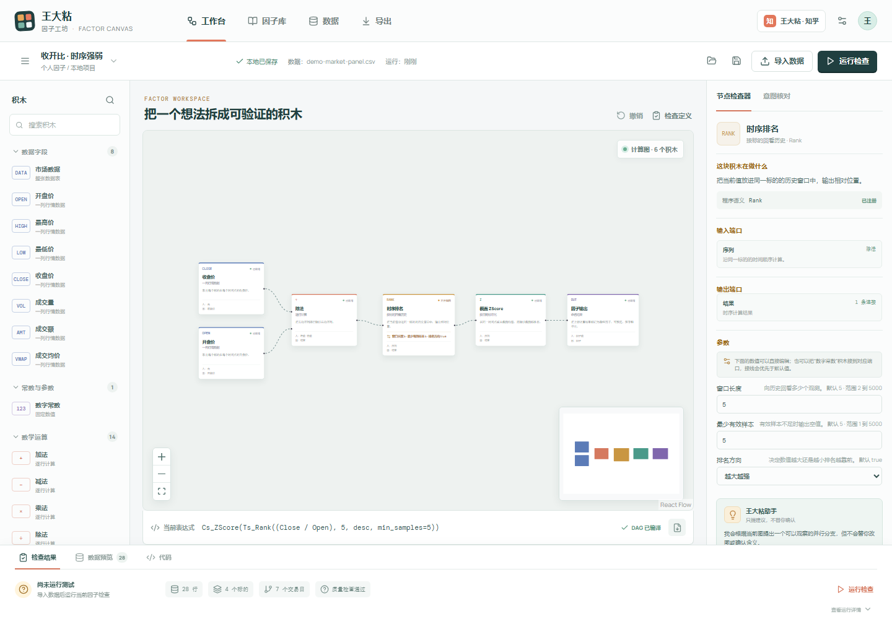

# 王大粘因子拆解

> 不背公式，不迷信名字。把一个因子拆开，看它究竟算了什么、为什么有人这样算，以及什么时候别太信它。

这个专栏配合“王大粘 · 因子工坊”一起使用。

文章负责把问题讲清楚，软件负责把公式拆成积木、导入数据、运行检查，再把结果导出到用户自己的量化环境。

每篇只讨论一个因子，并坚持回答三个问题：

1. 它到底在算什么？
2. 为什么有人会这样设计？
3. 它在什么情况下容易失效？

这里讲的是研究工具，不是荐股，也不会把一个历史表达式包装成必然有效的策略。

## 章节

### 第一章：K 线结构因子

从开盘、收盘、最高、最低四个最基础的价格开始，把一根 K 线拆成实体、振幅、上影线、下影线和收盘位置。

[进入第一章](第一章-K线结构因子/README.md)

### 第二章：历史窗口因子

从一根 K 线走向一段历史，拆解均值、波动、区间位置、线性趋势和趋势残差。

[进入第二章](第二章-历史窗口因子/README.md)

## 项目

- GitHub：[王大粘 · 因子工坊](https://github.com/superalp1985/-)
- 内容调研：[因子学习模块调研与内容方案](../../docs/因子学习模块调研方案-2026-09-27.md)

最后更新：2026 年 9 月 27 日。
