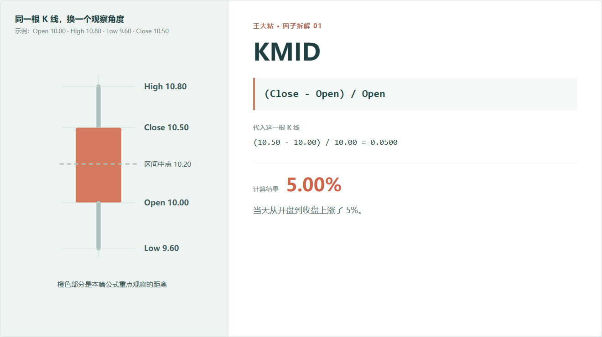
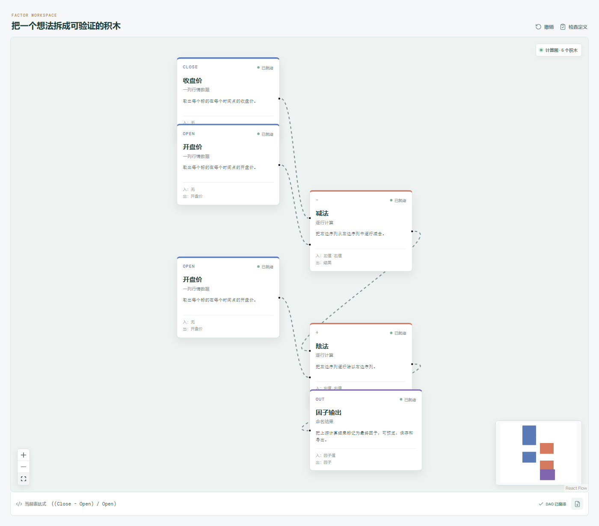

# KMID：从开盘到收盘，到底走了多少？

一只股票开盘 10 元，收盘 10.5 元。

最直接的说法是：涨了 0.5 元。

可换成一只 100 元的股票，同样涨 0.5 元，意义显然不一样。KMID 做的事情，就是把这段绝对价差换成相对于开盘价的比例。



## 它到底在算什么？

Qlib Alpha158 里的原始表达式是：

```text
KMID = (Close - Open) / Open
```

代入示例：

```text
(10.50 - 10.00) / 10.00 = 0.05
```

结果是 0.05，也就是从开盘到收盘上涨了 5%。

这里有个容易混淆的地方：**KMID 不是通常所说的“当日涨跌幅”**。

常见的日涨跌幅拿今天收盘和昨天收盘比较；KMID 只看今天开盘到今天收盘。隔夜跳空发生在开盘之前，不在这个数里。

所以它回答的是：

> 今天开盘以后，价格到收盘为止往哪个方向走了，幅度相对开盘价有多大？

## 为什么有人会这样设计？

第一层原因很朴素：归一化以后，不同价格的股票才能放在一起比较。

第二层是研究假设。有人会把开盘到收盘的变化看作当天买卖力量留下的结果：收盘明显高于开盘，说明当天后半段的成交最终把价格留在了更高的位置；反过来也一样。

但这只是一个可以拿去检验的想法。KMID 本身并没有证明这种力量会延续到明天，更没有给出买卖方向。

在因子研究里，它更像一块原材料：可以直接做横截面排名，也可以先放进历史窗口，观察今天的 KMID 在这只股票过去一段时间里处于什么位置。

## 它什么时候容易骗人？

**第一，它看不到盘中路径。**

从 10 元开到 10.5 元收，可能是一路缓慢上涨，也可能先跌到 9.6 元、再冲到 10.8 元，最后回到 10.5 元。两种走势的 KMID 完全一样。

**第二，它不包含隔夜跳空。**

昨天收盘 8 元，今天直接开在 10 元，最后收 10.1 元。KMID 只有 1%，但从昨天收盘看已经上涨很多。

**第三，单日数值很容易受消息和偶然成交影响。**

停牌复牌、涨跌停、开盘集合竞价异常，都会让这个数字和平常交易日不在一个语境里。

**第四，复权口径必须统一。**

如果开盘价和收盘价没有使用同一种复权口径，算出来的结果没有意义。

## 在因子工坊里怎么拆？



画布里是最基础的三步：

```text
收盘价 - 开盘价
        ↓
结果 ÷ 开盘价
        ↓
因子输出
```

图中会出现两个“开盘价”节点，因为这个字段在表达式里用了两次：一次参与减法，一次作为除法的分母。它们读取的是同一列数据，不是两份不同的数据。

## 自己动手改一下

把分母从 `Open` 换成 `High - Low`，问题就变了：

```text
(Close - Open) / (High - Low)
```

这不再问“实体相当于开盘价多少”，而是问“实体占全天振幅多少”。它就是下一篇要讲的 KMID2。

---

原始表达式来源：Microsoft Qlib Alpha158。  
项目地址：[王大粘 · 因子工坊](https://github.com/superalp1985/-)

本文只讨论因子定义与研究方法，不构成投资建议。
