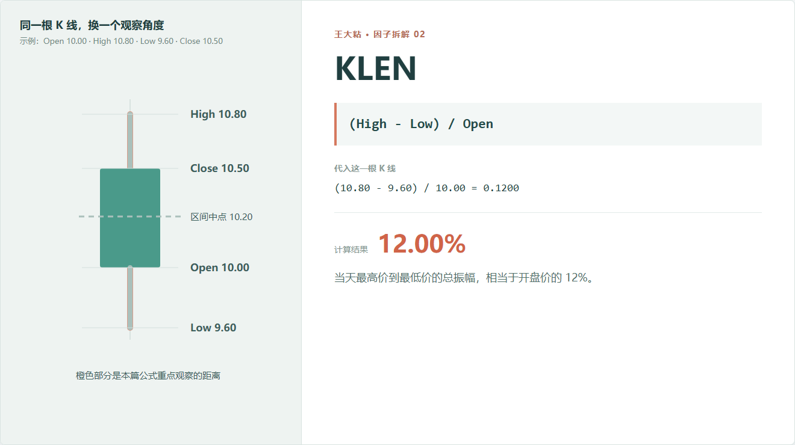
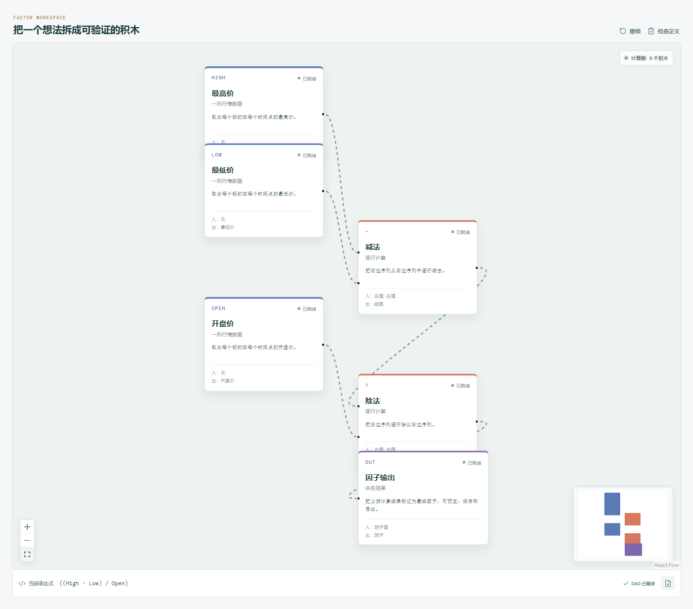

# KLEN：一只股票一天到底折腾了多大？

两只股票最后都涨了 1%。

第一只全天几乎没怎么波动，慢慢走到收盘；第二只先大跌、再拉高，盘中来回折腾了一大圈。只看开盘和收盘，这两天很像；看最高价和最低价，完全不是一回事。

KLEN 就是用来描述这段“全天活动范围”的。



## 它到底在算什么？

```text
KLEN = (High - Low) / Open
```

示例中的最高价是 10.8，最低价是 9.6，开盘价是 10：

```text
(10.80 - 9.60) / 10.00 = 0.12
```

结果是 12%。

它的意思不是“上涨 12%”，而是：**当天从最低点到最高点的整个价格区间，相当于开盘价的 12%。**

KLEN 只衡量范围，不区分方向。大阳线可能有很大的 KLEN，大阴线也可能有很大的 KLEN，宽幅震荡同样可能很大。

## 为什么有人会这样设计？

最高价减最低价，是最直接的日内振幅。再除以开盘价，是为了让不同价格水平的股票可以比较。

研究者通常会把较大的日内区间理解为“这一天价格分歧或活动程度较高”。背后可能是消息、成交活跃、流动性变化，也可能只是一次极端报价。

它可以作为波动或活跃度的一种简单描述，但不能自动等同于标准差、真实波幅或未来风险。这些指标的定义不一样。

## 它的局限性在哪里？

**它不知道先后顺序。**

先到最高价再跌到最低价，和先到最低价再涨到最高价，KLEN 完全相同。

**它对单个极端价格很敏感。**

只要有一笔成交打出异常高价或低价，全天区间就会被拉大。低流动性标的尤其要小心。

**它不包含隔夜缺口。**

从昨天收盘到今天开盘的跳空不属于 `High - Low`。如果研究目标包含隔夜风险，需要另算。

**振幅大不代表有明确方向。**

它可能是趋势，也可能是混乱。想看方向，还要结合 KMID、KSFT2 或其他因子。

## 在因子工坊里怎么拆？



画布逻辑很短：

```text
最高价 - 最低价
        ↓
结果 ÷ 开盘价
        ↓
因子输出
```

这里最值得检查的不是运算难度，而是字段口径：最高价和最低价是否可信，是否和开盘价使用同样的复权方式。

## 自己动手比较

把 KLEN 和 KMID 放在一起看：

- `KMID` 很大、`KLEN` 也大：可能是一根方向比较明确的大实体 K 线；
- `KMID` 很小、`KLEN` 很大：可能经历了明显的盘中来回波动；
- 两者都小：当天价格活动相对平静。

这不是交易规则，只是把一根 K 线从“一个图形”变成可以比较的两个数字。

---

原始表达式来源：Microsoft Qlib Alpha158。  
项目地址：[王大粘 · 因子工坊](https://github.com/superalp1985/-)

本文只讨论因子定义与研究方法，不构成投资建议。
