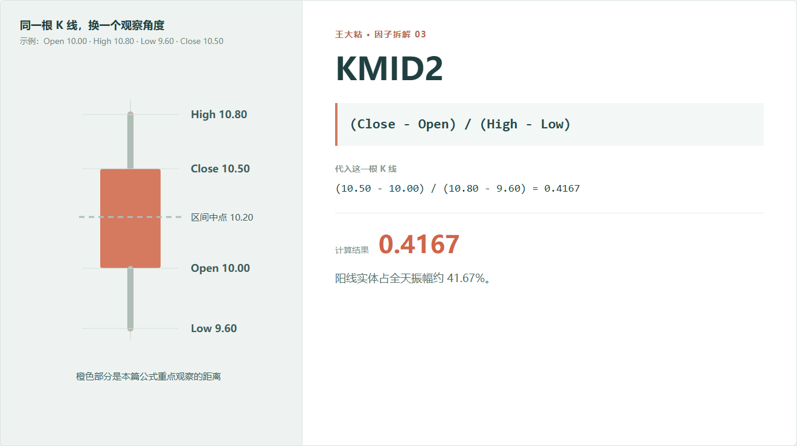
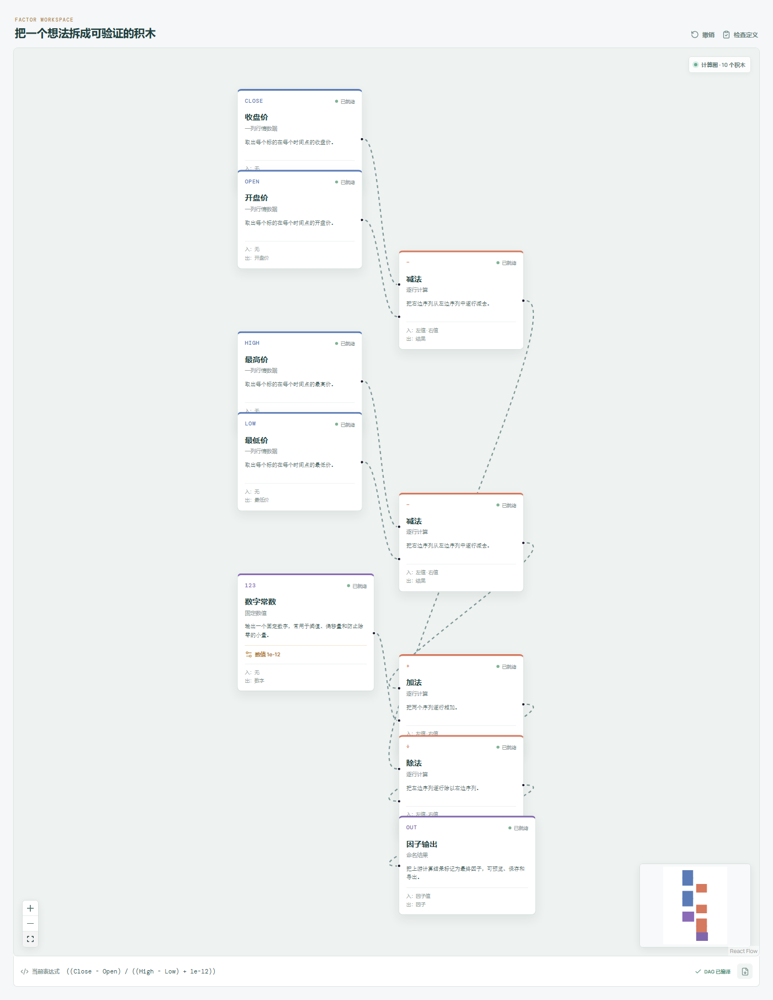

# KMID2：这根阳线看着挺大，其实占全天振幅多少？

同样是从 10 元开到 10.5 元收，背后的过程可以差很多。

如果全天只在 9.9 到 10.6 之间运行，0.5 元的阳线实体已经占了大部分区间；如果最低到 8 元、最高到 12 元，这 0.5 元实体就显得很小。

KMID2 不是拿实体和股价比，而是拿实体和这一天的完整振幅比。



## 它到底在算什么？

```text
KMID2 = (Close - Open) / (High - Low)
```

Qlib 的实现会在分母后加一个很小的数，避免最高价等于最低价时直接除以零。为了看懂公式，这里先按正常振幅计算：

```text
(10.50 - 10.00) / (10.80 - 9.60)
= 0.50 / 1.20
= 0.4167
```

这根阳线的实体，占全天振幅约 41.67%。

在行情字段正常的情况下，KMID2 通常落在 -1 到 1 之间：

- 接近 1：从开盘到收盘的上涨实体占据了大部分全天区间；
- 接近 -1：下跌实体占据了大部分全天区间；
- 接近 0：开盘和收盘很接近，全天波动主要出现在影线里。

## 为什么要除以全天振幅？

KMID 解决的是不同股价之间的可比性，KMID2 解决的是不同波动日之间的可比性。

同样 5% 的开盘到收盘涨幅，如果全天振幅只有 6%，说明实体占比很高；如果全天振幅达到 20%，说明收盘和开盘之间的变化只是当天波动的一小部分。

有人会把较大的绝对值理解为“当天方向比较集中”，把接近零理解为“盘中来回更多”。这是一个可检验的描述，不等于方向集中以后一定延续。

## 哪些地方要小心？

**分母很小时，比例会变得敏感。**

如果最高价和最低价几乎一样，哪怕开收盘只差一点点，比例也可能发生明显变化。代码里的极小量能避免报错，却不能让这条数据自动变得可靠。

**影线很长时，实体占比会被压低。**

这不一定是坏事。它只是告诉你：当天大量价格活动发生在开盘和收盘之外。

**它没有成交量。**

同样的 K 线形状，可能发生在巨量成交中，也可能出现在没有多少人交易的股票上。两者不能只凭 KMID2 当成同一种信号。

**正负号不是买卖建议。**

正值只说明收盘高于开盘。它既可能延续，也可能在第二天反转。

## 在因子工坊里怎么拆？



画布上有两条支路：

```text
收盘价 - 开盘价      -> 实体
最高价 - 最低价      -> 全天振幅
实体 ÷ 全天振幅      -> KMID2
```

这正是图形化拆解有用的地方。只看一行公式时，分子和分母容易混在一起；拆成两条支路以后，可以分别检查实体和振幅是不是自己真正想研究的东西。

## 一个值得试的变体

如果你只想研究“实体占比有多大”，暂时不关心上涨还是下跌，可以在分子外面加绝对值：

```text
Abs(Close - Open) / (High - Low)
```

这样阳线和阴线都会变成正数。方向信息被拿掉了，形状集中程度被保留下来。要不要这样做，取决于你的研究问题。

---

原始表达式来源：Microsoft Qlib Alpha158。  
项目地址：[王大粘 · 因子工坊](https://github.com/superalp1985/-)

本文只讨论因子定义与研究方法，不构成投资建议。
