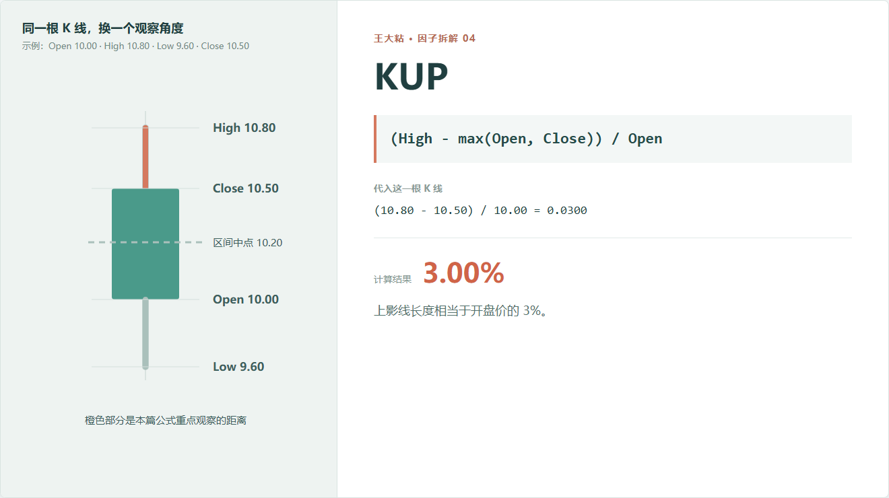
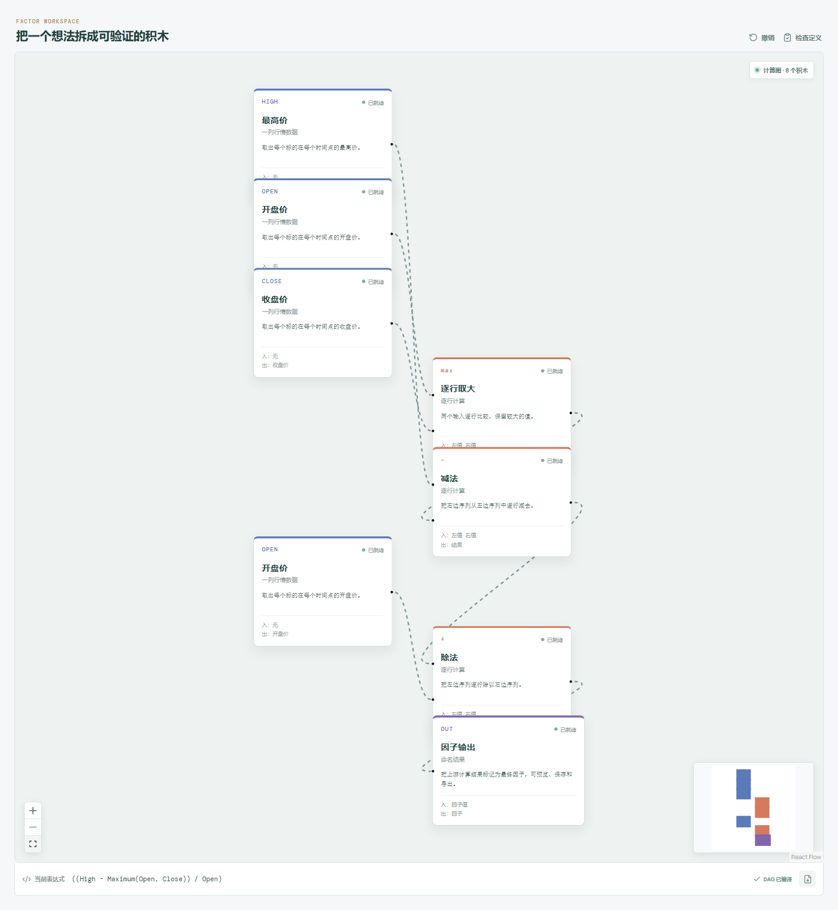

# KUP：上影线到底有多长？

有些股票盘中冲得很高，收盘却退了回来。

K 线图上留下的一根上影线，说明价格曾经到过更高的位置，但没有停在那里。KUP 要做的，就是把这段上影线量出来。



## 它到底在算什么？

```text
KUP = (High - max(Open, Close)) / Open
```

为什么要取 `max(Open, Close)`？

因为阳线和阴线的实体上沿不一样：

- 阳线收盘高于开盘，实体上沿是收盘价；
- 阴线开盘高于收盘，实体上沿是开盘价。

取两者较大值，才能在两种情况下都找到实体顶部。

示例是一根阳线，所以实体上沿是收盘价 10.5：

```text
(10.80 - 10.50) / 10.00 = 0.03
```

结果是 3%。意思是：上影线长度相当于开盘价的 3%。

## 为什么有人会观察上影线？

一种常见解释是：价格盘中曾经向上走，但收盘前没有守住最高位置。这可能意味着更高价位遇到了卖盘，也可能只是上涨后的正常回落。

请注意，这里的重点是“可能”。

只靠一根上影线，我们不知道价格为什么回落，也不知道明天会不会继续跌。它可以帮助描述当天的价格结构，但不能单独证明所谓“抛压”。

更合理的研究方式，是把 KUP 和其他信息放在一起：

- 当天成交量是否异常；
- 实体是阳线还是阴线；
- 收盘仍然处在近期高位，还是已经明显转弱；
- 这种结构出现在趋势初期还是连续上涨之后。

## 它的局限性

**盘中路径仍然未知。**

价格可能开盘后先冲高再回落，也可能临近收盘突然出现一笔高价成交。两种情况的上影线长度可能一样。

**最高价对异常成交很敏感。**

低流动性股票的一笔孤立成交，就可能把 `High` 抬高，让 KUP 看起来很大。

**长上影线不一定看空。**

在强趋势里，它可能只是波动扩大；在突破附近，它也可能意味着市场仍在尝试更高价格。方向要靠后续数据检验，不能靠图形名称决定。

**它按开盘价归一化。**

这让不同价格的股票更容易比较，但没有考虑当天自身振幅。想看“上影线占全天振幅多少”，要用 KUP2。

## 在因子工坊里怎么拆？



画布会先找到实体上沿：

```text
max(Open, Close)
```

再做：

```text
High - 实体上沿
        ↓
结果 ÷ Open
        ↓
KUP
```

这里的“逐行取大”不是比较条件，而是数学上的最大值。它输出的是开盘价和收盘价中较大的那个数字。

## 自己动手看一个组合

可以把 KUP 和 KMID 放在一起：

- KMID 为正、KUP 很小：收盘接近当天高位；
- KMID 为正、KUP 很大：虽然收涨，但盘中更高的位置没有守住；
- KMID 为负、KUP 很大：开盘以后曾经上冲，最后却收在开盘下方。

这三种结构比一句“有上影线”具体得多。

---

原始表达式来源：Microsoft Qlib Alpha158。  
项目地址：[王大粘 · 因子工坊](https://github.com/superalp1985/-)

本文只讨论因子定义与研究方法，不构成投资建议。
