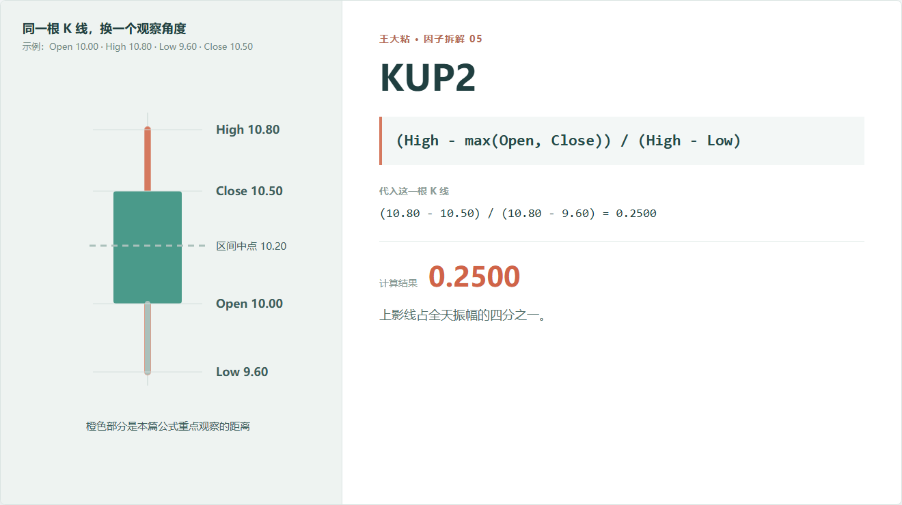
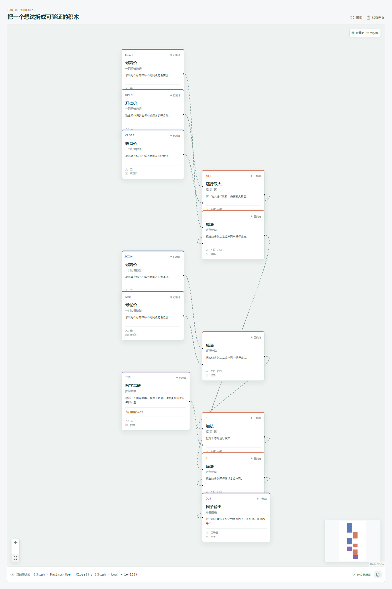

# KUP2：上影线很长，但它在全天振幅里占多少？

KUP 告诉我们上影线相当于开盘价多少。

可研究 K 线形状时，还有另一个问题：这根上影线在当天完整振幅里，到底占了多大一部分？

这就是 KUP2。



## 它到底在算什么？

```text
KUP2 = (High - max(Open, Close)) / (High - Low)
```

分子还是上影线长度，分母换成了当天最高价和最低价之间的完整区间。

代入示例：

```text
(10.80 - 10.50) / (10.80 - 9.60)
= 0.30 / 1.20
= 0.25
```

也就是说，上影线占全天振幅的四分之一。

只要行情数据正常，KUP2 通常在 0 到 1 之间：

- 接近 0：实体上沿离最高价很近，上影线很短；
- 接近 1：全天大部分区间都位于实体上方。

## 为什么要再做一次归一化？

KUP 按开盘价归一化，适合比较“相对于价格水平，上影线有多长”。

KUP2 按全天振幅归一化，适合比较“在这根 K 线内部，上影线占多少”。

这两个问题看起来很像，实际并不相同。

一只平常很安静的股票，上影线只占开盘价 1%，但如果全天振幅也只有 1.2%，那么这根上影线已经占据了绝大部分 K 线。另一只高波动股票，上影线相当于开盘价 3%，可全天振幅达到 15%，形状上反而不算突出。

## 哪些情况下别急着下结论？

**全天振幅很小时，比例不稳定。**

最高价和最低价几乎一样时，分母很小。代码可以加极小量避免除零，但这类数据仍然需要单独检查。

**KUP2 大，不一定是强烈卖压。**

它只说明上影线在整根 K 线里占比高。原因可能是冲高回落，也可能是实体和下影线都很短。

**下影线会影响它。**

分母包含全天完整振幅。下影线突然变长，即使上影线长度没变，KUP2 也会下降。

**极端最高价会同时改变分子和分母。**

一个异常高价既拉长上影线，也放大全天区间，最终比例怎么变化并不直观，最好回到原始数据查看。

## 在因子工坊里怎么拆？



这张图比 KUP 多出一条分母支路：

```text
High - max(Open, Close)  -> 上影线
High - Low               -> 全天振幅
上影线 ÷ 全天振幅        -> KUP2
```

图中还有一个很小的数字常数，用来避免 `High - Low` 等于零时直接报错。它只解决计算异常，不代表零振幅样本适合拿来研究。

## 一个有用的形状检查

对正常 K 线来说，可以观察下面这个关系：

```text
KUP2 + Abs(KMID2) + KLOW2 ≈ 1
```

上影线占比、实体占比、下影线占比加起来，应该接近完整 K 线区间。

如果明显偏离，可能是字段异常、极小量处理或公式口径不同。这个检查很适合放进数据清洗环节。

---

原始表达式来源：Microsoft Qlib Alpha158。  
项目地址：[王大粘 · 因子工坊](https://github.com/superalp1985/-)

本文只讨论因子定义与研究方法，不构成投资建议。
