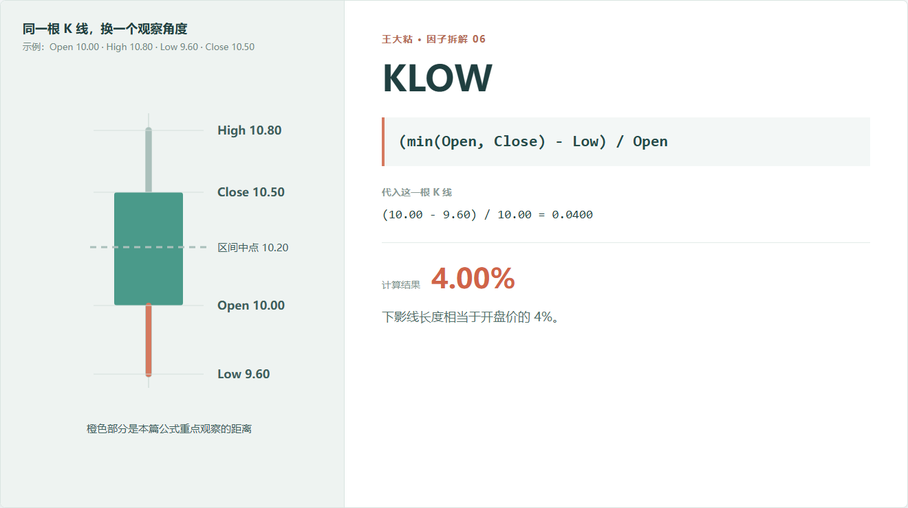
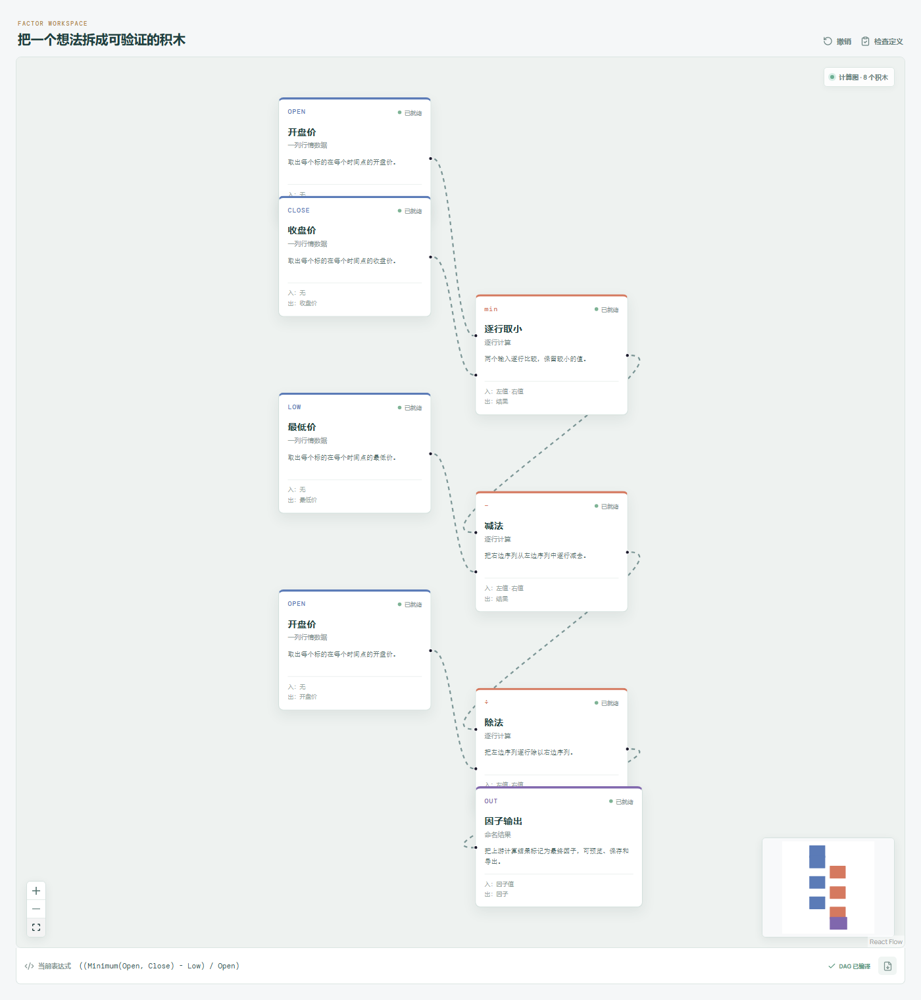

# KLOW：价格掉下去以后，又收回来了多少？

一根下影线代表价格曾经去过更低的位置，后来又离开了那里。

它经常被解释成“低位有承接”，但只看图形容易说得太快。我们先别讨论多空，把这段距离老老实实算出来。



## 它到底在算什么？

```text
KLOW = (min(Open, Close) - Low) / Open
```

这里取 `min(Open, Close)`，是为了找到实体下沿：

- 阳线的实体下沿是开盘价；
- 阴线的实体下沿是收盘价。

示例是一根阳线，实体下沿是开盘价 10 元：

```text
(10.00 - 9.60) / 10.00 = 0.04
```

结果是 4%。也就是下影线长度相当于开盘价的 4%。

它只描述最低价和实体下沿之间的距离，不负责判断这段下影线是怎么形成的。

## 为什么有人会关注下影线？

常见的市场直觉是：价格曾经下探，却没有在最低位置收盘，说明更低价位出现了买盘，或者卖压没有持续到收盘。

这种解释有一定直观性，但不要直接把它翻译成“出现下影线就会涨”。

同样一根下影线，可能发生在：

- 下跌趋势末端的快速反弹；
- 上涨过程中的普通震荡；
- 流动性很差时的一笔低价成交；
- 重大消息日的剧烈波动。

公式不会替我们分辨这些背景。

## 它的局限性

**最低价可能只是一个瞬间。**

如果只有很少成交发生在最低点，KLOW 仍然会完整记录这段距离。

**长下影线不一定代表有效支撑。**

价格离开最低点，可能只是暂时反弹。想验证“承接”，至少还要看成交量、后续价格和所处趋势。

**它没有考虑全天振幅。**

下影线相当于开盘价 4%，听起来不小；可如果当天总振幅是 20%，它在整根 K 线里的占比并不高。

**复权和异常行情仍然会影响结果。**

开、高、低、收必须使用一致口径。涨跌停、停牌复牌和错误低价都需要单独处理。

## 在因子工坊里怎么拆？



画布先找到实体下沿：

```text
min(Open, Close)
```

然后计算：

```text
实体下沿 - Low
        ↓
结果 ÷ Open
        ↓
KLOW
```

和 KUP 一样，这里的“逐行取小”是数学最小值，不是输出真假的比较积木。

## 自己动手比较

把 KLOW 和 KUP 同时放进画布：

- KLOW 明显大于 KUP：当天更多区间留在实体下方；
- KUP 明显大于 KLOW：当天更多区间留在实体上方；
- 两边都很长：开盘和收盘集中在中间，盘中波动范围较大。

这比简单说“有下影线”更接近可验证的描述。

---

原始表达式来源：Microsoft Qlib Alpha158。  
项目地址：[王大粘 · 因子工坊](https://github.com/superalp1985/-)

本文只讨论因子定义与研究方法，不构成投资建议。
