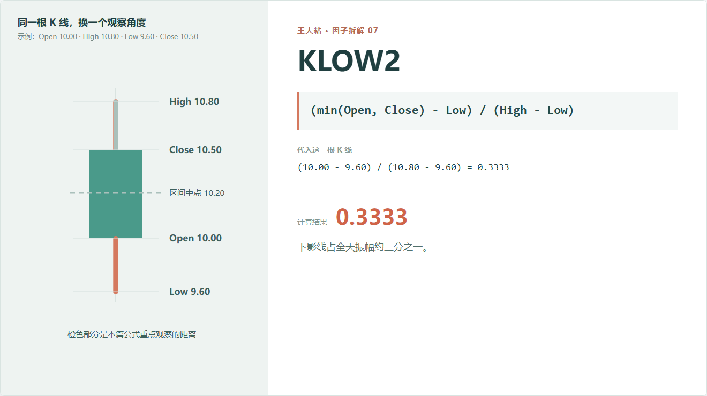
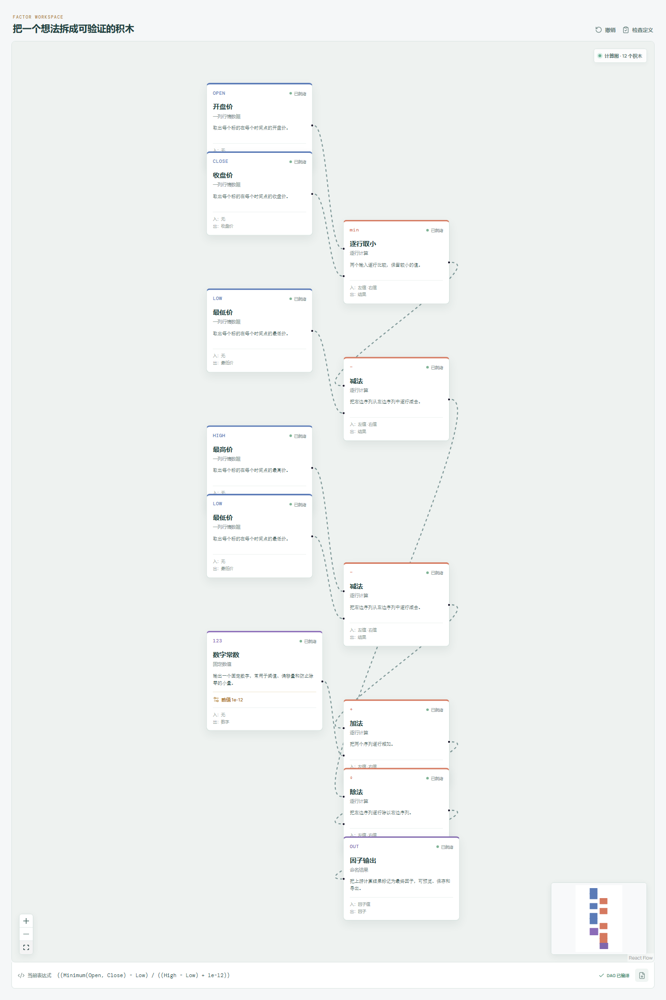

# KLOW2：下影线很长，还是全天振幅本来就很大？

看到一根明显的下影线，我们很容易说“下面有承接”。

但同样 0.4 元的下影线，放在 0.6 元的全天振幅里很突出，放在 3 元的振幅里就没那么特殊。KLOW2 做的，就是把下影线放回整根 K 线里看。



## 它到底在算什么？

```text
KLOW2 = (min(Open, Close) - Low) / (High - Low)
```

示例中，实体下沿是开盘价 10 元，最低价是 9.6 元，全天振幅是 1.2 元：

```text
(10.00 - 9.60) / (10.80 - 9.60)
= 0.40 / 1.20
= 0.3333
```

下影线占全天振幅约三分之一。

正常行情数据下，KLOW2 通常位于 0 到 1：

- 接近 0：实体下沿离最低价很近，下影线短；
- 接近 1：全天大部分区间位于实体下方。

## 为什么这种占比有用？

KLOW 按开盘价归一化，告诉我们下影线相对价格水平有多长；KLOW2 按当天振幅归一化，告诉我们它在 K 线形状中占多大。

研究“价格结构”时，后一个问题有时更直接。

例如，两只股票都有 4% 的 KLOW：

- 第一只全天振幅 5%，下影线几乎占满整根 K 线；
- 第二只全天振幅 20%，下影线只是其中一小段。

它们都曾经离开最低点，但当天价格活动的分布不同。

## 什么情况下会失真？

**最高价和最低价太接近。**

分母趋近零时，比例会变得敏感。增加极小量只能防止计算报错，不能替代数据判断。

**一个异常低价会同时改变分子和分母。**

它既会拉长下影线，也会放大全天区间。最后的比例可能看着正常，但原始行情已经异常。

**KLOW2 高不等于未来上涨。**

它只是说明大量日内区间位于实体下方。要讨论“低位承接”是否有效，还要看成交量、趋势位置和后续收益。

**不同交易制度不能直接混在一起。**

涨跌停、集合竞价、交易时段和流动性不同，都会改变影线的形成方式。

## 在因子工坊里怎么拆？



计算图包含两条清楚的支路：

```text
min(Open, Close) - Low  -> 下影线
High - Low              -> 全天振幅
下影线 ÷ 全天振幅       -> KLOW2
```

分母旁边同样有防止除零的极小常数。导出代码时，这个处理也会保留下来。

## 把一根 K 线拼回来

现在已经有三块比例：

```text
上影线占比：KUP2
实体占比：  Abs(KMID2)
下影线占比：KLOW2
```

在字段正常、忽略极小量误差时，它们加起来应该接近 1。

这不仅是一个数学关系，也是很实用的数据检查。三块拼不回一根完整 K 线时，先别研究收益，先检查字段。

---

原始表达式来源：Microsoft Qlib Alpha158。  
项目地址：[王大粘 · 因子工坊](https://github.com/superalp1985/-)

本文只讨论因子定义与研究方法，不构成投资建议。
