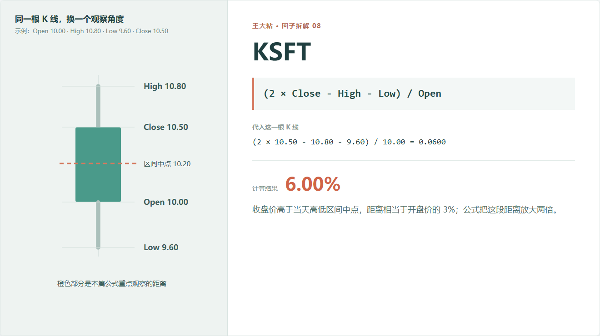
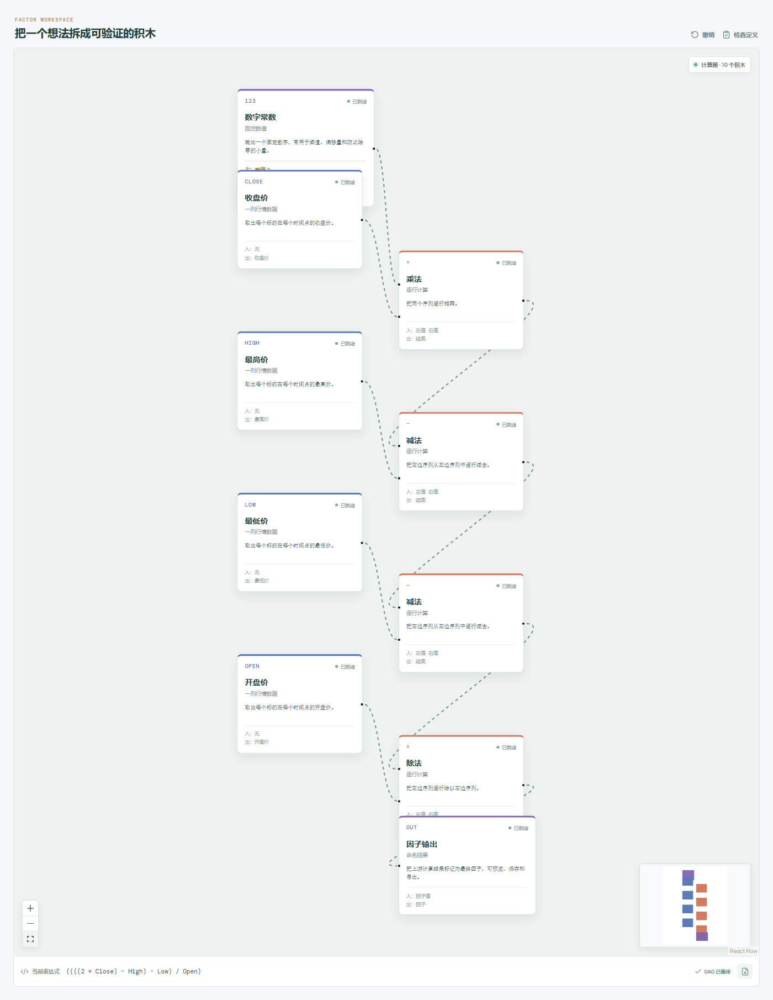

# KSFT：收盘价离当天高低区间的中点有多远？

KMID 关心的是收盘和开盘之间的距离。

KSFT 换了一个参照物：它不问收盘比开盘高多少，而是问收盘落在当天最高价和最低价的中点上方还是下方。

这个区别很重要。开盘只是一天开始时的价格，区间中点则来自当天完整的高低范围。



## 它到底在算什么？

```text
KSFT = (2 × Close - High - Low) / Open
```

这行公式看着不太直观，把它改写一下就清楚了：

```text
2 × Close - High - Low
= 2 × (Close - (High + Low) / 2)
```

也就是说，分子是“收盘价距离当天高低区间中点的距离”，再乘以 2。

示例中的区间中点是：

```text
(10.80 + 9.60) / 2 = 10.20
```

收盘价 10.5，比中点高 0.3 元。原公式把 0.3 乘以 2，再除以开盘价：

```text
(2 × 10.50 - 10.80 - 9.60) / 10.00
= 0.60 / 10.00
= 0.06
```

结果是 6%。

这里一定要防止一个误读：**它不是说收盘价比中点高 6%。** 实际距离是 0.3 元，相当于开盘价的 3%；公式因为采用了两倍距离，所以输出 6%。

## 为什么有人要看区间中点？

收盘落在当天区间上半部，说明价格最终留在了相对较高的位置；落在下半部，则说明收盘更接近低位。

这种设计试图把“收盘位置”从开盘方向里单独拿出来。

比如一只股票大幅高开，最后虽然收在开盘价下方，但收盘仍可能位于当天区间上半部。此时 KMID 为负，KSFT 却可能为正。两个因子没有谁对谁错，它们回答的是不同问题。

## 它的局限性

**它按开盘价归一化，所以没有固定上下界。**

当天振幅越大，收盘离中点的绝对距离也可能越大。KSFT 不像 KSFT2 那样稳定在 -1 到 1 附近。

**最高价和最低价仍然可能受异常成交影响。**

区间中点由 High 和 Low 决定，任意一端异常都会移动中点。

**收盘位置不等于盘中控制权。**

只看四个 OHLC 字段，我们不知道某个位置成交了多少，也不知道价格在那里停留了多久。

**正值没有天然的做多含义。**

收盘靠上可能代表强势，也可能是高波动日里的临时位置。是否具有预测力必须另外检验。

## 在因子工坊里怎么拆？



计算图可以理解为：

```text
Close × 2
    ↓
减去 High
    ↓
减去 Low
    ↓
除以 Open
    ↓
KSFT
```

另一种更容易教学的搭法是先算 `(High + Low) / 2`，再计算 `Close - Midpoint`，最后乘 2、除以 Open。两张图数学等价，但后者更容易让初学者看懂“区间中点”这个概念。

这也说明，因子画布不只负责复刻源码，还可以提供更适合人理解的等价拆法，但必须同时保留原始表达式。

## 自己动手比较

把同一天的 KMID 和 KSFT 放在一起：

- 两者都为正：收盘高于开盘，也位于全天区间上半部；
- KMID 为负、KSFT 为正：收盘低于开盘，但仍在当天区间上半部；
- KMID 为正、KSFT 为负：收盘高于开盘，却仍位于全天区间下半部，通常意味着上方区间很大。

这类分歧往往比单看一根阳线或阴线更值得研究。

---

原始表达式来源：Microsoft Qlib Alpha158。  
项目地址：[王大粘 · 因子工坊](https://github.com/superalp1985/-)

本文只讨论因子定义与研究方法，不构成投资建议。
