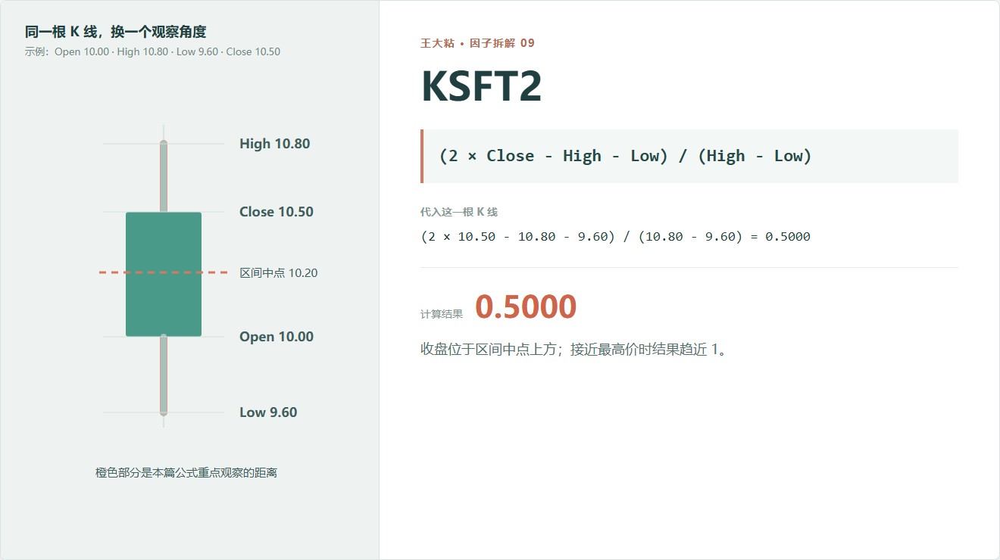
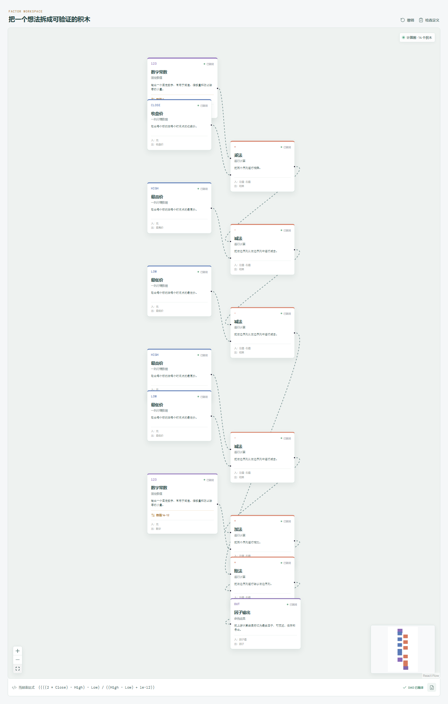

# KSFT2：收盘更靠近当天最高价，还是最低价？

如果只想快速知道收盘在当天区间里的位置，KSFT2 是这组 K 线因子里最直观的一个。

它把区间中点设为 0，最高价附近设为 1，最低价附近设为 -1。不同股价、不同振幅的交易日因此可以放到同一把尺子上比较。



## 它到底在算什么？

```text
KSFT2 = (2 × Close - High - Low) / (High - Low)
```

它也可以改写成：

```text
2 × (Close - 区间中点) / 全天振幅
```

示例中：

```text
区间中点 = (10.80 + 9.60) / 2 = 10.20
收盘与中点距离 = 10.50 - 10.20 = 0.30
全天振幅 = 10.80 - 9.60 = 1.20
```

因此：

```text
2 × 0.30 / 1.20 = 0.50
```

结果是 0.5，说明收盘位于区间中点上方，而且更靠近最高价。

它的几个特殊位置很好记：

```text
Close = High       -> KSFT2 =  1
Close = Midpoint   -> KSFT2 =  0
Close = Low        -> KSFT2 = -1
```

## 为什么这样设计？

只用 `Close - Low` 可以知道收盘距离最低价多远，但结果会受到当天振幅大小影响。KSFT2 把这段位置放进整个 `High - Low` 区间里，得到一把相对稳定的尺子。

它描述的是“收盘位置”，常见研究假设是：如果收盘持续靠近当天高位，可能说明买方在收盘时仍占优势；持续靠近低位则可能反映相反情况。

但这仍然只是对当日结果的描述。收盘靠近最高价，可能是趋势延续，也可能是短期过热；收盘靠近最低价，可能继续走弱，也可能出现反转。具体方向不能靠公式名字决定。

## 它什么时候不可靠？

**全天没有振幅时无法正常定义。**

如果 `High = Low`，分母为零。实现中会加极小量避免报错，但这种样本应该被标记，而不是当成普通结果。

**最高价或最低价异常会移动整把尺子。**

一个错误极值会同时改变中点和振幅，KSFT2 可能因此失真。

**涨跌停会让结果集中在边界。**

收盘长期等于最高价或最低价时，KSFT2 会频繁接近 1 或 -1，但这还牵涉能否成交，不能只看数值。

**收盘位置没有成交量信息。**

价格靠近高点收盘，不代表高位成交充分。研究“力量”时，可以再接成交量或成交额分支。

**不同市场的收盘机制不同。**

集合竞价、交易时段和价格限制会影响收盘价的形成。跨市场使用时，不能默认含义完全一致。

## 在因子工坊里怎么拆？



它和 KSFT 的分子相同，区别只在分母：

```text
KSFT  = 收盘相对中点的两倍距离 ÷ Open
KSFT2 = 收盘相对中点的两倍距离 ÷ (High - Low)
```

一个按价格水平归一化，一个按当天振幅归一化。

在画布里同时放入这两个输出，再导入自己的数据，很容易看到它们在哪些交易日给出类似信息，在哪些交易日差异明显。

## 从描述走向自己的因子

KSFT2 只告诉我们收盘的位置。可以继续问：

- 收盘靠近高点时，当天振幅是大还是小？
- 这种状态连续出现了几天？
- 它在这只股票过去 20 天里是否罕见？
- 同一天里，哪些股票的 KSFT2 更高？
- 加上成交量以后，结果是否不同？

例如把 KLEN 和 KSFT2 组合，就能区分：

```text
小振幅、靠近高点收盘
大振幅、靠近高点收盘
```

两者都有很高的 KSFT2，但市场状态未必一样。因子创新往往不是凭空发明复杂公式，而是从这种具体差异继续追问。

---

原始表达式来源：Microsoft Qlib Alpha158。  
项目地址：[王大粘 · 因子工坊](https://github.com/superalp1985/-)

本文只讨论因子定义与研究方法，不构成投资建议。
