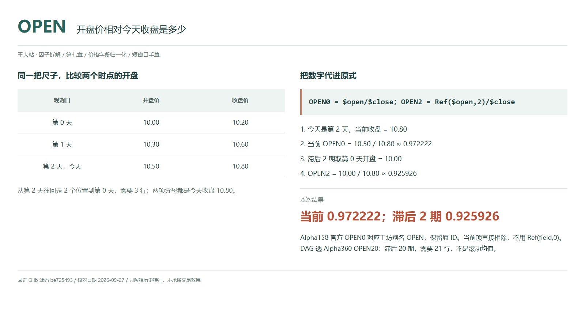
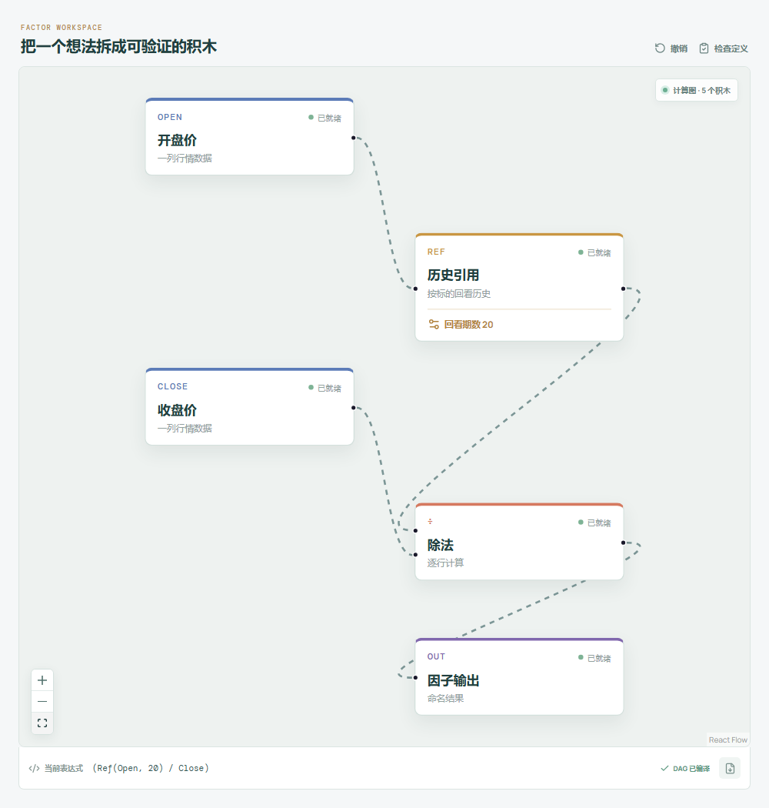

# OPEN：开盘价相对今天收盘是多少？

同样是开盘后涨了三毛，十元股和百元股的含义并不一样。把开盘价放到今天收盘价这把尺子上，才是在比较相对位置。这里没有预测，先把一个价格字段读明白。

Qlib Alpha158 默认的官方名称是 `OPEN0`；工坊显示别名 `OPEN`，保留已有 ID `qlib-alpha158-open`。本文同时讲 Alpha360 的同字段滞后序列，不再按每个滞后数重复写文章。



## 它到底在算什么？

```text
Alpha158 OPEN0 / 工坊 OPEN = $open/$close
Alpha360 OPENi = Ref($open,i)/$close，i=59,...,1
Alpha360 OPEN0 = $open/$close
```

同一标的、同一复权口径，按对齐日线排列：

| 观测日 | 开盘价 | 收盘价 |
| --- | ---: | ---: |
| 第 0 天 | 10.00 | 10.20 |
| 第 1 天 | 10.30 | 10.60 |
| 第 2 天，今天 | 10.50 | 10.80 |

```text
当前 OPEN0 = 10.50 / 10.80 ≈ 0.972222
滞后 OPEN2 = 10.00 / 10.80 ≈ 0.925926
```

前者说今天开盘相当于今天收盘的约 97.22%；后者说两期前开盘相当于今天收盘的约 92.59%。分母始终是今天收盘，不是那一天收盘，也不是今天开盘。

零滞后直接取字段。别写成 `Ref($open,0)`：此版本 Qlib 的零参数取加载序列首值，并非“不移动”。

## 为什么有人会这样设计？

除法去掉价格单位，让不同价位的标的更容易比较。当前值保留日内开收位置，历史值保留过去开盘相对现价的位置。两者共享尺度，但问的不是同一个时点。

价格为正时，当前值小于一表示收盘高于开盘；历史值小于一只表示今天收盘高于那个历史开盘。它们都不是通常的收益率，更不自动给出买卖方向。

## 它什么时候容易骗人？

**不要把开盘当成昨收。** 跳空会改变隔夜到开盘这一段，当前比值只比较今天开收，不能据此补出整段涨跌。

**不要把滞后当均线。** `OPEN20` 取二十期前的一个观测，不求二十日平均；包括今天要覆盖 21 行。日线的“期”依赖既定交易日历，删掉缺失行会偷偷改变位置。

**先检查数据再读数。** 历史开盘与当前收盘必须口径一致，除权、复牌跳空和错误行情要分别核查。收盘缺失、为零或非正时不作正常价格比例解释；原价格分母没有补 epsilon。

今天最终收盘要到收盘后才可用，不能拿这个信号假装开盘时已经知道全天结果。

## 在因子工坊里怎么拆？



选择 **Alpha360 OPEN20**：开盘价接历史引用，回看期数设为 20，输出接除法分子；今天收盘直连分母，再接因子输出。图中回看 20 期，与手算的两期参数不同。

要核对表中数字，把回看改为 2。要看当前别名 `OPEN`，则移除历史引用，让开盘直连分子，不能把回看参数改成零来冒充。

## 自己动手改一下

把第 1 天开盘从 10.30 改为 10.40，两个结果都不变，因为这个中间点没参与。再把第 0 天开盘改为 10.20，`OPEN2` 变成 `10.20/10.80≈0.944444`，当前值仍不变。这个实验能直接检验你连的是哪一天，而不是只看公式名字。

---

原始表达式来源：Microsoft Qlib Alpha158、Alpha360。源码核对日期：2026-09-27。

固定版本：`be725493eb1a6bbb42bf11b37aa7669f59610ff1`。

- [Alpha158 默认字段名称与直接商：loader.py](https://github.com/microsoft/qlib/blob/be725493eb1a6bbb42bf11b37aa7669f59610ff1/qlib/contrib/data/loader.py#L73-L133)
- [Alpha360 OPEN 序列：loader.py](https://github.com/microsoft/qlib/blob/be725493eb1a6bbb42bf11b37aa7669f59610ff1/qlib/contrib/data/loader.py#L32-L36)
- [Ref 的零参数与移位实现：ops.py](https://github.com/microsoft/qlib/blob/be725493eb1a6bbb42bf11b37aa7669f59610ff1/qlib/data/ops.py#L781-L824)

项目地址：[王大粘 · 因子工坊](https://github.com/superalp1985/-)

本文只讨论因子定义与研究方法，不构成投资建议。
