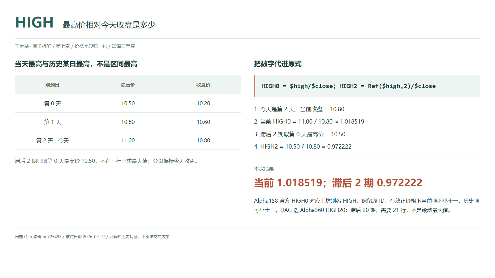
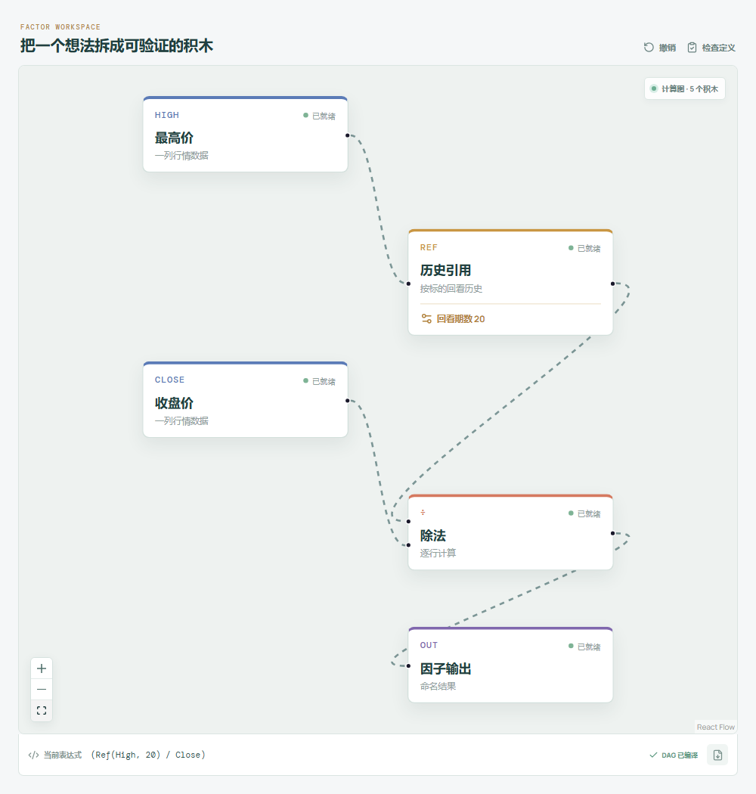

# HIGH：最高价相对今天收盘是多少？

“最高摸到十一元，最后收在十块八”，说的是一次日内上探。把十一除以十块八，得到的是最高价相对收盘的比例，不是上影线长度，也不是未来还能涨多少。

Qlib Alpha158 默认官方名为 `HIGH0`；工坊沿用别名 `HIGH` 和 ID `qlib-alpha158-high`。Alpha360 的 `HIGH59` 到 `HIGH0` 也属于这一字段家族，只是分子所在时点不同。



## 它到底在算什么？

```text
Alpha158 HIGH0 / 工坊 HIGH = $high/$close
Alpha360 HIGHi = Ref($high,i)/$close，i=59,...,1
Alpha360 HIGH0 = $high/$close
```

| 观测日 | 最高价 | 收盘价 |
| --- | ---: | ---: |
| 第 0 天 | 10.50 | 10.20 |
| 第 1 天 | 10.80 | 10.60 |
| 第 2 天，今天 | 11.00 | 10.80 |

```text
当前 HIGH0 = 11.00 / 10.80 ≈ 1.018519
滞后 HIGH2 = 10.50 / 10.80 ≈ 0.972222
```

在价格为正、同周期行情有效的前提下，当天最高价不低于当天收盘，所以当前值不小于一。但历史最高价可以低于今天收盘，`HIGH2` 小于一完全正常。不要把当天的范围约束套给历史项。

零滞后直接相除，不写 `Ref($high,0)`；指定 Qlib 版本里，零参数会取加载序列首值。

## 为什么有人会这样设计？

原始最高价带着股票本身的价格尺度，归一化后更容易比较收盘距离上探价有多远。历史序列则让模型看到此前每天的最高价相对现价如何排列。

这仍不是上影线：上影线需要最高价减去开盘与收盘的较大者。这个比值不看开盘，也不知道高点持续多久、成交多少。它保留的是价格位置，不是完整的冲高回落故事。

## 它什么时候容易骗人？

**历史某日最高，不等于区间最高。** `HIGH20` 只取二十期前那一天的最高价，不计算二十日最大值，也不是均值；完整对齐序列需要 21 行。

**一笔异常成交也可能成为最高价。** 脏数据、特殊成交和复牌跳空都可能放大读数。即使高价真实存在，也不代表策略能够在那个价位成交。

**字段必须来自同一套行情。** 复权口径混用可能破坏高低开收关系；删除缺失行会改变滞后位置。当前收盘缺失、为零或非正时应标为无效，价格分母没有 epsilon 保护。

当天最终最高和收盘只有周期结束后才完整可知，用日终值做盘中决策会引入未来信息。

## 在因子工坊里怎么拆？



选择 **Alpha360 HIGH20**，最高价先接历史引用，回看期数为 20，再接除法分子；今天收盘直接接分母。图中是单个历史位置，不能用“时序最大值”替换历史引用。

核对手算时改为回看 2；检查当前 `HIGH` 时移除引用，直接连接最高价与收盘价的除法。

## 自己动手改一下

只把第 1 天最高价从 10.80 改为 12.00，当前值和 `HIGH2` 都不动，尽管三天的最大值已经变化。再把今天最高价改成 11.20，当前值变为 `11.20/10.80≈1.037037`，`HIGH2` 仍不动。这就区分了当前字段、历史字段和滚动极值三个问题。

---

原始表达式来源：Microsoft Qlib Alpha158、Alpha360。源码核对日期：2026-09-27。

固定版本：`be725493eb1a6bbb42bf11b37aa7669f59610ff1`。

- [Alpha158 默认字段名称与直接商：loader.py](https://github.com/microsoft/qlib/blob/be725493eb1a6bbb42bf11b37aa7669f59610ff1/qlib/contrib/data/loader.py#L73-L133)
- [Alpha360 HIGH 序列：loader.py](https://github.com/microsoft/qlib/blob/be725493eb1a6bbb42bf11b37aa7669f59610ff1/qlib/contrib/data/loader.py#L37-L41)
- [Ref 的零参数与移位实现：ops.py](https://github.com/microsoft/qlib/blob/be725493eb1a6bbb42bf11b37aa7669f59610ff1/qlib/data/ops.py#L781-L824)

项目地址：[王大粘 · 因子工坊](https://github.com/superalp1985/-)

本文只讨论因子定义与研究方法，不构成投资建议。
