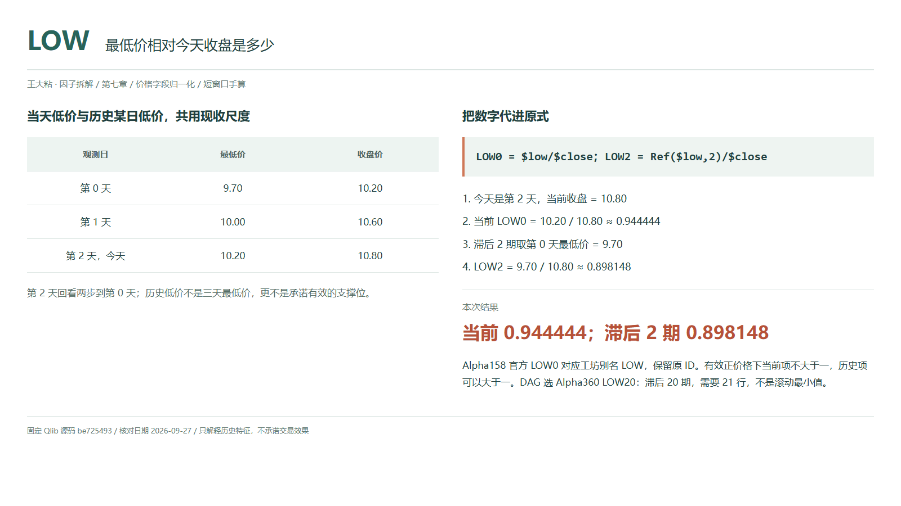
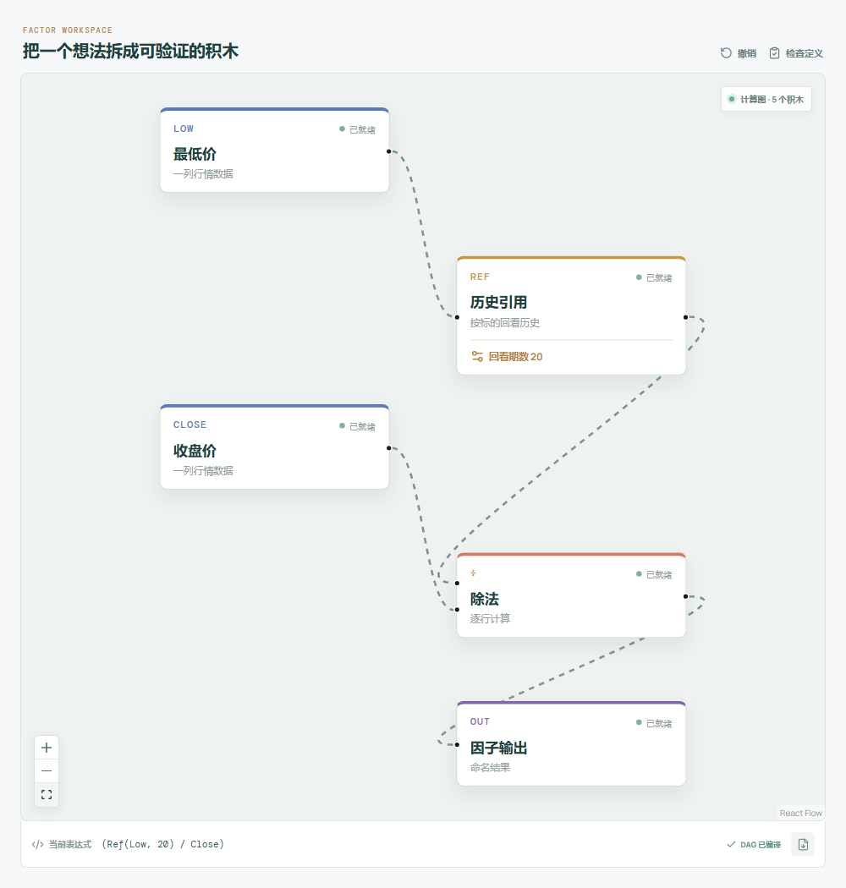

# LOW：最低价相对今天收盘是多少？

盘中跌到十块二，最后收在十块八，看起来像是“从低点拉了回来”。LOW 把低价放到收盘价的尺度上，却不会告诉你是谁买的，更不会保证那个低点以后守得住。

Qlib Alpha158 默认官方名称为 `LOW0`；工坊保留别名 `LOW` 及已有 ID `qlib-alpha158-low`。这篇也覆盖 Alpha360 的 LOW 滞后家族，参数换一天不另算一种原理。



## 它到底在算什么？

```text
Alpha158 LOW0 / 工坊 LOW = $low/$close
Alpha360 LOWi = Ref($low,i)/$close，i=59,...,1
Alpha360 LOW0 = $low/$close
```

| 观测日 | 最低价 | 收盘价 |
| --- | ---: | ---: |
| 第 0 天 | 9.70 | 10.20 |
| 第 1 天 | 10.00 | 10.60 |
| 第 2 天，今天 | 10.20 | 10.80 |

```text
当前 LOW0 = 10.20 / 10.80 ≈ 0.944444
滞后 LOW2 = 9.70 / 10.80 ≈ 0.898148
```

当前值约为 94.44%，意思是最低价相当于今天收盘的这一比例，不是从最低点涨了 94.44%。正价格、同周期有效行情下，当前值不大于一；历史项却可能大于一，例如今天收盘已跌破过去某日最低价。

当前分子直接读 `$low`，不能写 `Ref($low,0)`。在指定源码里，零参数返回加载序列的首值，不是当前值。

## 为什么有人会这样设计？

归一化让十元股与百元股的低价位置可以放在类似尺度上。当前项保留当日收盘离低价的关系；历史项保留过去每日低价与今天收盘的关系。

它没有记录低点后的路径。同样的低价和收盘，可能来自开盘急跌后恢复，也可能来自尾盘短暂下探。公式没有开盘和成交量，既不等于下影线，也不能单独证明承接有多强。

## 它什么时候容易骗人？

**别把历史低价叫支撑位。** `LOW20` 是二十期前那个观测的最低价，不是二十日最小值或均值。需要今天及之前二十个位置，共 21 行，才能定位它。

**低价可能只是异常点。** 错误报价、极少量成交或复牌跳空都会影响读数。即使价格真实，也不能假设自己的订单能按那个低点成交。

**对齐错误会伪造变化。** 同一标的的历史低价与当前收盘应采用一致复权口径；缺失值不要填零，也不要删行后重新数期。收盘为零、缺失或非正时，不解释正常价格比例；原式没有给价格分母加 epsilon。

最终日内最低和收盘在日线结束后才完整，用它们解释更早的可交易信号会泄露未来。

## 在因子工坊里怎么拆？



选择 **Alpha360 LOW20**：最低价接历史引用，回看期数 20，接除法分子；今天收盘直连分母，最后接输出。图中的二十期与手算的两期要分开。

改为回看 2 才能复核表格。要查看当前 `LOW`，移除引用节点，直接用最低价除以收盘价。

## 自己动手改一下

把第 1 天最低价从 10.00 改成 9.00，当前值与 `LOW2` 都不变，三天区间最低价却变了。再把今天最低价改为 10.40，当前值变成 `10.40/10.80≈0.962963`，历史项保持不变。别把这个改动描述成历史支撑抬高了。

---

原始表达式来源：Microsoft Qlib Alpha158、Alpha360。源码核对日期：2026-09-27。

固定版本：`be725493eb1a6bbb42bf11b37aa7669f59610ff1`。

- [Alpha158 默认字段名称与直接商：loader.py](https://github.com/microsoft/qlib/blob/be725493eb1a6bbb42bf11b37aa7669f59610ff1/qlib/contrib/data/loader.py#L73-L133)
- [Alpha360 LOW 序列：loader.py](https://github.com/microsoft/qlib/blob/be725493eb1a6bbb42bf11b37aa7669f59610ff1/qlib/contrib/data/loader.py#L42-L46)
- [Ref 的零参数与移位实现：ops.py](https://github.com/microsoft/qlib/blob/be725493eb1a6bbb42bf11b37aa7669f59610ff1/qlib/data/ops.py#L781-L824)

项目地址：[王大粘 · 因子工坊](https://github.com/superalp1985/-)

本文只讨论因子定义与研究方法，不构成投资建议。
