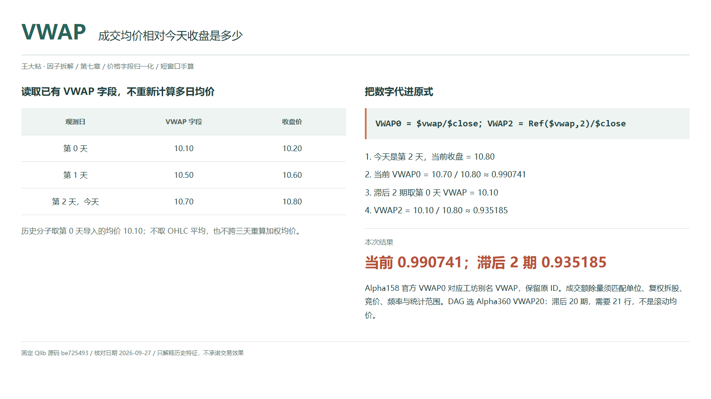
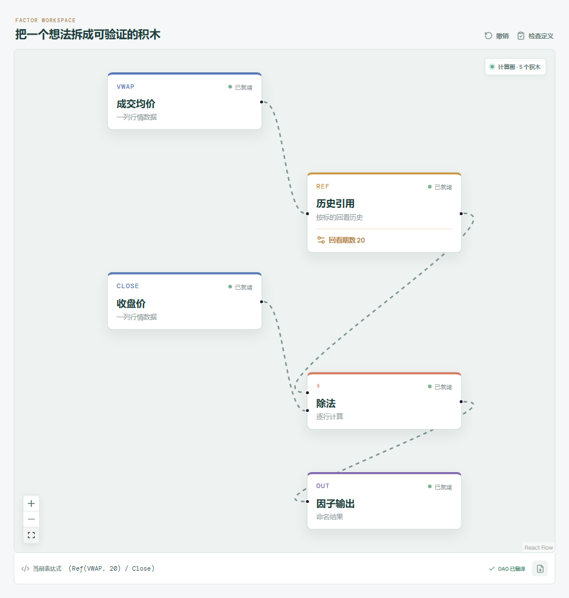

# VWAP：成交均价相对今天收盘是多少？

收盘在十块八，数据里的成交均价是十块七，这说明收盘略高于该字段记录的均价。但别急着把它叫成“所有人的持仓成本”：今天换手的成交与仍未卖出的持仓不是一回事。

Qlib Alpha158 默认官方名是 `VWAP0`；工坊使用别名 `VWAP`，保留 ID `qlib-alpha158-vwap`。Alpha360 的历史 VWAP 同样除以今天收盘，放在这篇一起理解。



## 它到底在算什么？

```text
Alpha158 VWAP0 / 工坊 VWAP = $vwap/$close
Alpha360 VWAPi = Ref($vwap,i)/$close，i=59,...,1
Alpha360 VWAP0 = $vwap/$close
```

| 观测日 | VWAP 字段 | 收盘价 |
| --- | ---: | ---: |
| 第 0 天 | 10.10 | 10.20 |
| 第 1 天 | 10.50 | 10.60 |
| 第 2 天，今天 | 10.70 | 10.80 |

```text
当前 VWAP0 = 10.70 / 10.80 ≈ 0.990741
滞后 VWAP2 = 10.10 / 10.80 ≈ 0.935185
```

价格有效且为正时，前者表示当前均价低于当前收盘；后者表示两期前均价低于今天收盘。它不是价格涨幅，也没有在这三天里重新求一次加权平均。

零滞后必须直接读字段。`Ref($vwap,0)` 在指定 Qlib 实现中取加载序列首值，不能拿来代表今天。

## 为什么有人会这样设计？

收盘只是最后的价格位置，成交均价则可以补充成交发生在什么价格水平的信息。除以相同的当前收盘，模型可以把这条字段序列与开、高、低、收放在一起比较。

但加载器只是引用导入的 `$vwap`，不会自动用开高低收求平均，更不会保证供应商已经按你期待的方式计算。先确认这列是什么，才谈它能解释什么。

## 它什么时候容易骗人？

**成交额除以成交量有前提。** 金额与数量单位必须匹配，例如元与股，不能把“手”直接当“股”；拆股和复权调整也要一致。集合竞价是否计入、日线或分钟频率、成交统计范围都应对齐，否则算出的均价不是同一口径。

**字段缺失不是零均价。** 零成交量时，成交额除成交量无法定义；供应商填充值不能照单全收。当前收盘缺失、为零或非正时比值无效，原价格分母没有 epsilon。

**历史项不是多日均价。** `VWAP20` 只取二十期前的字段值，需要 21 行定位，不是滚动二十日 VWAP。保留日历中的缺口并检查复权、跳空，别删行改变滞后含义。

全日均价和最终收盘只能在对应统计周期完成后使用，不能提前用于盘中信号。

## 在因子工坊里怎么拆？



选择 **Alpha360 VWAP20**，成交均价字段接历史引用，回看期数 20，输出接除法分子；今天收盘直连分母。这里直接使用已有均价字段，不额外插入 OHLC 平均节点。

改成回看 2 核对手算。看当前 `VWAP` 时移除引用，保留字段直接相除。

## 自己动手改一下

把第 0 天 VWAP 从 10.10 改为 10.20，`VWAP2` 变成 `10.20/10.80≈0.944444`，当前值不变。再把所有价格统一乘十，比例应不变；若只调整均价而不调整收盘，结果就会失真。这是一次口径检查，不是新的择时策略。

---

原始表达式来源：Microsoft Qlib Alpha158、Alpha360。源码核对日期：2026-09-27。

固定版本：`be725493eb1a6bbb42bf11b37aa7669f59610ff1`。

- [Alpha158 默认字段名称与直接商：loader.py](https://github.com/microsoft/qlib/blob/be725493eb1a6bbb42bf11b37aa7669f59610ff1/qlib/contrib/data/loader.py#L73-L133)
- [Alpha360 VWAP 字段引用：loader.py](https://github.com/microsoft/qlib/blob/be725493eb1a6bbb42bf11b37aa7669f59610ff1/qlib/contrib/data/loader.py#L47-L51)
- [Ref 的零参数与移位实现：ops.py](https://github.com/microsoft/qlib/blob/be725493eb1a6bbb42bf11b37aa7669f59610ff1/qlib/data/ops.py#L781-L824)

项目地址：[王大粘 · 因子工坊](https://github.com/superalp1985/-)

本文只讨论因子定义与研究方法，不构成投资建议。
