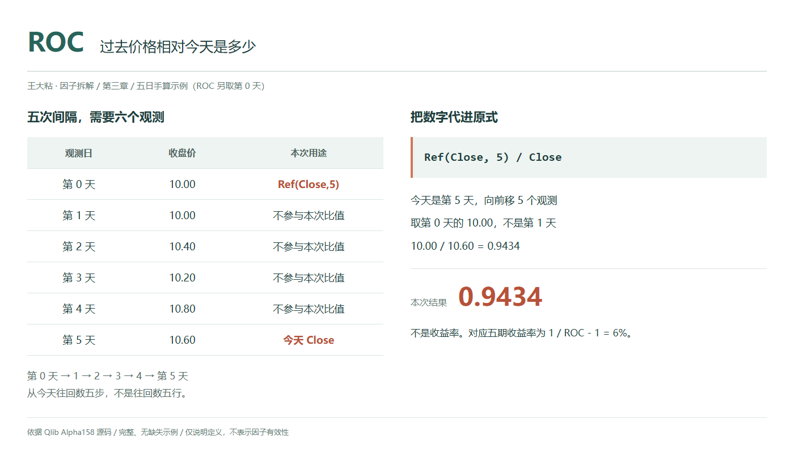
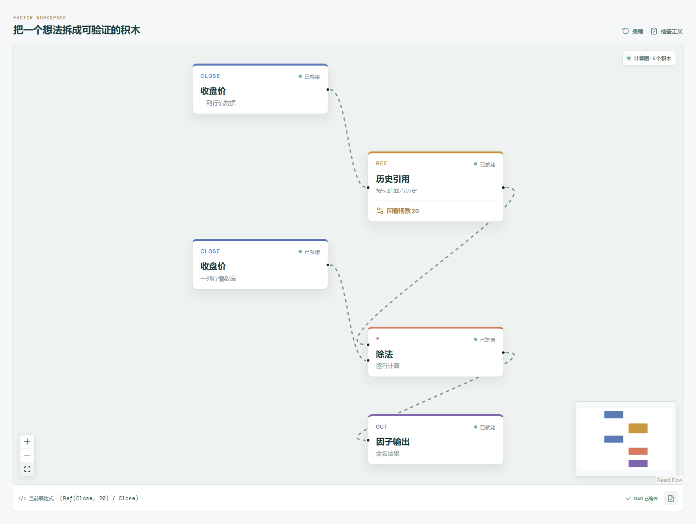

# ROC：过去价格相对今天是多少？

打开一张走势图，最自然的问题往往是：“和几天前相比，今天涨了多少？”

Qlib Alpha158 里的 ROC 也比较过去与现在，但它把除法的方向反了过来：不是今天除以过去，而是过去除以今天。名字看上去像熟悉的涨跌幅，结果却围绕 1 变化，而且上涨时数值反而变小。这里要先放下对名字的印象，认真看一遍分子和分母。

这篇只讲 ROC 这一家族。ROC5、ROC20、ROC60 的区别是回看期数，不是三种不同的计算原理。



## 它到底在算什么？

Qlib 的原始表达式是：

```text
ROC_n = Ref($close, n) / $close
```

`Ref($close, n)` 取同一标的往前数 n 个观测位置的收盘价，分母则是当前收盘价。下面都按已经对齐交易日的日线数据理解“天”，不是往日历上减 n 天。

先把手算数据摆出来。第 1 天到第 5 天是本章的五日样本；为了算 ROC5，必须再补出第 0 天：

| 观测日 | 收盘价 |
| --- | ---: |
| 第 0 天，额外补充 | 10.00 |
| 第 1 天 | 10.00 |
| 第 2 天 | 10.40 |
| 第 3 天 | 10.20 |
| 第 4 天 | 10.80 |
| 第 5 天，今天 | 10.60 |

站在第 5 天，向前引用五期，找到的是第 0 天，不是第 1 天。完整对齐的序列要覆盖六行，才能跨过五个观测间隔。

```text
ROC_5
= 第 0 天收盘 / 第 5 天收盘
= 10.00 / 10.60
≈ 0.943396
```

它的意思是：五期前的收盘价，相当于今天收盘价的约 94.34%。在价格为正的前提下，读数方向是：

- 小于 1：今天比五期前贵，期间价格上涨；
- 等于 1：两端价格相同；
- 大于 1：今天比五期前便宜，期间价格下跌。

那普通涨跌幅是多少？同一组端点算出来是 6%：

```text
普通区间收益率 r
= 今天收盘 / 五期前收盘 - 1
= 10.60 / 10.00 - 1
= 0.06

ROC_n = 1 / (1 + r)
r = 1 / ROC_n - 1
```

因此，不能把 `0.943396` 直接读成收益率，也不能拿 `1 - ROC_n` 冒充普通涨跌幅。后者在本例中约为 5.66%，它把价格差除以今天，而不是除以起点，分母不同，回答的问题也不同。

还有一个容易被例子遮住的地方：第 0 天和第 1 天恰好都是 10 元。如果误把第 1 天当起点，这一次仍会碰巧算对数值。但时间对齐已经错了，换一组数据就会暴露问题。

## 为什么有人会这样设计？

直接比较价格差，容易把价格水平和变化程度混在一起。10 元涨到 10.60 元，与 100 元涨到 106 元，差额相差十倍，端点比例却相同。用过去价格除以现价，保留的是相对变化信息。

它与普通区间收益率之间可以相互换算。在价格为正的范围内，收益越高，ROC 越小，所以它没有因为“倒着除”而失去端点涨跌的信息。但换算是非线性的，不能以为改个正负号就能得到同一个数；把它交给模型时，也不能默认它的数值尺度与收益率完全相同。

更重要的是，这个因子很克制。它只问起点和终点相差多少，不负责描述中途怎么走。从 10 元平稳走到 10.60 元，和先大涨再回到 10.60 元，可以得到同样的 ROC。它适合充当端点变化的描述，不能单独承担“走势是否平稳”的判断。

## 它什么时候容易骗人？

**第一，把回看五期误当成窗口里的五行。**

ROC 的 n 是位移长度。ROC20 需要今天以及二十期前的位置，完整序列跨度是 21 行。只有最近 20 行时，不能拿最早那一行勉强代替，也不能用零填出一个“看起来能运行”的历史价格。

**第二，起点一换，因子就可能跳，而今天并没有大涨大跌。**

滚动到下一天，分子也换成了下一个历史价格。如果旧起点恰好处在一次跳空附近，ROC 的明显变化可能来自分子的移动。看到曲线拐头，先分别看看两端发生了什么。

**第三，同样的端点，可能包着完全不同的风险。**

这条公式既不使用中途最高价、最低价，也不衡量中间波动。它不会告诉你这段路上经历过多大回撤，更不能把它等同于实际持仓收益；成交时点、成交价格与交易成本都没有进入表达式。

**第四，行情口径与数据时点必须对齐。**

起点和终点应采用一致的复权口径，不能一端用未复权价格，另一端用复权价格。缺失交易日也应按既定日历处理，随手删掉缺失行可能改变“往前二十期”的含义。

今天的最终收盘价在收盘后才完整可用。用它计算信号，却假设自己在更早时刻已经知道这个信号，会把未来信息带进研究。当前收盘缺失或为零时，比值也应视为无效，而不是继续解释。

## 在因子工坊里怎么拆？



画布示例采用 20 期回看，前面的五期数字只用于方便手算：

```text
收盘价 → 历史引用（回看期数 20） → 除法的分子
收盘价 ──────────────────────→ 除法的分母
除法 → 因子输出
```

两条输入读的是同一标的、同一价格口径的收盘价。历史引用节点先把上面一路移到二十期前，下面一路保留今天，再按“历史值除以当前值”连接。

这里不需要求均值，也不需要先把历史价格减去现价。Qlib 原式是 `Ref($close,20)/$close`；画布会显示等价的 `(Ref(Close, 20) / Close)`，字段命名不同，除法方向不变。再检查输入序列是否覆盖足够的回看历史。把回看期数临时改成 5，才能拿本文的六行数据核对 `0.943396`。

## 自己动手改一下

把它改成更习惯的普通区间收益率：

```text
$close / Ref($close, n) - 1
```

画布上交换除法的分子、分母，再接一个减去常数 1 的节点。原来的五期样本应该得到 `0.06`；若为了显示百分数再乘 100，显示值才是 `6`。

接着做一个小实验：只把第 3 天收盘从 10.20 改成 10.50，保持第 0 天和第 5 天不变。原 ROC 和改后的区间收益率都不会变化。这个“不变”很有用，它直接告诉你：这两条表达式都看端点，不看中途路径。

改完后给新表达式单独命名，别把普通收益率继续标成原版 ROC。研究时最容易出问题的，往往不是公式复杂，而是同一个名字下面悄悄换了口径。

---

原始表达式来源：Microsoft Qlib Alpha158。源码核对日期：2026-09-27。

固定版本：`be725493eb1a6bbb42bf11b37aa7669f59610ff1`。

- [Alpha158 的 ROC 表达式：loader.py](https://github.com/microsoft/qlib/blob/be725493eb1a6bbb42bf11b37aa7669f59610ff1/qlib/contrib/data/loader.py#L149-L153)
- [Ref 的移位与历史长度实现：ops.py](https://github.com/microsoft/qlib/blob/be725493eb1a6bbb42bf11b37aa7669f59610ff1/qlib/data/ops.py#L781-L824)

项目地址：[王大粘 · 因子工坊](https://github.com/superalp1985/-)

本文只讨论因子定义与研究方法，不构成投资建议。
