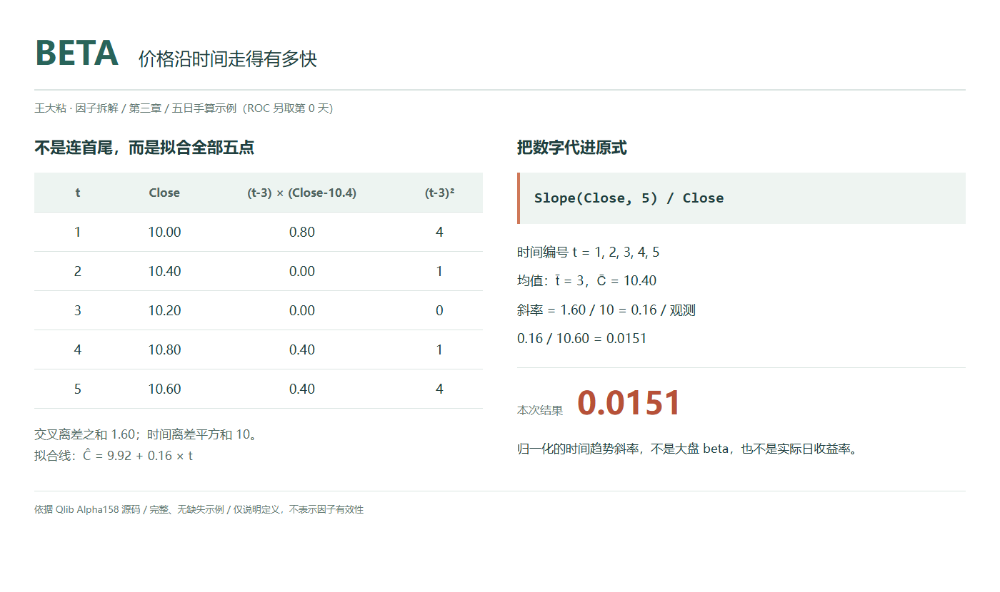
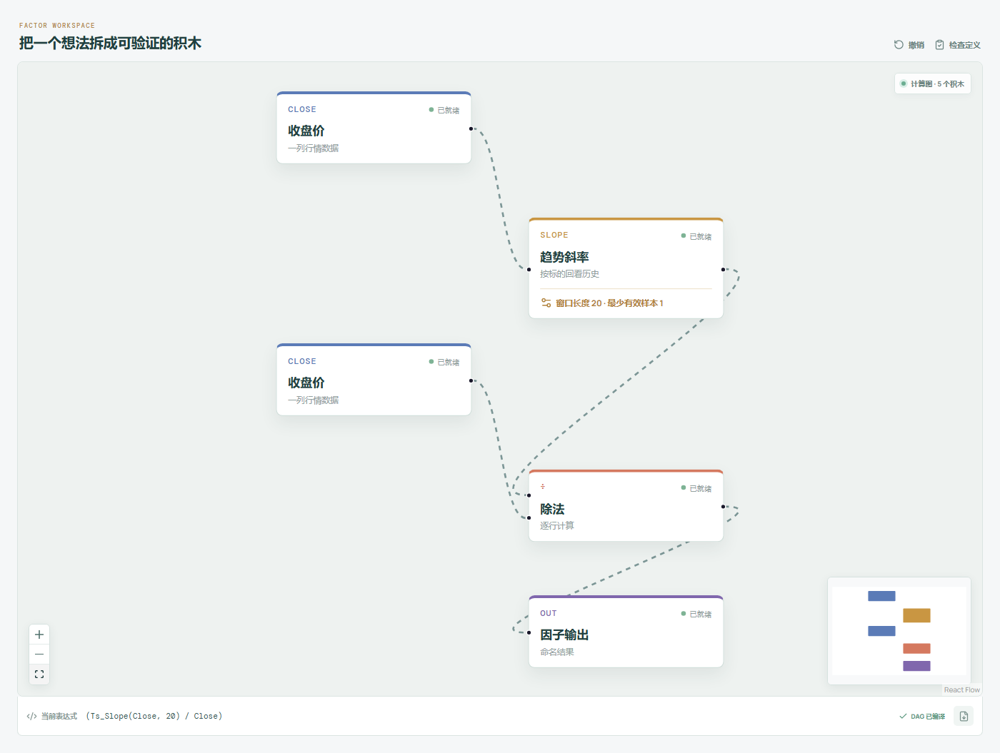

# BETA：价格沿时间走得有多快？

有的价格一路缓慢上移，有的价格先绕了一大圈，最后也停在差不多的位置。只比较开头和结尾，很难看出这段历史整体朝哪个方向倾斜。

Qlib Alpha158 的 BETA 会用窗口内的收盘价拟合一条直线，再把直线的斜率除以今天收盘价。它想描述的是：沿着观测顺序往前走，价格的线性趋势有多陡。

先澄清名字：这里的 BETA 不是股票对市场收益的敏感度，不需要输入指数收益率，也没有使用市场收益的协方差。它的横轴是时间顺序，纵轴是收盘价。



## 它到底在算什么？

原始表达式是：

```text
BETA_n = Slope($close, n) / $close
```

`Slope` 按从早到晚的顺序，把窗口里的观测编号为 1、2、3，直到 n，用普通最小二乘法拟合：

```text
拟合收盘价 = a + b × t
```

这里的 b 就是要取出的斜率。为了避免“回归”两个字把事情说得过于神秘，直接用五个收盘价算一次：

| 观测序号 t | 收盘价 C |
| --- | ---: |
| 1 | 10.00 |
| 2 | 10.40 |
| 3 | 10.20 |
| 4 | 10.80 |
| 5，今天 | 10.60 |

这一次只需要五行，不需要给窗口额外加第 0 天。五行对应五个拟合点，最早和最晚之间有四个观测间隔。

```text
t 的均值 = 3
C 的均值 = 10.40

b = Σ[(t - 3) × (C - 10.40)] / Σ[(t - 3)²]
```

把每一行对分子、分母的贡献展开：

| t | t - 3 | C - 10.40 | 两项乘积 | (t - 3)² |
| --- | ---: | ---: | ---: | ---: |
| 1 | -2 | -0.40 | 0.80 | 4 |
| 2 | -1 | 0.00 | 0.00 | 1 |
| 3 | 0 | -0.20 | 0.00 | 0 |
| 4 | 1 | 0.40 | 0.40 | 1 |
| 5 | 2 | 0.20 | 0.40 | 4 |
| 合计 |  |  | 1.60 | 10 |

于是：

```text
b = 1.60 / 10 = 0.16
a = 10.40 - 0.16 × 3 = 9.92

拟合收盘价 = 9.92 + 0.16 × t

BETA_5 = 0.16 / 10.60 ≈ 0.0150943
```

斜率 `0.16` 的意思是：拟合直线每向前一个观测，价格上升 0.16。再除以今天的 10.60，得到每个观测步长约为现价 1.51% 的线性变化尺度。

注意“拟合直线”这几个字。它不是说这五天每天都赚了 1.51%，也不是五日累计收益率。公式没有逐日计算收益，没有复利处理，更没有年化。把它直接乘 252 当成年化收益，已经离开了原表达式的含义。

手算从 1 开始编号只是为了方便。若改成 0 到 4，截距会变，斜率仍是 0.16；真正不能随意改的是先后顺序和观测间距。

## 为什么有人会这样设计？

它希望让窗口里的价格共同参与方向判断，而不是只拿两个端点说话。若较早的价格普遍偏低、较晚的价格普遍偏高，拟合出来的直线通常向上；反过来则向下。它把一段不完全平滑的走势，压缩成了一个带方向的数字。

再除以现价，是为了减少绝对价格尺度的影响。把本例的所有收盘价同时乘 10，斜率会从 0.16 变成 1.60，今天收盘会变成 106，二者之比保持不变。但这种尺度处理并没有让不同波动水平的股票拥有相同风险。

它也不是把每一步涨跌简单平均。较远离时间中心的点，对斜率更有影响。因此，“利用了整个窗口”不等于“对异常值天然稳健”，更不等于“已经识别出了可靠趋势”。一个数字可以概括方向，却不能包办对整段路径的评价。

## 它什么时候容易骗人？

**第一，斜率接近零，不代表过程平静。**

一段先涨后跌的走势，可能拟合出接近平的直线；大幅来回震荡也可能如此。BETA 小，只能说明这条线不陡，不能顺手得出“风险小”的结论。相反，斜率为正，也不保证拟合线贴近每一天的真实价格。

**第二，窗口边缘的异常点可能拉动整条线。**

上面表格已经给了线索：最前、最后的时间偏差绝对值更大。一个异常收盘若出现在窗口边缘，可能对斜率产生明显影响。检查异常行情、除权除息与复权口径，比给这个数套上“趋势强度”的名字更重要。

**第三，观测步长不是自然日，也不是自动统一的时间单位。**

日线里的一个步长，是序列中的一个日线位置；换成分钟线，含义也随之改变。不要混合不同频率后直接比较。缺失位置若被删掉，时间轴会被压缩；若保留缺失值，有效拟合点又会减少，这些处理需要在研究前约定清楚。

**第四，分母与今天这个拟合点都还在变化。**

今天收盘不仅是最后的归一化分母，也参与了斜率估计。因此，这不是昨天以前拟合好的模型对今天发出的预测。最终读数要等今天收盘可用，不能拿它解释同一天更早已经执行的交易。

实际复现时还应检查历史是否充分。一个名叫 BETA20 的结果，不代表底层一定等齐 20 个有效收盘才输出；不足窗口或存在缺失时，可能出现用较少有效点得到的数值。本文手算与 20 日画布的解释都以完整窗口为前提，研究样本应明确预热要求，并排除无效分母。

## 在因子工坊里怎么拆？



```text
收盘价 → 趋势斜率（窗口 20） → 除法的分子
收盘价 ──────────────────→ 除法的分母
除法 → 因子输出
```

趋势斜率节点内部负责按时间顺序拟合直线，输出的是价格斜率；除法节点再把它转成相对今天收盘价的尺度。画布不需要市场指数输入，也不需要先把收盘价变成收益率。

Qlib 原式为 `Slope($close,20)/$close`，画布显示等价的 `(Ts_Slope(Close, 20) / Close)`。`Ts_` 是工坊对时序积木的命名前缀，不代表换了算法。截图展示 20 日窗口；核对本文五行数据时，将窗口改成 5，先看中间斜率是否为 `0.16`，再看最终输出是否约为 `0.0150943`。分开检查这两步，更容易发现顺序颠倒或分母接错。

## 自己动手改一下

先只改归一化参照，把今天收盘换成同一窗口的平均收盘：

```text
Slope($close, n) / Mean($close, n)
```

画布上保留趋势斜率一支，在原来直接通往分母的收盘价后接入时序均值，并让两个窗口长度相同。五日样本会得到：

```text
0.16 / 10.40 ≈ 0.0153846
```

分子没有变化，变的是“用哪个价格水平衡量这条斜率”。新式以窗口均价为参照，仍然不是普通收益率，也不是市场 beta。把它和原式并排看，比单纯换几个窗口更容易理解归一化这一步到底做了什么。

再做一个不改公式的观察：将五个收盘价倒序排列。原始斜率会从正 0.16 变成负 0.16，但归一化后的绝对值不必保持相同，因为倒序之后“今天收盘”也换了。这个差别提醒我们，分子和分母必须一起看。

---

原始表达式来源：Microsoft Qlib Alpha158。源码核对日期：2026-09-27。

固定版本：`be725493eb1a6bbb42bf11b37aa7669f59610ff1`。

- [Alpha158 的 BETA 表达式：loader.py](https://github.com/microsoft/qlib/blob/be725493eb1a6bbb42bf11b37aa7669f59610ff1/qlib/contrib/data/loader.py#L163-L167)
- [Slope 的观测序号定义与调用：ops.py](https://github.com/microsoft/qlib/blob/be725493eb1a6bbb42bf11b37aa7669f59610ff1/qlib/data/ops.py#L1221-L1254)
- [滚动最小二乘斜率的实际计算：rolling.pyx](https://github.com/microsoft/qlib/blob/be725493eb1a6bbb42bf11b37aa7669f59610ff1/qlib/data/_libs/rolling.pyx#L49-L88)

项目地址：[王大粘 · 因子工坊](https://github.com/superalp1985/-)

本文只讨论因子定义与研究方法，不构成投资建议。
