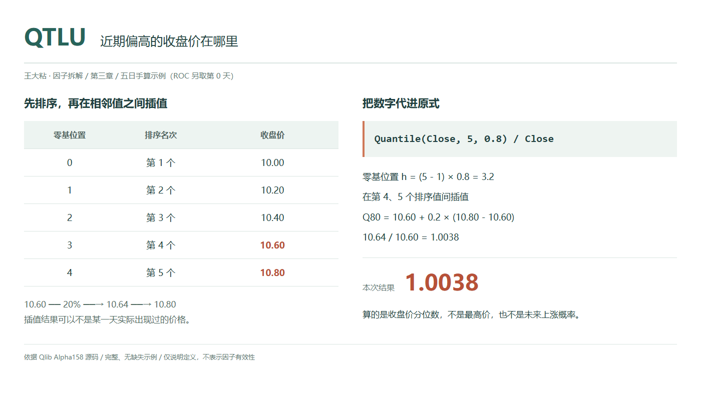
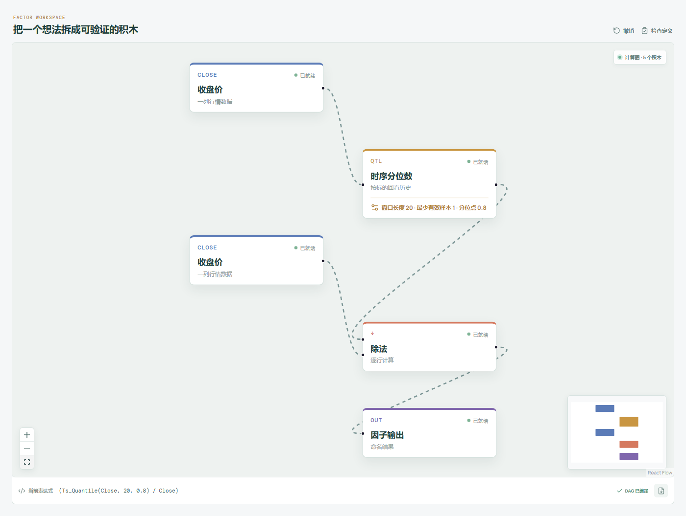

# QTLU：近期偏高的收盘价在哪里？

谈到近期高位，很容易把目光放在那根最高的针尖上。但盘中冲到过一次的价格，未必能代表这一段时间里偏高的收盘水平。

Qlib Alpha158 的 QTLU 换了一个观察对象：先只拿收盘价，从低到高排好，找到 80% 分位数，再除以今天收盘价。它不是在寻找最高的那一天，也不是直接输出今天排第几，而是在给出一个偏高的价格参照。

QTLU5、QTLU20 等属于同一家族，区别是纳入多长的历史。分位点在原版中都是 0.8。



## 它到底在算什么？

原始表达式是：

```text
QTLU_n = Quantile($close, n, 0.8) / $close
```

这里的窗口包含今天。为了看清楚输入字段，把五日样本的高、低、收一起列出：

| 观测日 | 最高价 | 最低价 | 收盘价 |
| --- | ---: | ---: | ---: |
| 第 1 天 | 10.20 | 9.80 | 10.00 |
| 第 2 天 | 10.60 | 10.00 | 10.40 |
| 第 3 天 | 10.50 | 10.00 | 10.20 |
| 第 4 天 | 11.00 | 10.40 | 10.80 |
| 第 5 天，今天 | 10.90 | 10.30 | 10.60 |

**参与分位数计算的只有最后一列。** 最高价 11.00 不会被拿来当上界，最低价也没有进入表达式。将五个收盘价升序排列：

```text
零起始下标： 0      1      2      3      4
收盘价：    10.00  10.20  10.40  10.60  10.80
```

Qlib 的这个算子调用 pandas 的滚动分位数，采用默认的线性插值。若有效样本数为 m，分位点为 q，先算零起始位置：

```text
h = (m - 1) × q
```

本例 `m = 5`、`q = 0.8`，所以 `h = 3.2`。它落在下标 3 与 4 之间，也就是 10.60 与 10.80 之间，从较小的一个往上走 20%：

```text
80% 分位数
= 10.60 + 0.2 × (10.80 - 10.60)
= 10.64

QTLU_5
= 10.64 / 10.60
≈ 1.0037736
```

10.64 没有作为任何一天的收盘价出现过，这并不是错误。线性插值允许分位数落在两个实际观测之间。

结果略大于 1，表示这个偏高的收盘参照略高于今天，差额约为今天收盘的 0.3774%。在收盘价为正的前提下，大于 1 表示今天在该参照之下，小于 1 表示今天已在该参照之上。

这里尤其不要把 80% 理解成“最高价乘 0.8”，也不要理解成“未来有 80% 的概率低于 10.64”。它是历史样本的一个插值位置，不是未来价格概率。本例恰好有四个收盘价低于 10.64，占五个观测的 80%；但换了样本数量或出现并列价格，就不保证仍有恰好 80% 的观测低于分位数。

## 为什么有人会这样设计？

“近期比较高的收盘水平”与“近期最高价”不是同一个问题。前者希望从收盘分布中找一个上侧参照，不把定义直接交给唯一的极值；后者则专门关心极端位置。

除以今天收盘后，10 元股票和 100 元股票可以用相同形式表达相对距离。若两只股票的整个价格序列只是相差一个固定倍数，QTLU 会相同。它描述的是现价与自身历史上侧分位之间的比例关系，不是股票贵不贵的基本面判断。

不过，不选最大值不等于彻底摆脱异常值。本例的 80% 分位数就含有最高收盘价的 20% 权重，最高收盘发生变化，10.64 也会跟着变。所谓“上侧参照”，依然是由有限样本和具体插值规则共同决定的，不能把它宣传成一个自动过滤噪声的万能数。

## 它什么时候容易骗人？

**第一，把历史分位线当成已经验证的压力位。**

公式不知道哪一个价位有多少卖单，也不知道市场参与者的持仓成本。今天站上 80% 分位，只能说明相对这段收盘分布的位置变了，不能据此认定突破成功，更不能推出接下来必涨或必跌。

**第二，排序会拿掉先后顺序。**

只要窗口里的收盘价格集合相同，分位数就相同。若同时保持今天收盘不变，只重排前几天，最终 QTLU 也不会变化。先涨后跌和先跌后涨可能被压成同一个数，因此它不能替你识别趋势方向。

**第三，小样本、并列价格和缺失值都会影响读法。**

五个数求 80% 分位，是一次明确的线性插值，不是某个近似口诀。大量相同收盘会让不同分位点重合；缺失值会减少有效样本数 m。

尤其要留意，Qlib 的分位数实现设置了 `min_periods=1`，历史不足 n 行时也可能输出数值。屏幕上出现 QTLU20，不代表已经观察了完整 20 日。做可比较的研究，应明确预热和有效数据要求；复现本文则应使用五个完整收盘，不要把部分窗口结果当成同一个例子。

**第四，今天也在改变那条参照线。**

原式把今天纳入窗口，并不是拿昨天已经固定好的 80% 分位去评价今天。今天收盘既影响分子，也充当分母，最终结果要等收盘数据可用。若要研究“对昨日参照的突破”，需要另外定义表达式。

所有输入还应使用一致的复权口径。公司行为或错误行情造成的价格断层会改变排序与距离；当前收盘缺失或为零时，也不能把结果继续解释为有效位置。

## 在因子工坊里怎么拆？



```text
收盘价 → 时序分位数（窗口 20，分位点 0.8） → 除法的分子
收盘价 ──────────────────────────────→ 除法的分母
除法 → 因子输出
```

截图使用 20 日窗口。时序分位数节点要同时确认两个参数：窗口为 20，分位点为 `0.8`，不是 `80`。Qlib 原式为 `Quantile($close,20,0.8)/$close`；工坊采用自己的时序积木命名，显示等价的 `(Ts_Quantile(Close, 20, 0.8) / Close)`。

手算验证时将窗口改成 5，查看分位数节点是否输出 `10.64`，最终结果是否约为 `1.0037736`。如果上游接成最高价，或者换成“直接取第几个数”的非线性插值实现，就不再是本文核对的 Qlib 定义。

## 自己动手改一下

做一个很小但含义清楚的变化：保留 80% 分位参照，改为观察今天相对它的有符号偏离：

```text
$close / Quantile($close, n, 0.8) - 1
```

只需交换除法的两路输入，再减去常数 1。五日样本会得到：

```text
10.60 / 10.64 - 1 ≈ -0.0037594
```

负值表示今天仍在参照下方，正值表示位于参照上方。它不是简单的 `1 - QTLU_n`，因为分母已经从今天收盘换成分位价格。

然后把分位点临时从 0.8 调到 0.9，其他条件不动。用同一条线性插值规则，参照会从 10.64 变成 10.72。这个实验不是在挑一个“更灵”的参数，而是在看你究竟想把多靠上的历史价格当作参照。参数一改，表达式的定义也改了，应另行命名和检验。

---

原始表达式来源：Microsoft Qlib Alpha158。源码核对日期：2026-09-27。

Qlib 固定版本：`be725493eb1a6bbb42bf11b37aa7669f59610ff1`。另以 pandas 2.2.3 的固定提交核对默认插值规则，不代表指定 Qlib 环境必须使用该 pandas 版本。

- [Alpha158 的 QTLU 表达式：loader.py](https://github.com/microsoft/qlib/blob/be725493eb1a6bbb42bf11b37aa7669f59610ff1/qlib/contrib/data/loader.py#L184-L188)
- [Quantile 的滚动调用与最小样本设置：ops.py](https://github.com/microsoft/qlib/blob/be725493eb1a6bbb42bf11b37aa7669f59610ff1/qlib/data/ops.py#L1047-L1076)
- [pandas 默认采用 linear 插值：rolling.py](https://github.com/pandas-dev/pandas/blob/0691c5cf90477d3503834d983f69350f250a6ff7/pandas/core/window/rolling.py#L1715-L1732)
- [零起始位置与线性插值公式：aggregations.pyx](https://github.com/pandas-dev/pandas/blob/0691c5cf90477d3503834d983f69350f250a6ff7/pandas/_libs/window/aggregations.pyx#L1225-L1242)

项目地址：[王大粘 · 因子工坊](https://github.com/superalp1985/-)

本文只讨论因子定义与研究方法，不构成投资建议。
