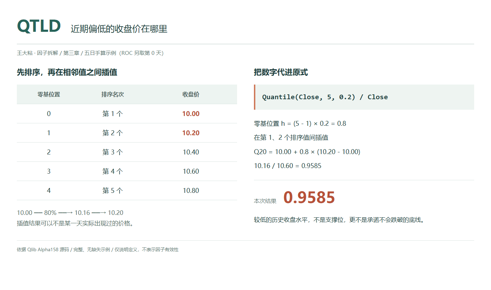
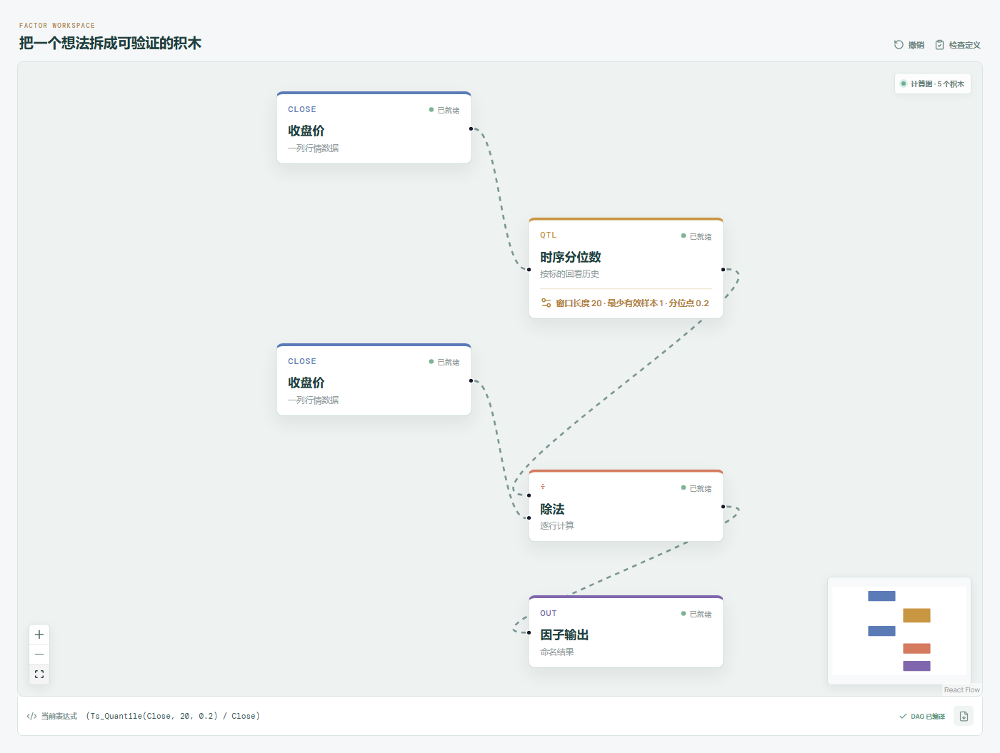

# QTLD：近期偏低的收盘价在哪里？

“已经跌到低位了”这句话，常常把几件不同的事揉在一起：离近期最低价很近、低于多数收盘价，或者只是比昨天便宜。

Qlib Alpha158 的 QTLD 只选择其中一个可计算的参照：近期收盘价的 20% 分位数。它先找出一个偏低的收盘水平，再看这个水平相当于今天价格的多少。它不负责认定底部，也不会因为用了一个字母 D，就自动变成下跌风险指标。

这篇讲的是 QTLD 家族的共同定义，5 日和 20 日只是观察尺度不同。



## 它到底在算什么？

原始表达式是：

```text
QTLD_n = Quantile($close, n, 0.2) / $close
```

分位点固定为 `0.2`，输入仍是收盘价，而不是最低价。用包含今天的五行数据说明：

| 观测日 | 最高价 | 最低价 | 收盘价 |
| --- | ---: | ---: | ---: |
| 第 1 天 | 10.20 | 9.80 | 10.00 |
| 第 2 天 | 10.60 | 10.00 | 10.40 |
| 第 3 天 | 10.50 | 10.00 | 10.20 |
| 第 4 天 | 11.00 | 10.40 | 10.80 |
| 第 5 天，今天 | 10.90 | 10.30 | 10.60 |

表中的 9.80 是一个盘中最低价，却不会参与 QTLD。真正被拿出来排序的是：

```text
零起始下标： 0      1      2      3      4
收盘价：    10.00  10.20  10.40  10.60  10.80
```

Qlib 调用 pandas 的滚动分位数，默认采用线性插值。有效样本数为 m、分位点为 q 时，零起始位置是：

```text
h = (m - 1) × q
  = (5 - 1) × 0.2
  = 0.8
```

位置 0.8 落在下标 0 和 1 之间。从 10.00 向 10.20 走 80% 的距离，而不是随意选最小值或者“第二小的数”：

```text
20% 分位数
= 10.00 + 0.8 × (10.20 - 10.00)
= 10.16

QTLD_5
= 10.16 / 10.60
≈ 0.9584906
```

`0.9584906` 表示近期偏低的这个收盘参照，相当于今天收盘的约 95.85%。它不是“今天处在 95.85% 的排名”，也不是“价格已经跌了 95.85%”。

在价格为正的前提下，小于 1 表示今天高于 20% 分位参照，大于 1 表示今天低于这个参照，等于 1 表示两者重合。读数越小，只能说明分位价格与今天的比值越小；如果分位价格也在移动，不能只凭这个数判定今天涨了多少。

还要留意百分比的分母。本例中，参照比今天低约 4.15%，对应 `1 - 10.16 / 10.60`；今天比分位参照高约 4.33%，对应 `10.60 / 10.16 - 1`。两句话方向相反、分母不同，不能把数字混着使用。

## 为什么有人会这样设计？

想观察近期的低侧价格，不一定要盯着最极端的一次盘中下探。20% 分位数选择了收盘分布里的一个较低位置，试图描述一段历史中的低侧水平，而不是把最低价出现的那一瞬间当成全部参照。

这并不表示 20% 这个位置有什么天然的交易意义。它只是一个明确、可复现的统计选择。在完整样本中，同一套排序和插值规则会给出同样的结果，便于研究者比较窗口变化、检验假设，而不是凭图形印象随口说“差不多到底了”。

除以今天收盘，是把价格参照转换成比例。如果所有价格同时乘上一个正的固定倍数，这个比例不变。但无量纲不等于可直接作价值比较：两个标的具有相同 QTLD，经营状况、波动与交易条件仍然可以完全不同。

此外，它只描述历史价格分布的下侧，不是收益分布的下尾。价格分位数不能直接当作未来亏损分位数，更不能直接读成某种置信水平下的风险价值。

## 它什么时候容易骗人？

**第一，偏低的历史价格不是承诺兑现的支撑。**

在持续下跌的窗口里，今天完全可能跌到 20% 分位数下面，使 QTLD 大于 1。这个读数不会阻止价格继续下跌，也不表示未来有 80% 的概率反弹。历史插值位置和未来涨跌概率之间，没有这样一条自动成立的等号。

**第二，分位数移动，不一定是今天移动。**

旧的低收盘滚出窗口，20% 分位数可能上移，即使今天收盘变化不大，QTLD 也会改变。若只盯着最终比值，容易把参照线的变化误读成当前价格的变化。把分位数与现价分别画出来，才能看见是谁在动。

**第三，低分位不是对异常值免疫。**

本例的 10.16 由 10.00 和 10.20 插值得来，最低收盘的权重仍为 20%。短窗口里，一个错误低价可能影响结果；反复出现的相同收盘又会让低分位、其他分位甚至现价重合。QTLD 接近 1，既可能是靠近低侧参照，也可能只是整个窗口几乎没有变化。

**第四，窗口长度和有效样本数不是一回事。**

Qlib 的 Quantile 使用 `min_periods=1`。如果历史尚未凑满 20 行，或其中有缺失值，QTLD20 仍可能输出基于更少有效数据的分位数。那不是一个完整 20 日窗口的统计量，不能只凭因子名称就认为口径一致。

本文样本和画布解释都假设有足够、完整的历史收盘。研究中应明确预热与缺失处理，统一复权口径，并将当前收盘缺失或为零的情况标记为无效。原式还包括今天收盘，所以只能在这一价格可用之后形成完整信号，不能倒用到当天更早的决策。

## 在因子工坊里怎么拆？



```text
收盘价 → 时序分位数（窗口 20，分位点 0.2） → 除法的分子
收盘价 ──────────────────────────────→ 除法的分母
除法 → 因子输出
```

画布示例仍采用 20 日窗口。要检查的重点是输入字段和分位参数：上游是收盘价，分位点是 `0.2`。Qlib 原式为 `Quantile($close,20,0.2)/$close`；画布显示等价的 `(Ts_Quantile(Close, 20, 0.2) / Close)`，`Ts_` 只是工坊的时序积木前缀。

把时序分位数节点的窗口临时改成 5，便能用本文五行数据检查两个结果：中间节点为 `10.16`，最终输出约为 `0.9584906`。如果中间节点读出 9.80，说明你很可能做成了最低价极值，而不是收盘价分位数。

分位点从 0.2 改成 0.8，可以切换到上侧参照，但不要因此把两条线叫成天然的交易通道。它们首先只是历史收盘分布的两个统计位置。

## 自己动手改一下

这一次不改分位点，而是把参照线冻结在昨天，观察今天相对于“昨天已经知道的低侧水平”处于哪里：

```text
Ref(Quantile($close, n, 0.2), 1) / $close
```

在画布的时序分位数后面，接一个回看期数为 1 的历史引用节点，再送入除法的分子。对于完整窗口，这样分子使用的是从今天往前第 n 期到昨天的 n 个收盘，不再让今天参与分位线计算。

这是一个新表达式，不能继续拿原 QTLD 的数值作为答案。如果 n 为 5，本文主表只有第 1 天至第 5 天五行，还缺少更早的第 0 天。补用[本章 ROC 示例](01-ROC-过去价格相对今天是多少.md)的第 0 天收盘 10.00，昨天窗口的五个收盘便是 `10.00、10.00、10.40、10.20、10.80`，20% 分位数为 10.00，今天的改式结果为 `10.00 / 10.60 ≈ 0.943396`。先补足历史，不能把四行悄悄当成五行。

比较原式与改式，可以看见“今天推动了参照线多少”。不过，改式的分母仍是今天收盘，所以也要等今天收盘可用，不能因为分子来自昨天，就声称整个信号在今天开盘前已经确定。

---

原始表达式来源：Microsoft Qlib Alpha158。源码核对日期：2026-09-27。

Qlib 固定版本：`be725493eb1a6bbb42bf11b37aa7669f59610ff1`。另以 pandas 2.2.3 的固定提交核对默认插值规则，不代表指定 Qlib 环境必须使用该 pandas 版本。

- [Alpha158 的 QTLD 表达式：loader.py](https://github.com/microsoft/qlib/blob/be725493eb1a6bbb42bf11b37aa7669f59610ff1/qlib/contrib/data/loader.py#L189-L192)
- [Quantile 的滚动调用与最小样本设置：ops.py](https://github.com/microsoft/qlib/blob/be725493eb1a6bbb42bf11b37aa7669f59610ff1/qlib/data/ops.py#L1047-L1076)
- [Ref 的历史移位实现：ops.py](https://github.com/microsoft/qlib/blob/be725493eb1a6bbb42bf11b37aa7669f59610ff1/qlib/data/ops.py#L781-L824)
- [pandas 默认采用 linear 插值：rolling.py](https://github.com/pandas-dev/pandas/blob/0691c5cf90477d3503834d983f69350f250a6ff7/pandas/core/window/rolling.py#L1715-L1732)
- [零起始位置与线性插值公式：aggregations.pyx](https://github.com/pandas-dev/pandas/blob/0691c5cf90477d3503834d983f69350f250a6ff7/pandas/_libs/window/aggregations.pyx#L1225-L1242)

项目地址：[王大粘 · 因子工坊](https://github.com/superalp1985/-)

本文只讨论因子定义与研究方法，不构成投资建议。
