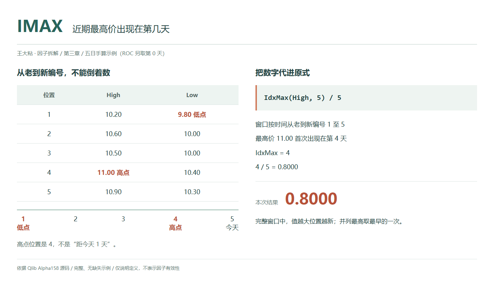
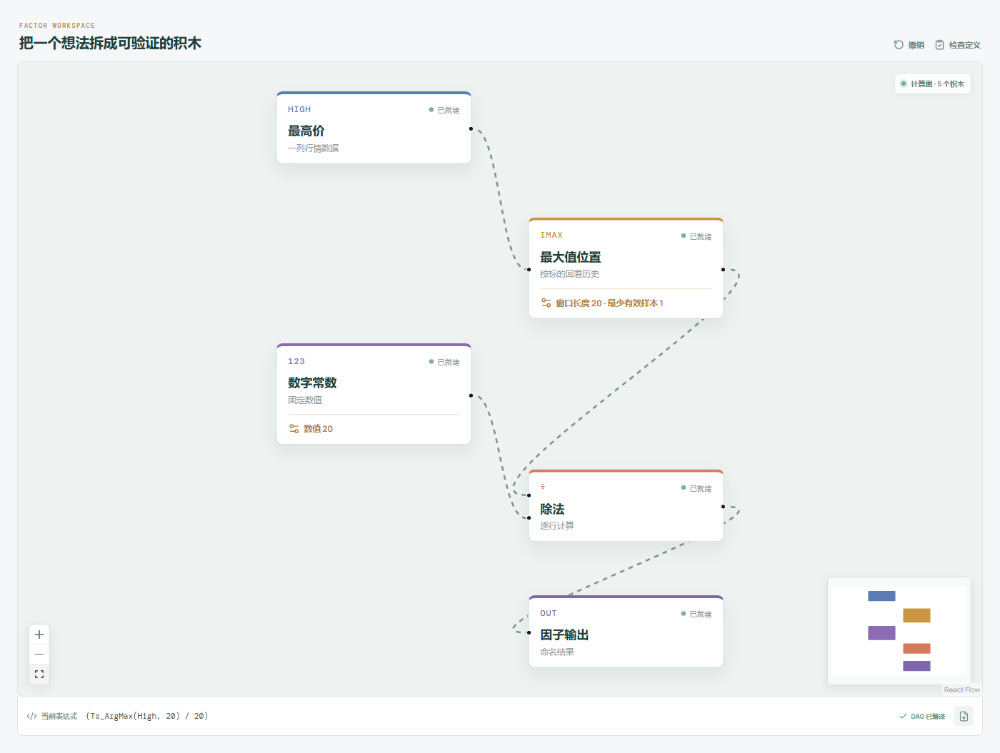

# IMAX：近期最高价出现在第几天？

同样是近期最高价，出现在窗口开头，还是刚刚出现在最后一天，描述的是两件不同的事。

IMAX 不问高点有多高，只问：把最近这段历史从旧到新排好，最高价第一次出现在第几个位置？



## 它到底在算什么？

Qlib Alpha158 的原式是：

```text
IMAX_n = IdxMax($high, n) / n
```

这里输入的是每天的最高价 `High`，不是收盘价，也不是最高价的数值排名。`IdxMax` 返回最高价所在的观测编号。

先约定方向：窗口按时间从旧到新排列，满窗口的编号是 `1, 2, ..., n`。最早一条是 1，最新一条是 n。题目里的“第几天”指观测位置，不是自然日间隔；数据中缺少某天记录时，不能自行补算一天。

沿用本章五条示例日线，最后一条视为今天：

| 观测编号（从旧到新） | 收盘价 | 最高价 | 最低价 |
| --- | --- | --- | --- |
| 1 | 10.00 | 10.20 | 9.80 |
| 2 | 10.40 | 10.60 | 10.00 |
| 3 | 10.20 | 10.50 | 10.00 |
| 4 | 10.80 | 11.00 | 10.40 |
| 5 | 10.60 | 10.90 | 10.30 |

最高价 11.00 在第 4 条：

```text
IdxMax($high, 5) = 4
IMAX_5 = 4 / 5 = 0.80
```

0.80 表示所选高点在窗口靠后的第 4 个位置。它不是涨幅 80%，也不是“高点距今 4 天”。

在数据有效、窗口已满时，取值范围是 `[1/n, 1]`，不是从 0 开始。数值越大，选中的高点越靠近窗口末尾；等于 1，表示所选高点在最新一条。

## 为什么有人会这样设计？

价格高度和发生时间是两种信息。

把窗口内的价格整体乘以同一个正数，高点出现的位置不会变，IMAX 也不会变。它把价格尺度暂时放到一边，留下高点在这段历史中的时间位置。

除以窗口长度以后，5 期和 20 期都能写成无单位的位置比例。但相同的比例不代表相同的观测间隔，更不代表后续会继续创新高。

## 它什么时候容易骗人？

**第一，并列最高价取最早一次，不取最近一次。**

原实现对按时间排列的数组执行 `np.argmax() + 1`。多个位置同为最高价时，选第一次出现的位置。今天再次触及旧高点，IMAX 不一定变成 1。

**第二，旧高点离开窗口，数值也会跳。**

窗口向前滚动，保留下来的旧高点编号会减小；等它移出窗口，算子会重新选出剩余记录里的最高价。IMAX 突然变大，不等于今天创出了此前那个高点。

**第三，历史不足时，分母仍然是 n。**

上述数据如果只是某标的现有的 5 条记录，而窗口设为 20，编号仍从实际可用历史的最早一条开始，高点编号仍是 4：

```text
IMAX_20 = 4 / 20 = 0.20
```

这时高点其实只在最新记录之前 1 个观测，不能照搬满窗口的“越小就越久远”解释。原算子使用 `min_periods=1`，不保证等历史满 20 条才输出。

**第四，它不包含幅度，脏数据却能改变位置。**

高点比其余价格高一点还是高很多，只要位置不变，IMAX 就一样。异常尖峰、未统一的复权口径，都可能改变被选中的记录。

还要特别留意缺失值：在仍有有效观测、但混入 `NaN` 的窗口中，原实现的 `np.argmax` 会选到第一个 `NaN` 的位置，并不会自动跳过它去找真实高点；全缺失窗口的滚动结果则为空。应先检查并处理数据质量，不能把缺失位置解释成高点，也不要为凑满窗口补造价格或交易记录。

## 在因子工坊里怎么拆？



```text
最高价 → 最大值位置（窗口 20） → 除法（左值） → 因子输出
数字常数 20 ─────────────────→ 除法（右值）
```

“最大值位置”先输出从 1 开始的原始编号，除法节点再除以 20。别把位置节点换成“时序最大值”，后者输出的是价格，不是发生位置。

窗口参数和除数必须一起改。要对齐上述 Qlib 源码，最少有效样本设为 1；设为 20、让开头不足窗口的结果留空，是额外的数据约束。

## 自己动手改一下

只看干净、已满的窗口时，可以把方向反过来，表达高点距离最新记录有多少个观测间隔：

```text
高点距今的观测间隔 / n = 1 - IMAX_n
```

本例 `1 - 0.80 = 0.20`，对应 `1 / 5`，即高点在前 1 个观测。这里的高点仍遵守“并列取最早一次”。

这个等式只适用于满窗口。若实际只有 m 条记录，正确的归一化间隔是 `(m - IdxMax($high, n)) / n`；不能直接用 `1 - IMAX_n`，也不能把它称为自然日天数。

---

原始表达式与算子来源：Microsoft Qlib，固定提交 `be725493eb1a6bbb42bf11b37aa7669f59610ff1`。

- [Alpha158 表达式：loader.py](https://github.com/microsoft/qlib/blob/be725493eb1a6bbb42bf11b37aa7669f59610ff1/qlib/contrib/data/loader.py#L202-L208)
- [IdxMax 实现：ops.py](https://github.com/microsoft/qlib/blob/be725493eb1a6bbb42bf11b37aa7669f59610ff1/qlib/data/ops.py#L971-L996)

源码核对日期：2026-09-27。`loader.py` 的英文注释将它描述成距当前的天数，本文以实际表达式及 `ops.py` 的编号实现为准。

本文只讨论因子定义与研究方法，不构成投资建议。
