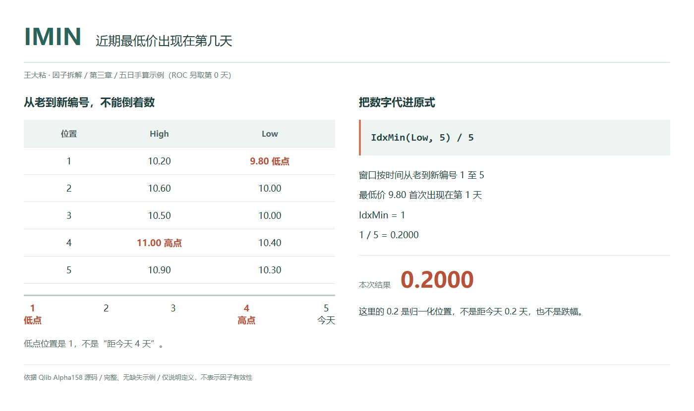
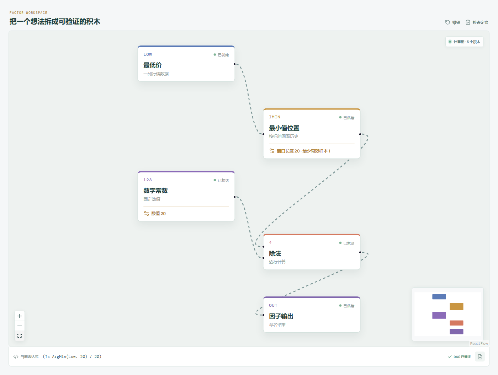

# IMIN：近期最低价出现在第几天？

看见一个近期低点，我们往往还会追问：它是这段历史一开始就出现了，还是刚刚出现？

IMIN 记录的就是这个位置。它不衡量低点有多低，也不衡量今天离低点反弹了多少。



## 它到底在算什么？

Qlib Alpha158 的原式是：

```text
IMIN_n = IdxMin($low, n) / n
```

输入是每天的最低价 `Low`，不是收盘价。`IdxMin` 找到窗口内最低价，返回它第一次出现的观测编号，再除以窗口长度。

编号按时间从旧到新排。满窗口中，最早一条编号为 1，最新一条编号为 n。“第几天”是这组观测里的第几个位置，不是两个日期之间隔了多少个自然日。

沿用本章五条示例日线，最后一条视为今天：

| 观测编号（从旧到新） | 收盘价 | 最高价 | 最低价 |
| --- | --- | --- | --- |
| 1 | 10.00 | 10.20 | 9.80 |
| 2 | 10.40 | 10.60 | 10.00 |
| 3 | 10.20 | 10.50 | 10.00 |
| 4 | 10.80 | 11.00 | 10.40 |
| 5 | 10.60 | 10.90 | 10.30 |

最低价 9.80 在第 1 条：

```text
IdxMin($low, 5) = 1
IMIN_5 = 1 / 5 = 0.20
```

0.20 表示选中的低点在窗口第 1 个位置，不是“距离现在 1 天”。它与最新一条之间实际相隔 4 个观测间隔。

在数据有效、窗口已满时，取值范围是 `[1/n, 1]`。数值越大，选中的低点越靠后；等于 1 表示所选低点出现在最新一条。这里没有“数值越小，低点越新”的倒序规则。

## 为什么有人会这样设计？

只看最低价是多少，会漏掉它发生在什么时候。

两段历史即使有相同的最低价，只要低点出现的位置不同，IMIN 就可能不同。反过来，价格水平不同的两段历史，只要最低价都在同一个相对位置，IMIN 也可以相同。

所以它适合描述低点在窗口中的时间位置。除以 n 是统一尺度，不是把时间位置变成价格便宜程度，更不能据此判断是否已经见底。

## 它什么时候容易骗人？

**第一，并列最低价不认“最近一次”。**

原实现使用 `np.argmin() + 1`，并列时取按时间排列后的第一次出现。再次触及同一个低点，不一定把 IMIN 推到 1。

这也意味着，低点日期可能只是被并列规则选出来的那一次，不能自动称为“最后一次探底”。

**第二，旧低点移出窗口，会改变答案。**

即使今天没有刷新历史低价，原来的低点离开窗口后，剩余记录中的某个较高价格也会成为新窗口的最低价。位置跳变描述的是窗口变化，不等于当天发生了新的价格事件。

**第三，短历史不能按满窗口读。**

原算子允许至少有 1 个有效样本就计算。如果设定窗口为 20，但实际只有上表 5 条记录，最低价仍在实际可用历史的第 1 条，分母却不会缩为 5：

```text
IMIN_20 = 1 / 20 = 0.05
```

低点与最新记录只隔了 4 个观测，不能因为数值很小，就把它读成接近 20 期以前。先确认窗口是否已满，再解释相对位置。

**第四，它不看幅度，也不会替你清洗数据。**

IMIN 相同，低点之后的价格变化可以完全不同。异常低价或不一致的复权口径也可能改变低点归属。

在有有效观测、但夹有 `NaN` 的窗口中，原实现的 `np.argmin` 会选到第一个 `NaN` 的位置，而不是跳过缺失值找最低价；全缺失窗口的滚动结果为空。不要把缺失位置当成一次真实探底，更不要随手填 0，把缺失记录变成假低价。应先核查行情质量并明确缺失值处理规则。

## 在因子工坊里怎么拆？



```text
最低价 → 最小值位置（窗口 20） → 除法（左值） → 因子输出
数字常数 20 ─────────────────→ 除法（右值）
```

位置节点输出从 1 开始的观测编号，数字常数 20 是归一化分母。这里不需要接收盘价，也不要误用输出价格数值的“时序最小值”。

窗口改为 10，除数也要改为 10。与指定 Qlib 源码对齐时，最少有效样本设为 1；改成只在满窗口时输出，应明确这是另加的约束。

## 自己动手改一下

把输入从最低价改成收盘价：

```text
最低收盘价的位置比例 = IdxMin($close, n) / n
```

画布上只替换数据输入，其余位置和除法节点不变。新问题变成“近期最低收盘出现在第几个观测”，不再是原始 IMIN。

上表最低收盘 10.00 和最低价 9.80 恰好都在第 1 条，因此本例结果仍是 0.20。这不代表两种定义等价：某天盘中最低，但收盘未必也是整个窗口最低。

改完继续保留从旧到新编号、并列取最早、短历史固定分母的规则，并检查输入有没有缺失值。

---

原始表达式与算子来源：Microsoft Qlib，固定提交 `be725493eb1a6bbb42bf11b37aa7669f59610ff1`。

- [Alpha158 表达式：loader.py](https://github.com/microsoft/qlib/blob/be725493eb1a6bbb42bf11b37aa7669f59610ff1/qlib/contrib/data/loader.py#L209-L215)
- [IdxMin 实现：ops.py](https://github.com/microsoft/qlib/blob/be725493eb1a6bbb42bf11b37aa7669f59610ff1/qlib/data/ops.py#L1019-L1044)

源码核对日期：2026-09-27。`loader.py` 的英文注释写的是距当前的天数，本文按实际表达式及 `ops.py` 的正向编号解释。

本文只讨论因子定义与研究方法，不构成投资建议。
