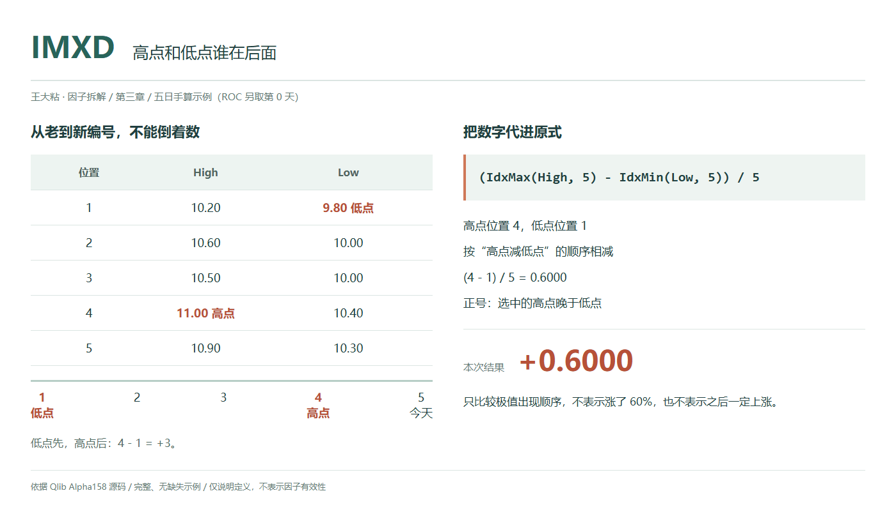
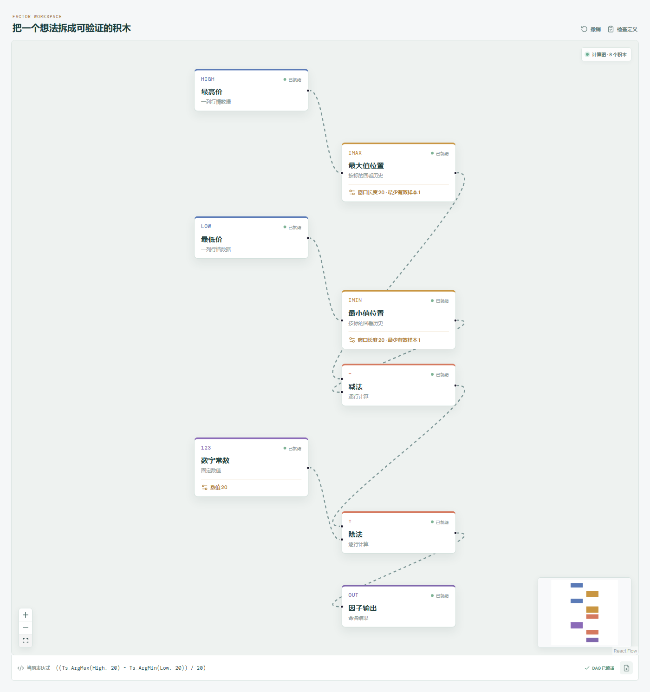

# IMXD：高点和低点谁在后面？

一段历史里，最高价和最低价各有一个发生位置。先出现低点、后出现高点，与先出现高点、后出现低点，顺序不一样。

IMXD 把这两个位置相减。它留下极值的先后和观测间隔，不保留价格变化幅度，也不描绘中间那条完整路径。



## 它到底在算什么？

Qlib Alpha158 的原式是：

```text
IMXD_n = (IdxMax($high, n) - IdxMin($low, n)) / n
```

高点来自每天的最高价 `High`，低点来自每天的最低价 `Low`，都不是从收盘价里选。

两个算子都按时间从旧到新编号，满窗口里从 1 排到 n。`IdxMax` 用 `np.argmax() + 1`，`IdxMin` 用 `np.argmin() + 1`，并列都选第一次出现的位置，不选最近一次。

沿用本章五条示例日线，最后一条视为今天：

| 观测编号（从旧到新） | 收盘价 | 最高价 | 最低价 |
| --- | --- | --- | --- |
| 1 | 10.00 | 10.20 | 9.80 |
| 2 | 10.40 | 10.60 | 10.00 |
| 3 | 10.20 | 10.50 | 10.00 |
| 4 | 10.80 | 11.00 | 10.40 |
| 5 | 10.60 | 10.90 | 10.30 |

最高价 11.00 在第 4 条，最低价 9.80 在第 1 条：

```text
高点编号 = 4
低点编号 = 1
IMXD_5 = (4 - 1) / 5 = 0.60
```

正负号一定要按减法方向理解：

- 大于 0：选中的高点在低点之后。
- 小于 0：选中的高点在低点之前，也就是低点在后。
- 等于 0：选中的高点和低点落在同一条观测。

本例 0.60 表示高点比低点晚 3 个观测间隔，再除以窗口长度 5。不是涨了 60%，也不是高点距离今天有 3 天。“天”在这里指观测位置，跨周末、节假日或缺少记录时，不能当作自然日数。

两个编号均在 `1..n` 内，所以数据有效、窗口已满时，取值范围是：

```text
[-(n - 1) / n, (n - 1) / n]
```

5 期对应 `[-0.80, 0.80]`，20 期对应 `[-0.95, 0.95]`，不会取到 -1 或 1。

## 为什么有人会这样设计？

分别记录两个日期可以保留更多信息，相减则把问题压缩成“谁在后，相隔多远”。

除以 n 后，位置差变成无单位比例。把两处价格同时放大若干倍，只要极值位置不变，结果也不变。

但这个压缩有代价：第 1 条到第 4 条，与第 2 条到第 5 条，位置差都是 3。IMXD 不能单独告诉你两个极值各自离今天多近，也不能证明窗口内价格一路上涨或一路下跌。

## 它什么时候容易骗人？

**第一，正负顺序不等于涨跌幅，更不等于后续方向。**

高点在低点之后，只说明选中的两个记录按这个顺序发生。高点之后是否已经回落、中间如何反复、窗口首尾涨跌多少，都不能仅靠 IMXD 判断。

**第二，等于 0 不代表没波动，也不提供日内先后。**

同一根日 K 线可以同时包含窗口最高价和最低价，甚至有很大振幅，此时两个编号相同，IMXD 仍为 0。

日线只提供当日高低价，不能据此知道盘中先到高点还是先到低点。不要把同一天的两处极值编排成一条日内路径。

**第三，并列和旧极值出窗都可能改变顺序。**

重复的高点、低点各自取最早一次；再次触及并不自动更新所选日期。窗口继续滚动，旧极值离开后会重新选点，数值甚至可能换符号，但这不等于当天发生了趋势反转。

**第四，短历史仍然除以原定窗口长度。**

若实际只有上表 5 条记录，但设定 n 为 20，编号仍从实际可用历史的最早一条开始：

```text
IMXD_20 = (4 - 1) / 20 = 0.15
```

高点仍在低点后面 3 个观测，变的是归一化比例。不能误读成两个日期比五期示例更接近，也不能据此判断它们离现在有多远。原算子允许至少有 1 个有效观测便开始计算，历史未满时要单独标记。

**第五，两个位置都需要干净、对齐的行情。**

两条输入必须对应同一标的、同一组按时间排序的记录，价格口径也要一致。异常尖峰、异常低价可能占据极值位置。

含有有效观测但夹有 `NaN` 时，原实现的 `np.argmax`、`np.argmin` 都会选到各自窗口的第一个 `NaN` 位置，不会自动跳过缺失值。如果两条序列在同一位置缺失，甚至可能算出貌似正常的 0；那不是同日真实高低点。全缺失窗口的滚动结果为空。应先处理数据质量问题，不能用补造价格或行情事件来解释这些输出。

## 在因子工坊里怎么拆？



```text
最高价 → 最大值位置（窗口 20） → 减法（左值）
最低价 → 最小值位置（窗口 20） → 减法（右值）
减法结果 ───────────────────→ 除法（左值） → 因子输出
数字常数 20 ────────────────→ 除法（右值）
```

最容易接错的是减法顺序：必须是高点编号减低点编号。两条位置分支使用相同窗口，最后只除一次 20；位置节点本身先输出从 1 开始的编号。

与指定 Qlib 源码对齐时，两条分支的最少有效样本都设为 1。若选择只保留满窗口结果，需要另外明确这个约束。

## 自己动手改一下

保留 IMXD 不变，再单独记录一个价格跨度：

```text
窗口价格跨度 = Max($high, n) - Min($low, n)
```

本例可以并排读成“IMXD 为 0.60，窗口价格跨度为 1.20”。前者讲选中极值的先后和相隔观测数，后者讲价格上下沿差多少。

不要直接把两者相加：一个无单位，一个是价格差。价格跨度仍受价格水平影响，也不是从窗口起点到终点的收益率。把两项作为独立描述，才不会用一个时间位置差冒充价格幅度。

---

原始表达式与算子来源：Microsoft Qlib，固定提交 `be725493eb1a6bbb42bf11b37aa7669f59610ff1`。

- [Alpha158 表达式：loader.py](https://github.com/microsoft/qlib/blob/be725493eb1a6bbb42bf11b37aa7669f59610ff1/qlib/contrib/data/loader.py#L216-L220)
- [IdxMax 实现：ops.py](https://github.com/microsoft/qlib/blob/be725493eb1a6bbb42bf11b37aa7669f59610ff1/qlib/data/ops.py#L971-L996)
- [IdxMin 实现：ops.py](https://github.com/microsoft/qlib/blob/be725493eb1a6bbb42bf11b37aa7669f59610ff1/qlib/data/ops.py#L1019-L1044)

源码核对日期：2026-09-27。`loader.py` 的英文注释对先后方向的描述容易误导；本文按实际减法表达式和 `ops.py` 的正向编号解释，正值明确表示所选高点晚于所选低点。

本文只讨论因子定义与研究方法，不构成投资建议。
