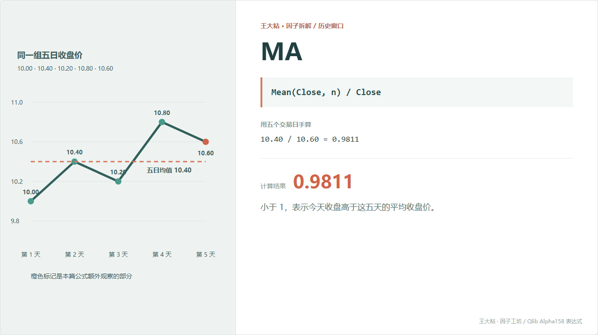
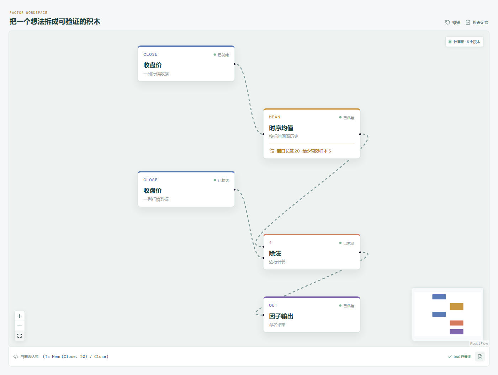

# MA：现在价格离近期均线有多远？

“股价在均线上方还是下方”是很多老股民都会看的东西。

Qlib Alpha158 里的 MA 因子也从均线出发，但它没有直接输出一条均线，而是把近期平均收盘价除以今天收盘价。这样不同价格水平的股票才能放在一起比较。



## 它到底在算什么？

通用表达式是：

```text
MA_n = Mean(Close, n) / Close
```

用本章五天的收盘价手算：

```text
近期平均收盘价
= (10.00 + 10.40 + 10.20 + 10.80 + 10.60) / 5
= 10.40

MA_5 = 10.40 / 10.60 = 0.9811
```

这个方向很容易看反：

- 等于 1：今天收盘刚好等于近期均值；
- 小于 1：今天收盘高于近期均值；
- 大于 1：今天收盘低于近期均值。

所以 0.9811 的意思不是“上涨了 98.11%”，而是近期平均收盘价约为今天收盘价的 98.11%。

## 为什么有人会这样设计？

直接看 `10.40` 元的均线没有办法跨股票比较。10 元股票和 100 元股票的均线天生不在一个尺度上。

除以今天收盘价以后，数值被拉到 1 附近。研究者可以把它理解为“现价相对近期价格中心的位置”，再去检验两种完全不同的假设：

- 趋势延续：价格站上均线以后，强势可能继续；
- 均值回归：价格离均线太远以后，可能向中心靠拢。

同一个因子可以服务于相反的假设。公式本身不会替我们决定该做多还是做空。

## 它什么时候容易骗人？

**第一，收盘价均值不等于市场持仓成本。**

它没有使用成交量，更不知道每个价格成交了多少。把它直接叫“平均成本”并不准确。

**第二，均线天然滞后。**

价格已经转向时，窗口里还留着旧数据。窗口越长，旧数据影响越久。

**第三，单个异常价格会拖动均值。**

复牌跳空、错误行情、未处理的除权除息，都可能让均线失真。

**第四，窗口长度会改变问题本身。**

5 日 MA 和 60 日 MA 不是同一个信号的“清晰版与模糊版”，它们观察的是不同时间尺度。

## 在因子工坊里怎么拆？



画布里的逻辑是：

```text
收盘价 ─→ 时序均值（窗口 20） ─┐
                                ÷ ─→ 因子输出
收盘价 ────────────────────────┘
```

两块“收盘价”读的是同一列数据：上面一条路先求历史均值，下面一条路保留今天收盘价作为分母。

## 自己动手改一下

如果觉得原式方向不直观，可以改成：

```text
Close / Mean(Close, n) - 1
```

这样结果大于 0 就表示现价在均线上方，小于 0 表示在均线下方。数学信息接近，但读起来更符合很多人的习惯。

---

原始表达式来源：Microsoft Qlib Alpha158。  
项目地址：[王大粘 · 因子工坊](https://github.com/superalp1985/-)

本文只讨论因子定义与研究方法，不构成投资建议。
