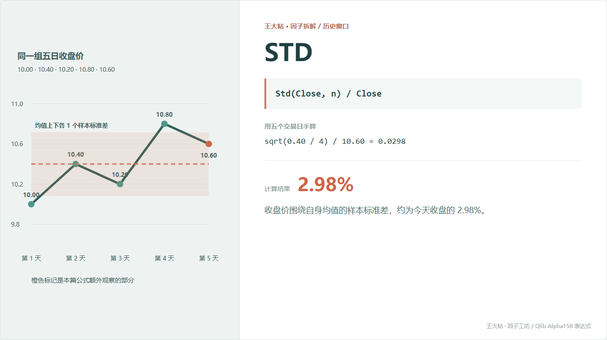
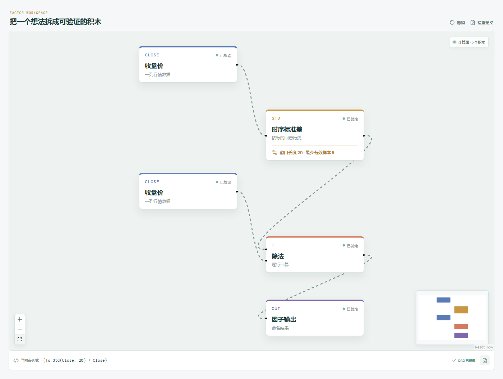

# STD：最近价格有多不安分？

只看均值，会漏掉一件很重要的事。

两只股票的五日平均价都可能是 10 元，但一只每天只动几分钱，另一只每天上下折腾 5%。STD 想补上的，就是这段“围着平均值晃了多大”。



## 它到底在算什么？

Qlib Alpha158 的表达式是：

```text
STD_n = Std(Close, n) / Close
```

本章五天的平均收盘价是 10.40。五个收盘价和均值的差分别是：

```text
-0.40, 0.00, -0.20, 0.40, 0.20
```

Qlib 这里沿用 pandas 的样本标准差口径，分母是 `n - 1`：

```text
Std = sqrt((0.16 + 0 + 0.04 + 0.16 + 0.04) / 4)
    = 0.3162

STD_5 = 0.3162 / 10.60 = 0.0298
```

结果约为 2.98%。它表示近期收盘价围绕自身均值的离散程度，相当于今天收盘价的约 2.98%。

## 为什么有人会这样设计？

标准差先回答“散不散”，再除以今天收盘价消掉价格单位。

不做归一化时，100 元股票波动 1 元和 10 元股票波动 1 元会得到相同标准差，但相对幅度明显不是一回事。归一化以后，研究者可以粗略比较不同价格水平的股票。

它常被拿来描述近期状态：数值较大，说明窗口里的收盘价比较分散；数值较小，说明价格更集中。

## 它什么时候容易骗人？

**第一，它算的是价格水平波动，不是收益率波动。**

一段每天匀速上涨的走势非常平滑，但收盘价会逐渐远离窗口均值，STD 仍然可能较高。

**第二，它不认识方向。**

一路上行和一路下行，只要离散程度相同，STD 就可能相同。

**第三，异常点影响很大。**

平方会放大极端偏差。一个错误价格或一次跳空可能控制整个窗口。

**第四，小样本口径不能混用。**

样本标准差除以 `n - 1`，总体标准差除以 `n`。窗口很小时，两者差异并不小。复现开源因子时必须把这个细节写清楚。

## 在因子工坊里怎么拆？



```text
收盘价 ─→ 时序标准差（窗口 20） ─┐
                                  ÷ ─→ 因子输出
收盘价 ──────────────────────────┘
```

画布试算和导出的纯 Python 代码都使用同一套样本标准差口径。

## 自己动手改一下

如果真正想研究“每天涨跌有多不稳定”，可以先算日收益率，再做标准差：

```text
Std(Close / Ref(Close, 1) - 1, n)
```

这和原始 STD 不是谁取代谁。一个看价格水平的离散，一个看日收益率的离散，回答的问题不同。

---

原始表达式来源：Microsoft Qlib Alpha158。  
项目地址：[王大粘 · 因子工坊](https://github.com/superalp1985/-)

本文只讨论因子定义与研究方法，不构成投资建议。
