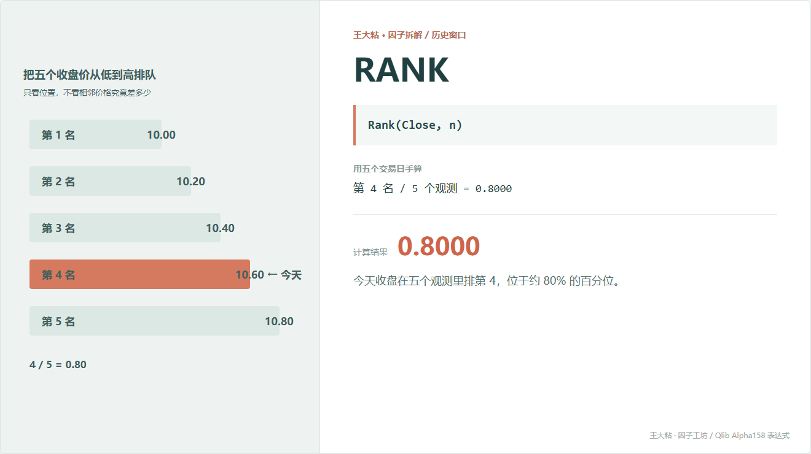
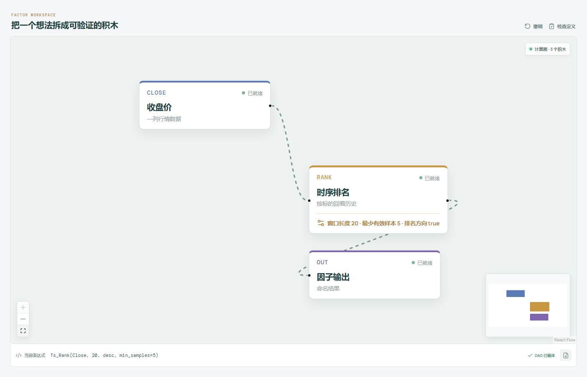

# RANK：今天收盘在近期排第几？

均线会告诉我们“离平均位置多远”，RANK 换了一个问法：不管差几毛钱，今天的收盘价在最近这段时间里排第几？



## 它到底在算什么？

表达式很短：

```text
RANK_n = Rank(Close, n)
```

把五天收盘价从低到高排列：

```text
10.00, 10.20, 10.40, 10.60, 10.80
```

今天收盘 10.60，排第 4，共 5 个观测：

```text
RANK_5 = 4 / 5 = 0.80
```

也就是今天收盘位于这个窗口约 80% 的百分位。Qlib 的滚动排名采用百分位排名；出现相同价格时，使用并列位置的平均名次。

## 为什么有人会这样设计？

排名把具体价格差压缩成了 0 到 1 附近的位置。

10 元股票涨 1 元和 100 元股票涨 1 元不容易直接比较，但“都处于各自过去 20 天的 80% 位置”就进入了同一尺度。

它也比均值少依赖极端数值的具体大小。最高价高出 1 毛还是高出 10 元，只要排序没变，当前排名就不变。

## 它什么时候容易骗人？

**第一，它只看顺序，不看距离。**

10.60 和 10.80 很接近，或者相差很远，只要名次一样，RANK 就一样。

**第二，窗口一换，名次就可能大变。**

过去 5 天处于高位，不代表过去 60 天也处于高位。

**第三，横盘和停牌会制造大量并列值。**

并列平均排名虽然有明确规则，但数值的区分能力会下降。

**第四，它只看收盘。**

盘中冲到很高又回落，RANK 可能完全看不出来。

## 在因子工坊里怎么拆？



```text
收盘价 ─→ 时序排名（窗口 20，越大排名越高） ─→ 因子输出
```

这是少数只需要一条输入线的窗口因子。节点里的窗口和排名方向都可以改，不是写死的积木。

## 自己动手改一下

排名不一定只能套在收盘价上。例如先算一天的涨跌幅，再看它在自己历史里的位置：

```text
Rank(Close / Ref(Close, 1) - 1, n)
```

原式研究“价格处于什么位置”，改式研究“今天这次涨跌在近期算不算极端”。

---

原始表达式来源：Microsoft Qlib Alpha158。  
项目地址：[王大粘 · 因子工坊](https://github.com/superalp1985/-)

本文只讨论因子定义与研究方法，不构成投资建议。
