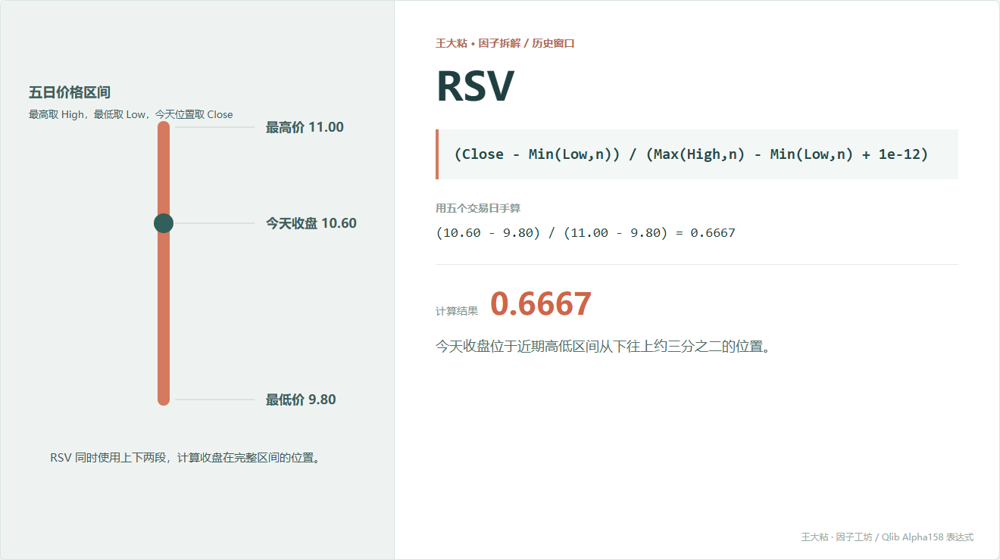
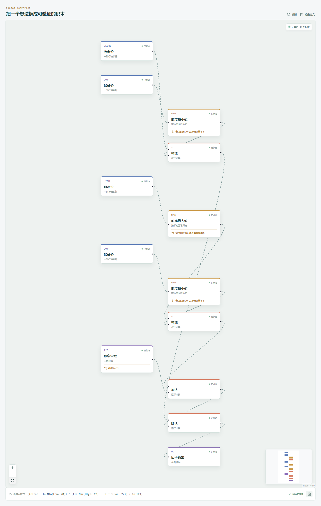

# RSV：收盘站在近期高低区间哪一层？

RANK 用收盘价互相排名。RSV 则把窗口里的最高价和最低价拉成一把尺子，看今天收盘落在尺子的什么位置。



## 它到底在算什么？

Qlib Alpha158 的表达式是：

```text
RSV_n = (Close - Min(Low, n))
        / (Max(High, n) - Min(Low, n) + 1e-12)
```

本章五天数据里：

```text
窗口最高价 = 11.00
窗口最低价 =  9.80
今天收盘价 = 10.60

RSV_5 = (10.60 - 9.80) / (11.00 - 9.80)
      = 0.80 / 1.20
      = 0.6667
```

结果约为 0.67，表示今天收盘位于近期高低区间从下往上约三分之二的位置。

公式里的 `1e-12` 只是防止最高价和最低价相同导致除以 0。它不能让一段完全没有波动的数据突然产生研究意义。

## 为什么有人会这样设计？

市场参与者经常会看“离近期高点还有多远”“是不是已经靠近区间底部”。RSV 把这两个问题合成一个 0 到 1 附近的相对位置。

它和随机指标里的未平滑 RSV 思路相同：

- 接近 1，收盘靠近窗口上沿；
- 接近 0，收盘靠近窗口下沿；
- 接近 0.5，收盘大致位于区间中部。

这仍然只是位置描述。靠近上沿既可以被解释为强势，也可以被解释为接近压力位，必须靠后续检验决定。

## 它什么时候容易骗人？

**第一，一个极端高点或低点可以把尺子拉得很长。**

哪怕那次价格只出现了几分钟，也可能在整个窗口里控制 RSV。

**第二，旧极值离开窗口时，数值会突然跳。**

今天价格没怎么动，RSV 也可能因为 20 天前的高点刚好被移出窗口而明显变化。

**第三，涨跌停和流动性不足会改变含义。**

靠近上沿不一定代表买方可以继续成交，靠近下沿也不一定代表出现了可交易的便宜价格。

**第四，复权口径必须统一。**

最高、最低和收盘只要有一列使用了不同复权方式，整个区间都会失真。

## 在因子工坊里怎么拆？



画布里要把公式完整拆开：

```text
最低价 ─→ 时序最小值 ─┬→ 收盘价减最低值 ───────────┐
                       └→ 最高值减最低值 ─→ 加 1e-12 ─→ 相除 ─→ 输出
最高价 ─→ 时序最大值 ─┘
```

连接线表达的是公式内部的数据流，不是“先做第一步、再做第二步”的说明图。

## 自己动手改一下

可以把今天收盘换成今天的成交量加权平均价：

```text
(VWAP - Min(Low, n)) / (Max(High, n) - Min(Low, n) + 1e-12)
```

这样观察的不再是收盘那一个时点，而是当天平均成交价格在近期区间里的位置。

---

原始表达式来源：Microsoft Qlib Alpha158。  
项目地址：[王大粘 · 因子工坊](https://github.com/superalp1985/-)

本文只讨论因子定义与研究方法，不构成投资建议。
