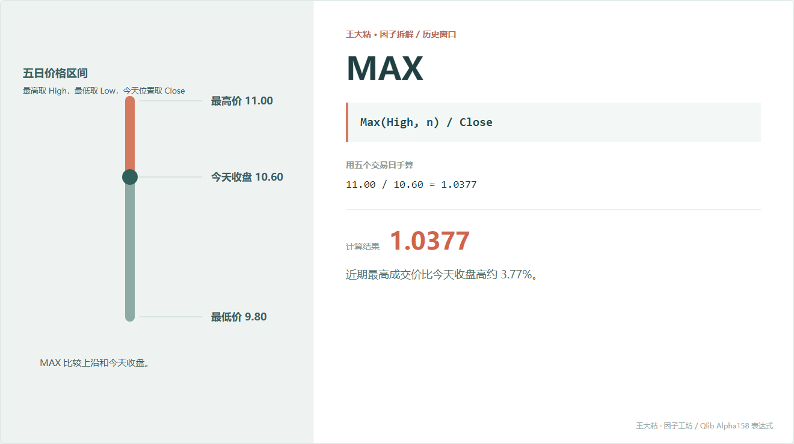
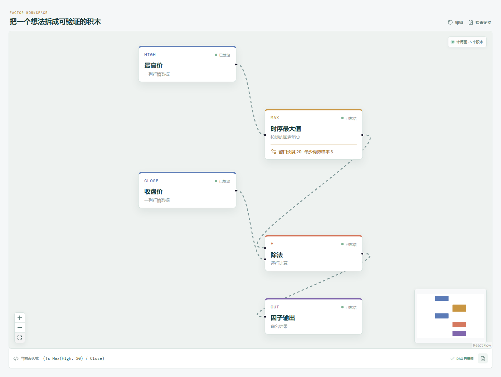

# MAX：离近期最高价还有多远？

MAX 这个名字看着像“找最大的收盘价”，但 Qlib Alpha158 原式不是这样。

它找的是窗口内最高的 `High`，再拿这个最高价和今天收盘比较。这个字段差别不能含糊，因为盘中高点和收盘高点不是一回事。



## 它到底在算什么？

```text
MAX_n = Max(High, n) / Close
```

本章五天数据里，窗口最高价是 11.00，今天收盘是 10.60：

```text
MAX_5 = 11.00 / 10.60 = 1.0377
```

这表示近期最高成交价约为今天收盘价的 1.0377 倍。

只要行情字段正常，窗口里又包含今天，结果通常不会小于 1，因为今天最高价本来就不会低于今天收盘价。

## 为什么有人会这样设计？

它把“近期最高价”从一个绝对价格变成了相对距离。

对 10 元股票来说，离高点 0.4 元可能不少；对 100 元股票来说，0.4 元可能很近。除以当前收盘以后，不同价格水平的股票更容易放在一起比较。

研究者可能把它当成距离近期上沿的粗略描述：

- 接近 1，今天收盘靠近近期最高价；
- 明显大于 1，今天收盘离近期最高价较远。

但“靠近高点”究竟代表强势突破还是碰到压力，并不是这个公式能回答的。

## 它什么时候容易骗人？

**第一，最高价不等于有效压力位。**

最高价可能只成交了一小笔，未必代表大量资金在那里形成成本。

**第二，极端尖峰会长时间占住窗口。**

一次异常拉升可以让 MAX 在后面很多天都显得很高。

**第三，旧高点移出窗口时会跳变。**

价格没有突破，数值却可能因为窗口滚动突然接近 1。

**第四，不复权会把公司行为误当成价格距离。**

拆股、分红、送转等变化没有处理好，历史最高价和今天收盘不能直接相除。

## 在因子工坊里怎么拆？



```text
最高价 ─→ 时序最大值（窗口 20） ─┐
                                  ÷ ─→ 因子输出
收盘价 ──────────────────────────┘
```

注意画布上方输入是“最高价”，不是“收盘价”。这是复现 Alpha158 时必须逐项核对的地方。

## 自己动手改一下

把结果改成更直观的“高点比现价高多少”：

```text
Max(High, n) / Close - 1
```

本例会得到约 3.77%。信息基本相同，但 0 可以直接表示“收盘就在窗口最高价附近”。

---

原始表达式来源：Microsoft Qlib Alpha158。  
项目地址：[王大粘 · 因子工坊](https://github.com/superalp1985/-)

本文只讨论因子定义与研究方法，不构成投资建议。
