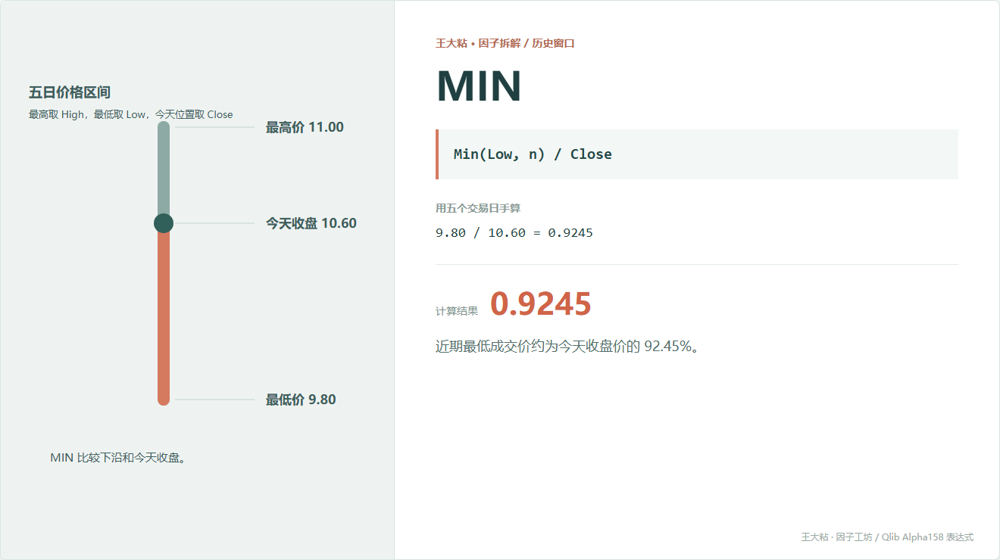
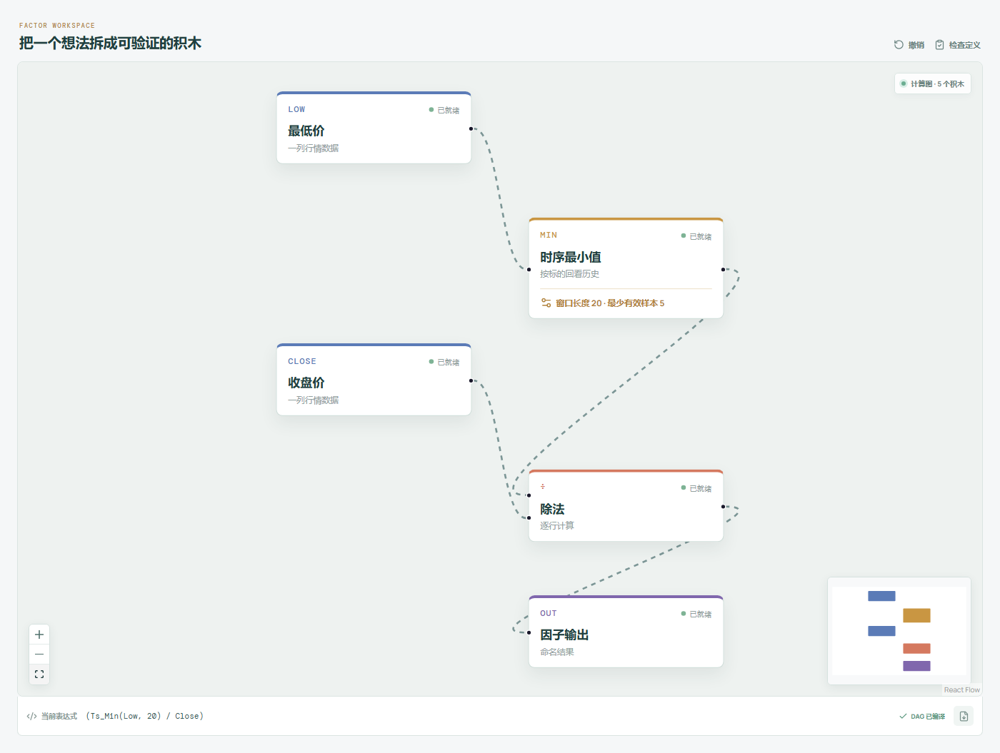

# MIN：离近期最低价还有多远？

MIN 和上一篇 MAX 正好从区间另一头看问题。

它不是找最低收盘价，而是找窗口内最低的 `Low`，再和今天收盘比较。



## 它到底在算什么？

```text
MIN_n = Min(Low, n) / Close
```

本章五天里，窗口最低价是 9.80，今天收盘是 10.60：

```text
MIN_5 = 9.80 / 10.60 = 0.9245
```

这表示近期最低成交价约为今天收盘价的 92.45%。

在正常行情下，这个比值通常不会大于 1。越接近 1，说明今天收盘越靠近近期最低价；越小，说明今天收盘离窗口下沿越远。

## 为什么有人会这样设计？

很多人会看一只股票离近期低点反弹了多少。MIN 用一个无单位比值表达这件事，方便跨股票比较。

研究上可以从不同方向提出假设：

- 接近 1，价格仍在近期底部附近；
- 数值较小，价格已经明显离开近期低点；
- MAX 和 MIN 一起使用，可以描述今天收盘在整个历史区间中的相对位置。

这些都只是可以检验的解释，不是“接近低点就便宜”的证明。

## 它什么时候容易骗人？

**第一，最低价不等于支撑。**

一次恐慌成交、乌龙报价或流动性很差时的一笔交易，都可能成为窗口最低价。

**第二，离低点远不代表风险小。**

一只股票从 5 元涨到 10 元，MIN 看起来很低；如果基本面和市场状态已经变化，这个历史低点可能没有参考价值。

**第三，窗口滚动会让“地板”自己移动。**

旧低点离开窗口后，MIN 可能突然升高，即使今天价格没动。

**第四，复权和停牌问题一样不能省。**

价格序列不连续时，公式算得出来，不代表比较成立。

## 在因子工坊里怎么拆？



```text
最低价 ─→ 时序最小值（窗口 20） ─┐
                                  ÷ ─→ 因子输出
收盘价 ──────────────────────────┘
```

和 MAX 一样，字段必须核对清楚：这里的历史输入是最低价，分母才是今天收盘价。

## 自己动手改一下

如果想直接表达“今天收盘比近期最低价高多少”，可以改成：

```text
Close / Min(Low, n) - 1
```

本例约为 8.16%。注意它和 `1 - MIN` 的分母不同，数值不会完全一样。选哪种写法，要看你想拿谁作为比较基准。

---

原始表达式来源：Microsoft Qlib Alpha158。  
项目地址：[王大粘 · 因子工坊](https://github.com/superalp1985/-)

本文只讨论因子定义与研究方法，不构成投资建议。
