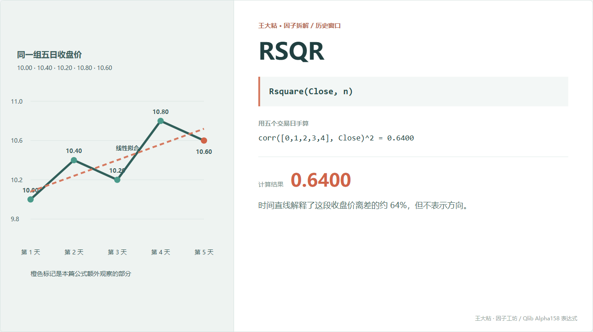
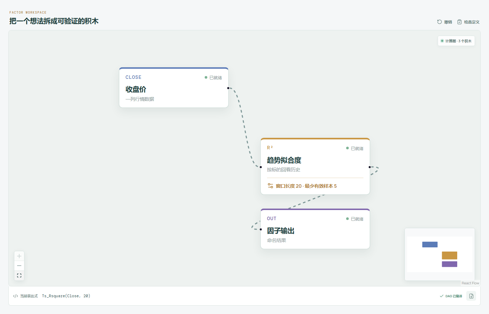

# RSQR：这段走势到底像不像一条直线？

有些上涨走得很整齐，有些上涨靠一根大阳线完成；有些下跌一路缓慢滑落，有些下跌每天上蹿下跳。

只看起点和终点，这些路径可能差不多。RSQR 关心的是另一件事：这段收盘价走势，能不能被一条直线解释。



## 它到底在算什么？

```text
RSQR_n = Rsquare(Close, n)
```

计算时，把窗口里的交易日依次编号为 `0, 1, 2, ...`，再用一元线性回归拟合收盘价。

本章五个收盘价拟合得到：

```text
拟合线：Close_hat = 10.08 + 0.16 × t
R² = 0.64
```

`0.64` 表示这条时间直线解释了窗口内约 64% 的收盘价离差。数值越接近 1，路径越接近线性趋势；越接近 0，线性关系越弱。

这里一定要注意：**R² 不告诉我们趋势向上还是向下。**

一段整齐上涨和一段整齐下跌，都可能得到很高的 R²。

## 为什么有人会这样设计？

斜率回答“方向和速度”，R² 回答“这条直线靠不靠谱”。

同样是上涨 10%，如果一路稳定抬高，线性拟合度可能较高；如果先暴跌再暴涨，拟合度可能很低。RSQR 因此可以被看作一种“趋势整齐程度”的描述。

它不需要除以当前收盘价，因为 R² 本身已经是无单位数值。

## 它什么时候容易骗人？

**第一，高 R² 不代表会上涨。**

稳定下跌同样可以高度线性。

**第二，高 R² 也不代表趋势会继续。**

它只总结窗口内已经发生的路径，不知道拐点是不是就在明天。

**第三，非线性趋势会被低估。**

一段平滑加速上涨可能很有规律，但不贴合直线，R² 未必高。

**第四，窗口短时很容易显得“很会拟合”。**

观测太少，漂亮的 R² 可能只是小样本巧合。价格几乎不变时，方差接近 0，R² 也会失去定义。

## 在因子工坊里怎么拆？



```text
收盘价 ─→ 趋势拟合度 R²（窗口 20） ─→ 因子输出
```

积木内部完成“时间编号、直线拟合、计算相关系数平方”这些固定数学步骤。用户仍然可以修改窗口，或者把它和斜率积木继续组合。

## 自己动手改一下

把方向和整齐程度放在一起：

```text
(Slope(Close, n) / Close) × Rsquare(Close, n)
```

斜率提供正负方向，R² 给不够线性的路径降权。这不是现成结论，只是一种值得拿数据检验的新表达。

---

原始表达式来源：Microsoft Qlib Alpha158。  
项目地址：[王大粘 · 因子工坊](https://github.com/superalp1985/-)

本文只讨论因子定义与研究方法，不构成投资建议。
