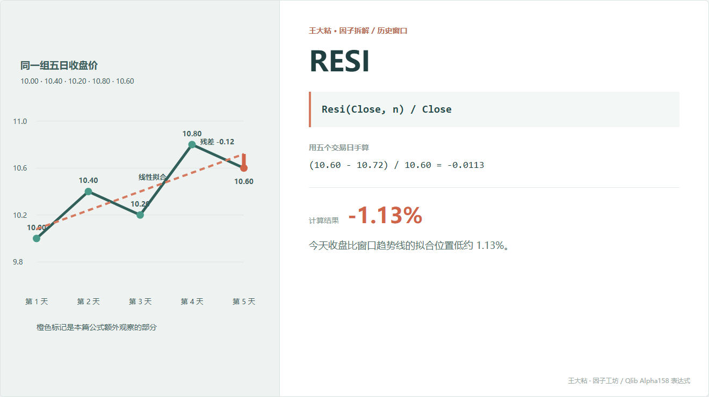
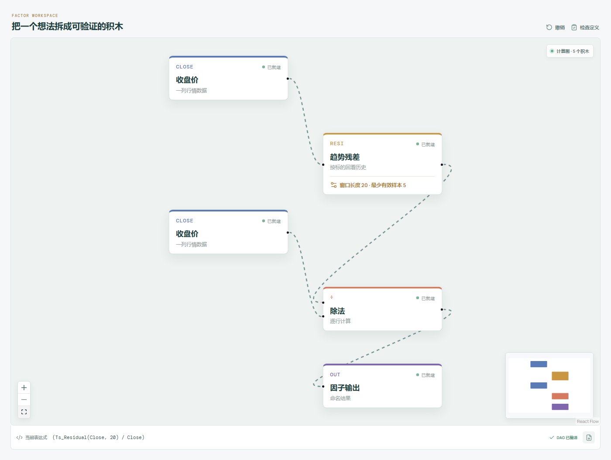

# RESI：今天偏离趋势线多少？

RSQR 看整段路径像不像直线，RESI 把视线收回到今天：按照这段历史拟合出的趋势线，今天收盘本来应该在哪？实际价格又偏了多少？



## 它到底在算什么？

```text
RESI_n = Resi(Close, n) / Close
```

先用窗口内收盘价对时间做线性回归，再计算今天的残差：

```text
残差 = 今天实际收盘 - 趋势线在今天的拟合值
```

本章例子的拟合线是：

```text
Close_hat = 10.08 + 0.16 × t
```

第 5 天对应 `t = 4`，拟合值为 10.72：

```text
残差 = 10.60 - 10.72 = -0.12

RESI_5 = -0.12 / 10.60 = -0.0113
```

结果约为 -1.13%，表示今天收盘比窗口趋势线给出的拟合位置低约 1.13%。正值表示在拟合线上方，负值表示在拟合线下方。

## 为什么有人会这样设计？

直接看价格很难分清“整体趋势”和“今天相对趋势的偏离”。回归先把窗口里的线性部分拿出来，残差留下当前没有被这条直线解释的部分。

研究者可以围绕它提出不同假设：

- 偏离会回归：价格暂时离开趋势线，之后可能靠回去；
- 偏离代表加速：价格开始摆脱旧趋势，可能进入新状态。

两种解释都合理，也都可能在不同市场阶段失效。

## 它什么时候容易骗人？

**第一，今天的数据参与了趋势线拟合。**

这不是“拿昨天以前的模型预测今天”产生的纯样本外误差。今天收盘既影响拟合线，又拿来计算残差。

**第二，一条直线可能根本不适合这段行情。**

震荡、拐点、加速趋势都可能让残差难以解释。

**第三，窗口里的异常点会拉歪整条线。**

残差变小不一定是今天正常，也可能是旧异常值改变了斜率和截距。

**第四，负残差不等于低估，正残差也不等于高估。**

它只表示相对统计趋势线的位置，不包含基本面价值判断。

## 在因子工坊里怎么拆？



```text
收盘价 ─→ 趋势残差（窗口 20） ─┐
                                ÷ ─→ 因子输出
收盘价 ────────────────────────┘
```

趋势残差积木负责线性拟合和最后一个观测的残差，除法节点再用今天收盘价做归一化。

## 自己动手改一下

如果想让“偏离有多异常”更容易跨时期比较，可以再除以近期波动：

```text
Resi(Close, n) / (Std(Close, n) + 1e-12)
```

这样更接近一个残差标准化值。另一种更严格的设计，是只用今天以前的数据拟合趋势，再比较今天收盘；那会变成新的因子，而不是原始 RESI。

---

原始表达式来源：Microsoft Qlib Alpha158。  
项目地址：[王大粘 · 因子工坊](https://github.com/superalp1985/-)

本文只讨论因子定义与研究方法，不构成投资建议。
