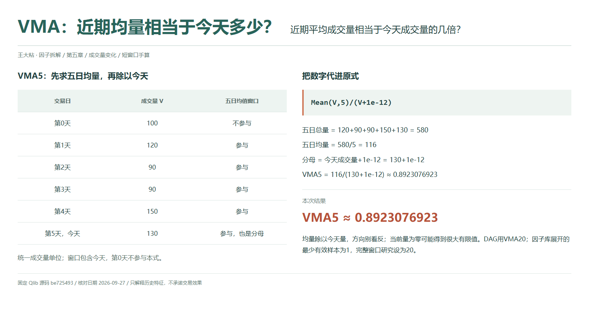
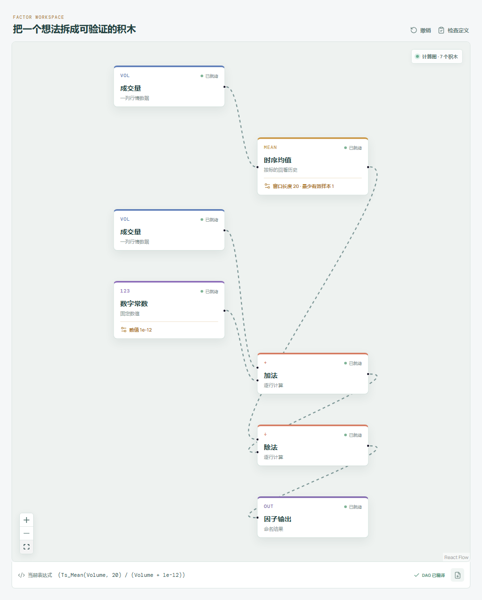

# VMA：近期均量相当于今天多少？

看到今天成交量变大，我们常想知道：它比最近的常态高多少？Qlib Alpha158 的 VMA 确实在比较这两件事，但除法方向容易看反。它拿近期平均成交量除以今天成交量，不是拿今天除以均量。因此，今天越放量，读数反而可能越小。

## 它到底在算什么？

本地 `src/factors.ts` 与固定版 Qlib 的表达式一致：

```text
VMA_n = Mean($volume,n)/($volume+1e-12)
```

均值窗口包含今天。全章沿用第 0 至第 5 天的成交量 `100、120、90、90、150、130`，单位统一；本篇只取第 1 至第 5 天，第 0 天不参与五日均值。



```text
五日总量 = 120+90+90+150+130 = 580
五日均量 = 580/5 = 116
今天成交量 = 130
VMA5 = 116/(130+1e-12) ≈ 0.8923076923
```

忽略极小项时，近期均量约为今天的八成九。它不是“今天缩量了约一成”，因为这个比值既不是相邻两天的变化率，分子也不是昨天成交量。若今天低于窗口均量，读数通常大于一；理解方向，先看谁在分母。

## 为什么这样设计？

直接比较成交量绝对值，容易混入标的规模差异。用同一标的的近期均量作参照，可以描述今天相对自身历史的活跃程度。它保留的是相对水平，不是价格方向，也不说明成交发生在什么价位。

窗口中的每一天等权参与平均，今天既影响均值，也决定分母。因此它不是拿完全独立的“过去基准”来评价今天。一次异常放量会抬高均值，随后留在窗口内继续影响读数，直到退出窗口。

## 什么时候容易误读？

首先，量要用同一单位，不能把前几天的“股”和今天的“手”混起来。统一换单位时，分子、分母中的成交量会同倍缩放，但固定的 `1e-12` 不会；远离零时影响很小，接近零时不能宣称严格尺度不变。

其次，今天零成交量不保证输出缺失。若历史均量仍为正，除以极小项会产生很大的有限值。例如把本例今天改成零，均量变为 `90`，结果是 `9×10^13`。若完整窗口全为零，则结果是零。这两种情况都不应被机械解读为市场信号。

最后，缺失值不等于零，停牌记录也不能随意补成正常观测。Qlib 均值跳过缺失，至少一个有效量便可输出，全窗缺失才为空；若今天量缺失，最终分母仍缺失。本文按完整窗口计算，不能把短历史均值当成满窗结果。盘中尚未结束的量与完整日量不是同一口径，用收盘后才确定的数据解释此前决策还会引入时间错位。

## 在因子工坊里怎么拆？



```text
成交量 → 时序均值（窗口 20） → 除法的分子
成交量、数字常数 1e-12 → 加法 → 除法的分母
除法 → 因子输出
```

实际展开式为 `Ts_Mean(Volume,20)/(Volume+1e-12)`。从因子库展开的均值节点使用 `min_samples=1`，对应 Qlib 的 `min_periods=1`，不等于必须攒满二十行。复算本文只把窗口改为 `5`，保留门槛 `1`，在第 5 天检查均值和最终比值。若把门槛也改为窗口长度，就是另加满窗要求，会改变预热和部分缺失时的输出条件。

## 自己动手改一下

把分子改接今天成交量，分母改为“时序均值加极小项”，得到 `Volume/(Mean(Volume,5)+1e-12)`，本例约为 `1.1206896552`。这回答“今天相当于近期均量几倍”，方向更贴近口头说法，但已经不是原 VMA。

对照两式时保留各自分母中的极小项，不要直接宣称严格互为倒数。再把今天量调小，观察均值和比值同时变化，便能看清归一化参照如何参与结果。

---

源码核对日期：2026-09-27；固定提交：`be725493eb1a6bbb42bf11b37aa7669f59610ff1`。

- [Qlib Alpha158 VMA 原式：loader.py](https://github.com/microsoft/qlib/blob/be725493eb1a6bbb42bf11b37aa7669f59610ff1/qlib/contrib/data/loader.py#L267-L270)
- [滚动预热与均值实现：ops.py](https://github.com/microsoft/qlib/blob/be725493eb1a6bbb42bf11b37aa7669f59610ff1/qlib/data/ops.py#L713-L844)

本文只解释统计定义与复现方法，不构成投资建议或收益承诺。
