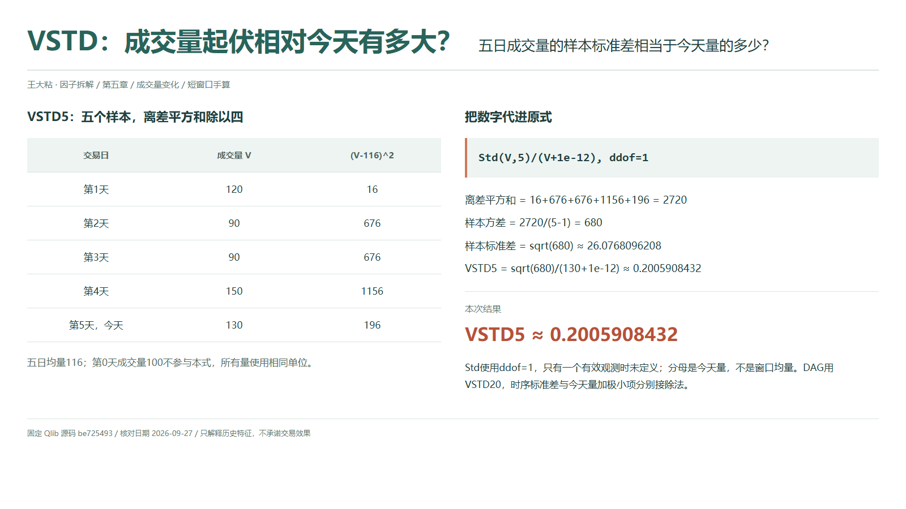
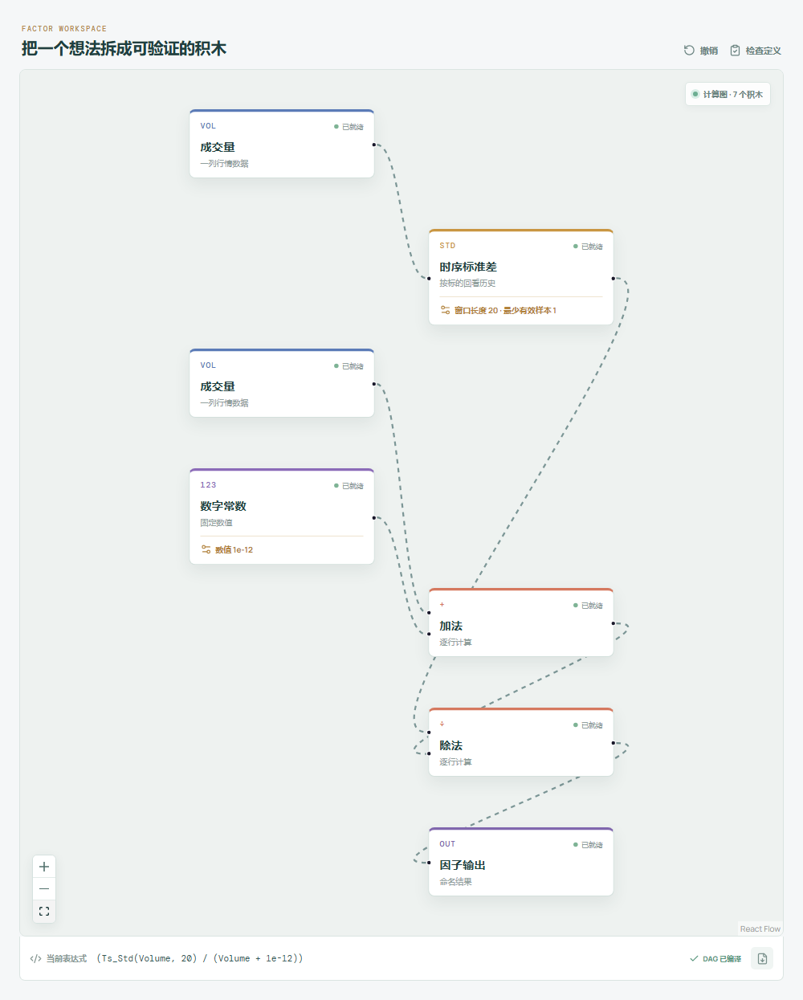

# VSTD：成交量起伏相对今天有多大？

两段行情可以有接近的平均成交量，却呈现不同节奏：一段每天差不多，另一段忽高忽低。VSTD 关心这种量的起伏，但它最后拿今天成交量作分母，而不是拿窗口均量作分母。读数同时受历史离散程度和今天量级影响。

## 它到底在算什么？

本地 `src/factors.ts` 对应的 Qlib Alpha158 原式是：

```text
VSTD_n = Std($volume,n)/($volume+1e-12)
```

这里 `Std` 是样本标准差，`ddof=1`。五个有效值的离差平方和要除以四，不能直接除以五。全章成交量为第 0 至第 5 天的 `100、120、90、90、150、130`；五日窗口只包含后五个数。



| 第几天 | 成交量 | 与均量 116 的离差平方 |
| --- | ---: | ---: |
| 1 | 120 | 16 |
| 2 | 90 | 676 |
| 3 | 90 | 676 |
| 4 | 150 | 1156 |
| 5 | 130 | 196 |

```text
离差平方和 = 2720
样本方差 = 2720/(5-1) = 680
样本标准差 = sqrt(680) ≈ 26.0768096208
VSTD5 = sqrt(680)/(130+1e-12) ≈ 0.2005908432
```

这些结果由 Python 从原始数据计算，展示时才舍入。它说的是窗口成交量的标准差约为今天量的两成，不是量每天变化两成，也不是收益波动率；这里没有用到收盘价。

## 为什么这样设计？

标准差把每天偏离均量的程度汇总成一个非负数，让“量稳不稳定”可以进入量化比较。再除以当前量级，能减少成交量绝对规模对结果的影响；直接拿两个标的的原始标准差对比，往往会先比较到体量大小。

不过，标准差会平方放大较大的偏离。一次极端成交就可能明显改变结果。它也不关心先后顺序：同一组五个量重新排列，原始标准差不变；但若重排改变了今天成交量，最终 VSTD 就可能改变。分子描述整段分布，分母仍盯着今天。

## 什么时候容易误读？

今天突然缩量，分母会缩小，即便历史起伏没有相应放大，比值也可能明显升高。因此不要只看最终读数，就把原因全部归给“波动加剧”；应同时检查标准差和当前量。

至少两个有效观测才能定义样本标准差。只有一个观测时应为缺失，不能为了方便填成零；完整窗口内量恒定时标准差才是零。若今天为零而窗口仍有起伏，极小分母也可能产生很大数值，不能想当然认为除法会自动返回空值。

全窗必须采用相同成交量单位。整体缩放通常会被比值抵消，但固定极小项使近零区域不严格尺度不变。Qlib 标准差跳过缺失，全窗缺失或只剩一点时为空；今天量缺失也会使最终分母缺失。停牌和异常量还可能改变有效样本数，不能把未满窗口的读数和完整窗口无区别地比较。全天量未确定前，也不能使用日终读数。

## 在因子工坊里怎么拆？



```text
成交量 → 时序标准差（窗口 20） → 除法的分子
成交量、数字常数 1e-12 → 加法 → 除法的分母
除法 → 因子输出
```

工坊实际使用 `Ts_Std`，本地运行和 Python 导出均按样本标准差计算。Qlib 导入后 `min_samples=1`，但标准差仍至少需要两点。复算本文只把窗口设为 `5`，保留门槛 `1`，在第 5 天核对中间值 `26.0768096208`。主动把门槛改为窗口长度可以要求满窗，但这会改变 Qlib 默认的预热和部分缺失输出。

## 自己动手改一下

只改分母：在成交量与加法之间接“时序均值”，并让它与标准差窗口一致。新式 `Std(Volume,5)/(Mean(Volume,5)+1e-12)` 约为 `0.2248000829`。

改后是以窗口均量为参照的成交量变异系数，不再是原 VSTD。两式共用同一个标准差，差别只来自今天量与均量的选择；把中间值并排看，比仅比较最终大小更容易定位变化来源。

---

源码核对日期：2026-09-27；固定提交：`be725493eb1a6bbb42bf11b37aa7669f59610ff1`。

- [Qlib Alpha158 VSTD 原式：loader.py](https://github.com/microsoft/qlib/blob/be725493eb1a6bbb42bf11b37aa7669f59610ff1/qlib/contrib/data/loader.py#L271-L274)
- [滚动计算调用：ops.py](https://github.com/microsoft/qlib/blob/be725493eb1a6bbb42bf11b37aa7669f59610ff1/qlib/data/ops.py#L742-L755)
- [Std 委托 pandas std，默认 ddof=1：ops.py](https://github.com/microsoft/qlib/blob/be725493eb1a6bbb42bf11b37aa7669f59610ff1/qlib/data/ops.py#L867-L884)

本文只解释统计定义与复现方法，不构成投资建议或收益承诺。
