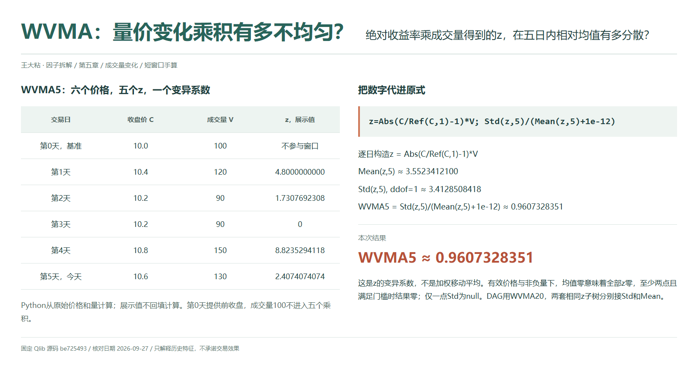
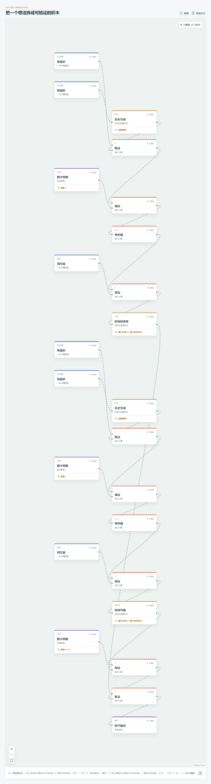

# WVMA：量价变化乘积有多不均匀？

名字里有 MA，不代表它就是一条均线。Qlib Alpha158 的 WVMA 不是加权移动平均价，而是先构造“绝对收益率乘成交量”，再计算这个新变量的变异系数。它问的是：这种量价变化乘积在近期是否集中于少数观测，而不是价格向哪边走。

## 它到底在算什么？

按 `src/factors.ts` 与固定版 Qlib 原式，先记：

```text
z = Abs($close/Ref($close,1)-1)*$volume
WVMA_n = Std(z,n)/(Mean(z,n)+1e-12)
```

先算每天的 `z`，再跨天求标准差和均值；不能把成交量放到滚动运算之后相乘。`Std` 使用样本口径 `ddof=1`。五个 `z` 需要六个连续收盘价，因为第一个收益率还需要窗口开始前的价格。



| 第几天 | 收盘价 | 成交量 | 当天 z，展示值 |
| --- | ---: | ---: | ---: |
| 0，基准 | 10.0 | 100 | 不计入窗口 |
| 1 | 10.4 | 120 | 4.8000000000 |
| 2 | 10.2 | 90 | 1.7307692308 |
| 3 | 10.2 | 90 | 0 |
| 4 | 10.8 | 150 | 8.8235294118 |
| 5 | 10.6 | 130 | 2.4074074074 |

第 0 天成交量不参与这五个乘积。Python 用原始价格和量计算，没有把表中舍入后的 `z` 再拿去统计：

```text
Mean(z,5) ≈ 3.5523412100
Std(z,5) ≈ 3.4128508418
WVMA5 ≈ 0.9607328351
```

第 4 天同时有较大的绝对价格变化和成交量，乘积明显高于其他天。最终数字描述的是这些乘积相对自身均值的离散程度，不是收益率，也不是量价相关系数。

## 为什么这样设计？

同样的价格变化幅度，配上不同成交量，得到的 `z` 不同；同样的成交量，价格几乎不动与大幅变化也不同。将两者相乘，是一种描述联合强度的办法，而用标准差除以均值，则把注意力转向这种强度是否均匀。

绝对值已经删除了上涨、下跌的方向。即使结果很高，也不能据此断言上涨更强，更不能把它解释为资金流入或买卖力量失衡。日成交量没有提供主动买卖方向，乘上绝对收益率也不会凭空补出这类信息。

## 什么时候容易误读？

少数异常价格或异常量可能主导 `z`，复权跳变尤其值得检查。前收盘为零或缺失时，收益率无效，应先处理数据，不能拿极小项去掩盖前面的除法问题。

在价格有效、成交量非负的前提下，`z` 非负。若均值恰好为零，就意味着所有有效 `z` 都为零；只要至少两个有效观测且满足样本门槛，标准差也为零，结果就是零，不是必然爆炸。仅一个有效观测时样本标准差仍未定义，工坊输出 `null`。

成交量必须统一单位。统一放大成交量会同倍放大均值和标准差，但固定 `1e-12` 不随之变化，所以只在它可忽略时近似尺度不变。均值很小时，还要区分真实的相对不均匀与数值精度问题。

Qlib 的均值与标准差会跳过缺失的 `z`，全窗缺失时结果为空；不能把缺失乘积填成零来表示“没有变化”。当天收盘与全天量都参与计算，最终读数须等它们可用。

## 在因子工坊里怎么拆？



```text
收盘价、历史引用（回看 1） → 除法 → 减常数 1
→ 绝对值 → 乘成交量 → z
z → 时序标准差（20） → 最后除法的分子
z → 时序均值（20） → 加常数 1e-12 → 分母
最后除法 → 因子输出
```

实际展开会重复生成两套 `z` 子树，分别接标准差和均值，不是不同变量。两处窗口同步设置；Qlib 导入的两处 `min_samples` 均为 `1`，样本标准差仍至少需要两个有效 `z`。复核手算时只将两个窗口改为 `5`，保留第零天与门槛 `1`。若要求二十个有效 `z` 才输出，可另将两处门槛设为 `20` 并提供前序价格，但这是比 Qlib 默认更严格的样本要求。

## 自己动手改一下

把两处乘成交量都去掉，改为绝对收益率本身的变异系数。本例约为 `0.8272959396`。比较前后，不是在寻找哪个数字更好，而是在检验成交量这一输入改变了哪些天的相对贡献。只改一条分支会破坏分子、分母对同一变量的统计口径。

---

源码核对日期：2026-09-27；固定提交：`be725493eb1a6bbb42bf11b37aa7669f59610ff1`。

- [Qlib Alpha158 WVMA 原式：loader.py](https://github.com/microsoft/qlib/blob/be725493eb1a6bbb42bf11b37aa7669f59610ff1/qlib/contrib/data/loader.py#L275-L282)
- [Ref、Mean 与样本 Std：ops.py](https://github.com/microsoft/qlib/blob/be725493eb1a6bbb42bf11b37aa7669f59610ff1/qlib/data/ops.py#L781-L884)

本文只解释统计定义与复现方法，不构成投资建议或收益承诺。
