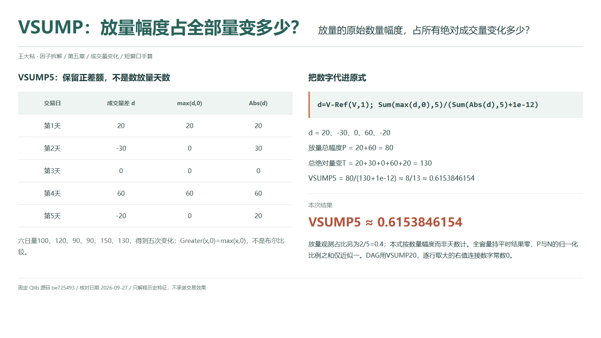
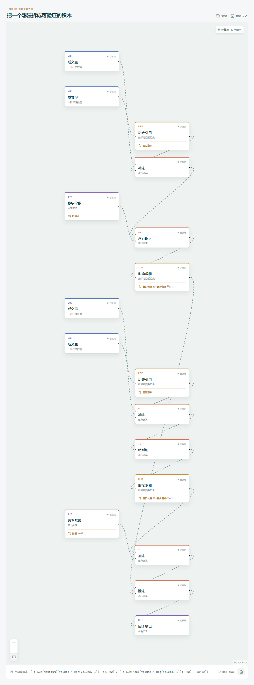

# VSUMP：放量幅度占全部量变多少？

一段成交量序列里，放量和缩量各出现几次，并不能告诉我们哪边变化得更多。一次明显放量，可能超过几次小幅缩量的总和。VSUMP 统计的是放量的数量幅度占全部绝对量变的比例，不是放量天数占比。

## 它到底在算什么？

`src/factors.ts` 与固定版 Qlib Alpha158 原式一致：

```text
VSUMP_n =
Sum(Greater($volume-Ref($volume,1),0),n)
/(Sum(Abs($volume-Ref($volume,1)),n)+1e-12)
```

记 `d=Volume-Ref(Volume,1)`。这里 `Greater(d,0)` 是逐行取最大值 `max(d,0)`，不是“大于零”的真假判断。正数保留原数量，负数归零；分母则把每次变化的绝对数量相加。它没有除以前一天的量，因此也不是逐日百分比变化。



第 0 至第 5 天成交量统一为 `100、120、90、90、150、130`，相邻相减后：

| 第几天 | 成交量差 d | 放量部分 max(d,0) | 绝对量变 |
| --- | ---: | ---: | ---: |
| 1 | 20 | 20 | 20 |
| 2 | -30 | 0 | 30 |
| 3 | 0 | 0 | 0 |
| 4 | 60 | 60 | 60 |
| 5 | -20 | 0 | 20 |

```text
放量总幅度 P = 20+60 = 80
全部绝对量变 T = 20+30+0+60+20 = 130
VSUMP5 = 80/(130+1e-12)
        ≈ 8/13 ≈ 0.6153846154
```

注意第零天是差分基准，不能删掉。五日窗口装的是五次变化，需要六个成交量观测。本例只有两天放量，但它们贡献了超过一半的绝对量变；这正是数量占比与次数占比的区别。

## 为什么这样设计？

分母让不同绝对量级的序列有一个相对参照，分子保留每次变化的大小，而不是只记一次事件。它回答“量变幅度偏向扩张还是收缩”，并不回答这些成交量发生在上涨日还是下跌日，因为公式根本没有输入价格。

同一笔成交同时有买卖双方，总量增加不能被翻译成资金净流入。VSUMP 也没有使用订单方向或主动买卖信息，不能据此判断买卖力量失衡。把一个历史数量统计讲成参与者意图，会超出数据本身。

## 什么时候容易误读？

大额单次变化可能支配整个窗口，读数高不代表每天都在放量。若所有成交量相同，每次差分都是零，分子为零，分母只有极小项，结果为零；这不是缩量占满了另一边，而是根本没有可分配的量变。

同窗的放量与缩量幅度之和等于总绝对量变，但加了极小项以后，两项比例之和只是近似一，并非严格一。所有量必须使用相同单位；整体换单位通常影响很小，靠近极小项尺度时却不再严格不变。缺失差分也不能擅自记成零。

Qlib 求和跳过缺失，至少一个有效差分就可能输出，全窗差分缺失则为空，不是量完全持平时的零。全天量尚不可用时，也不能拿日终结果作此前的信号。

## 在因子工坊里怎么拆？



```text
成交量、历史引用（1） → 减法 → d
d、数字常数 0 → 逐行取大 → 时序求和（20） → 分子
d → 绝对值 → 时序求和（20） → 加常数 1e-12 → 分母
分子、分母 → 除法 → 因子输出
```

实际展开将 `Greater(d,0)` 映射为“逐行取大”，右值连接数字常数 `0`，不是布尔“大于”节点。分母另有一条差分支路，接绝对值后求和；两条支路虽然重复取数，计算的都是同一组相邻量差。读图时先确认常数和减法方向，再检查窗口。

两处求和窗口都设为 `20`，Qlib 导入的 `min_samples=1`。复核手算只把两处窗口同步改为 `5`，保留门槛 `1` 与基准行。若主动将门槛设为窗口长度，是额外要求满窗，会改变原版的预热和部分缺失输出。

## 自己动手改一下

另搭一支 `Mean(Volume>Ref(Volume,1),5)`：用“大于”比较，接“条件选择”的条件端，真值、假值分别接常数 `1`、`0`；转成数值序列后接 `fill_missing(0)`，再接窗口 5、`min_samples=1` 的均值，结果为 `2/5=0.4`。条件选择用于匹配手动连线的布尔与数值端口；填的是比较结果，不是成交量，目的是匹配 Qlib 缺失比较为假的语义。它才是放量观测占比。将它与本例的 `0.6153846154` 并排看，就能直接检验“变化发生几次”和“总共变化多少”是两个不同问题。

---

源码核对日期：2026-09-27；固定提交：`be725493eb1a6bbb42bf11b37aa7669f59610ff1`。

- [Qlib Alpha158 VSUMP 原式：loader.py](https://github.com/microsoft/qlib/blob/be725493eb1a6bbb42bf11b37aa7669f59610ff1/qlib/contrib/data/loader.py#L283-L290)
- [Greater 是 maximum，Gt 才是比较：ops.py](https://github.com/microsoft/qlib/blob/be725493eb1a6bbb42bf11b37aa7669f59610ff1/qlib/data/ops.py#L438-L495)
- [Ref 与滚动求和：ops.py](https://github.com/microsoft/qlib/blob/be725493eb1a6bbb42bf11b37aa7669f59610ff1/qlib/data/ops.py#L781-L864)

本文只解释统计定义与复现方法，不构成投资建议或收益承诺。
