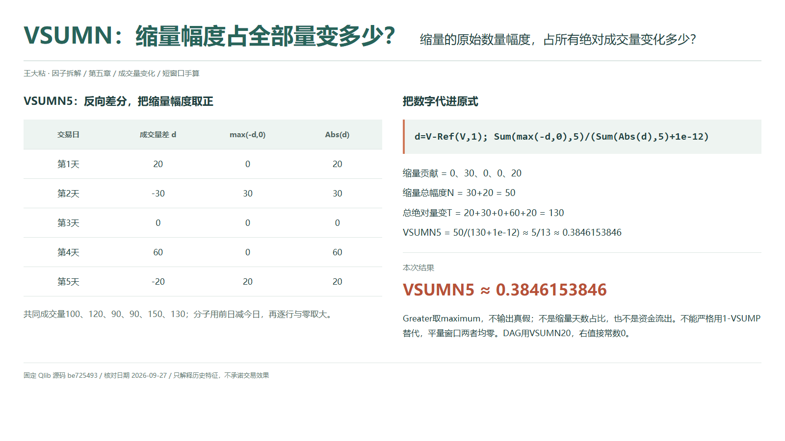
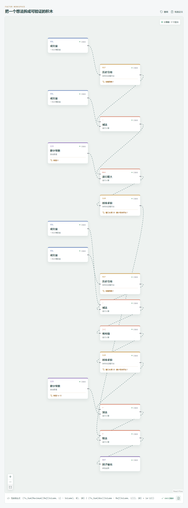

# VSUMN：缩量幅度占全部量变多少？

“最近经常缩量”和“缩量贡献了大部分变化”不是一回事。前者在数发生次数，后者在累计变化幅度。VSUMN 属于后者：把每天相对前一天减少的成交量取正值，加起来，再看它占全部绝对量变多少。

## 它到底在算什么？

本地 `src/factors.ts` 采用的 Qlib Alpha158 表达式是：

```text
VSUMN_n =
Sum(Greater(Ref($volume,1)-$volume,0),n)
/(Sum(Abs($volume-Ref($volume,1)),n)+1e-12)
```

记 `d=Volume-Ref(Volume,1)`，分子逐行取 `max(-d,0)`。`Greater` 是取两个数中的较大值，不是布尔比较。今天少于昨天时，留下减少的原始数量；今天更多或持平时，这一天对分子的贡献为零。



共同样本的成交量从第 0 天开始为 `100、120、90、90、150、130`。五次差分要使用六行量，第零天只提供前值：

| 第几天 | 成交量差 d | 缩量部分 max(-d,0) | 绝对量变 |
| --- | ---: | ---: | ---: |
| 1 | 20 | 0 | 20 |
| 2 | -30 | 30 | 30 |
| 3 | 0 | 0 | 0 |
| 4 | 60 | 0 | 60 |
| 5 | -20 | 20 | 20 |

```text
缩量总幅度 N = 30+20 = 50
全部绝对量变 T = 20+30+0+60+20 = 130
VSUMN5 = 50/(130+1e-12)
        ≈ 5/13 ≈ 0.3846153846
```

结果是非负比例，不是负收益，也不是少成交了多少百分比。这里累计的是成交量的原始差额，没有将每次差额除以前日成交量。两天缩量的次数占比是 `2/5`，与这个数量占比不是同一个数。

## 为什么这样设计？

它保留缩量的程度：减少很多与只减少一点，对分子的贡献不同。用全窗口绝对量变归一化，则允许把缩量部分与放量部分放到同一参照下讨论。这比单纯累计缩量差额少受标的绝对成交规模影响。

但公式只看量，不看收盘涨跌，更不看订单是谁主动发起。缩量不能直接解释成资金流出，也不能替代买卖力量判断。减少的是相邻观测的成交数量，不是账户里被观察到的资金余额。

## 什么时候容易误读？

最常见的偷懒是直接写成 `1-VSUMP`。在同一完整窗口，若放量总幅度为 `P`、缩量总幅度为 `N`，有 `P+N=T`，但两项比例之和其实是 `T/(T+1e-12)`，只在极小项可忽略时近似一。

全窗量不变时，`P、N、T` 都为零，两项因子也都为零。此时用一减另一项就会得到错误结果。不要被源码里的简写注释带偏，应按实际分子、分母复现。

单位混用会制造虚假的量变；即使全窗统一换单位，固定极小项也会破坏近零区域的严格尺度不变性。还要注意异常量与缺失记录：删掉中间一天再做差，比较的就不再是原来的相邻观测。

Qlib 求和跳过缺失差分，最少有效样本为 1；全窗差分缺失时输出为空，不会被分母的极小项变成零。部分缺失或短历史也可能有结果，应另查覆盖情况。当天总量要等统计周期结束才完整。

## 在因子工坊里怎么拆？



```text
历史引用成交量（1）减当前成交量 → 逐行取大（与 0）
→ 时序求和（20） → 分子
当前成交量减历史引用（1） → 绝对值 → 时序求和（20）
→ 加常数 1e-12 → 分母
除法 → 因子输出
```

实际展开中，“逐行取大”的右值连接数字常数 `0`，左值接反向差分，输出保留缩量数量而非真假标签。分子减法方向与放量那篇相反，分母仍用全部绝对量变；不能只改分母方向或将两条支路都误接成缩量求和。

两处求和窗口统一为 `20`，Qlib 导入的 `min_samples=1`。复算本例只把窗口改为 `5`，保留门槛 `1` 和前值基准行。将门槛也设为窗口长度属于额外满窗要求，不再沿用 Qlib 的默认预热和缺失口径。

## 自己动手改一下

仅交换分子减法的两个输入，其他连线保持不变，缩量部分就变成放量部分，本例输出约为 `0.6153846154`。再将六行成交量全部设成同一个数，两支输出都会为零。这一对照既检查减法方向，也能当场识破“二者总是严格互补”的误解。

---

源码核对日期：2026-09-27；固定提交：`be725493eb1a6bbb42bf11b37aa7669f59610ff1`。

- [Qlib Alpha158 VSUMN 原式及注释：loader.py](https://github.com/microsoft/qlib/blob/be725493eb1a6bbb42bf11b37aa7669f59610ff1/qlib/contrib/data/loader.py#L291-L299)
- [Greater 的 maximum 语义：ops.py](https://github.com/microsoft/qlib/blob/be725493eb1a6bbb42bf11b37aa7669f59610ff1/qlib/data/ops.py#L438-L455)
- [Ref 与滚动求和：ops.py](https://github.com/microsoft/qlib/blob/be725493eb1a6bbb42bf11b37aa7669f59610ff1/qlib/data/ops.py#L781-L864)

本文只解释统计定义与复现方法，不构成投资建议或收益承诺。
