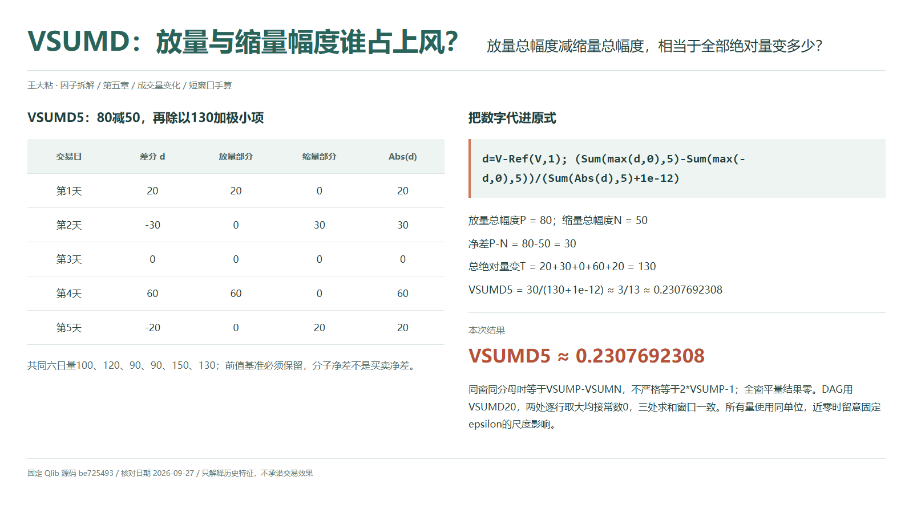
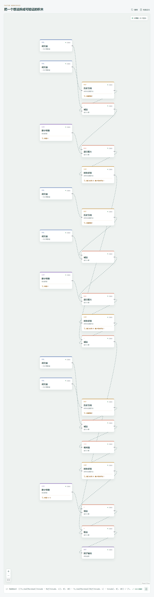

# VSUMD：放量与缩量幅度谁占上风？

看完放量与缩量各占多少，还可以问：两边的总变化幅度相差多少？VSUMD 用放量幅度减去缩量幅度，再除以全部绝对量变。正负号描述的是成交数量扩张与收缩的相对差额，不是价格涨跌，也不是买卖力量的净差。

## 它到底在算什么？

`src/factors.ts` 对照的 Qlib Alpha158 原式为：

```text
VSUMD_n =
(Sum(Greater($volume-Ref($volume,1),0),n)
 -Sum(Greater(Ref($volume,1)-$volume,0),n))
/(Sum(Abs($volume-Ref($volume,1)),n)+1e-12)
```

设 `d=Volume-Ref(Volume,1)`，放量部分是 `max(d,0)`，缩量部分是 `max(-d,0)`。两个 `Greater` 都是逐行取最大值，保留数量大小，不是把变化变成真假标签后数天数。



全章第 0 至第 5 天成交量为 `100、120、90、90、150、130`：

| 第几天 | 差分 d | 放量部分 | 缩量部分 | 绝对量变 |
| --- | ---: | ---: | ---: | ---: |
| 1 | 20 | 20 | 0 | 20 |
| 2 | -30 | 0 | 30 | 30 |
| 3 | 0 | 0 | 0 | 0 |
| 4 | 60 | 60 | 0 | 60 |
| 5 | -20 | 0 | 20 | 20 |

```text
放量总幅度 P = 80，缩量总幅度 N = 50
净差 P-N = 30
全部绝对量变 T = 130
VSUMD5 = 30/(130+1e-12) ≈ 3/13 ≈ 0.2307692308
```

正值说明放量的数量幅度较大，不能解释成上涨概率。今天量其实比昨天少，但整个窗口仍可得到正值；最后一天的方向和窗口累计差额并不矛盾。

## 为什么这样设计？

这一步把两个非负比例压缩成一个带符号的统计量。同窗、同样本、同一分母时，`VSUMD=VSUMP-VSUMN`；不过 `VSUMP+VSUMN=T/(T+1e-12)` 只是近似一，因此不能不加条件地将前式改写成严格的 `2*VSUMP-1`。

还有一个有用观察：在连续无缺失的序列上，所有相邻差分相加会抵消中间项。本例分子就是 `130-100=30`，比较的是今天与第零天，不是五日窗口第一天的 `120`。分母却仍保留中间来回变化的绝对总量，所以它不只是一个端点比值。

## 什么时候容易误读？

净差接近零，不代表成交量平稳。剧烈放量再缩回原处，也会令分子抵消；想知道过程中是否折腾，必须查看分母或原始量序列。全窗完全持平时，分子与绝对量变同时为零，原式输出零，而不是负一。

这个因子不含价格，也不含主动买卖分类。放量净差为正不代表资金净流入，缩量净差为负也不等于卖压更大。异常成交与单位混用可能同时扭曲分子、分母，应先确认数据口径。

即使全部成交量统一缩放，固定极小项仍不缩放，近零时不具有严格尺度不变性。缺失行还会破坏相邻差分的含义和端点抵消关系，不能一边删行、一边沿用完整窗口的解释。

Qlib 求和跳过缺失差分，全窗差分缺失时为空；只有部分差分有效时，分子不再保证等于整个窗口的首尾量差。最少有效样本为 1 也允许短历史输出，不能把非空当作已满窗。完整日量可用前不能使用日终读数。

## 在因子工坊里怎么拆？



```text
d = 当前成交量 - 历史引用成交量（1）
d、常数 0 → 逐行取大 → 时序求和（20） → P
反向差分、常数 0 → 逐行取大 → 时序求和（20） → N
d → 绝对值 → 时序求和（20） → 加常数 1e-12 → 分母
P、N → 减法 → 分子；除法 → 因子输出
```

实际展开有两处“逐行取大”，各自右值均连接常数零，另有一支绝对差分求和。两个非负和先做减法，再接最终除法；不能颠倒减法顺序。三处求和窗口同步设为 `20`，Qlib 导入的 `min_samples` 均为 `1`。复核手算只把三个窗口改为 `5`，保留门槛 `1` 和基准行；若将门槛设为窗口长度，就是主动增加满窗要求，改变原版预热和部分缺失输出。

## 自己动手改一下

把分母的“绝对差分求和”换成“成交量求和”，保留极小项。五日总量为 `580`，新结果 `30/(580+1e-12)` 约为 `0.0517241379`。分子没变，参照从量变总幅度换成了成交量总和，问题也变成“净量变相对累计成交量有多大”。这是新指标，不能继续冒用原 VSUMD 的含义。

---

源码核对日期：2026-09-27；固定提交：`be725493eb1a6bbb42bf11b37aa7669f59610ff1`。

- [Qlib Alpha158 VSUMD 原式：loader.py](https://github.com/microsoft/qlib/blob/be725493eb1a6bbb42bf11b37aa7669f59610ff1/qlib/contrib/data/loader.py#L300-L308)
- [Greater 的 maximum 语义：ops.py](https://github.com/microsoft/qlib/blob/be725493eb1a6bbb42bf11b37aa7669f59610ff1/qlib/data/ops.py#L438-L455)
- [Ref 与滚动求和：ops.py](https://github.com/microsoft/qlib/blob/be725493eb1a6bbb42bf11b37aa7669f59610ff1/qlib/data/ops.py#L781-L864)

本文只解释统计定义与复现方法，不构成投资建议或收益承诺。
