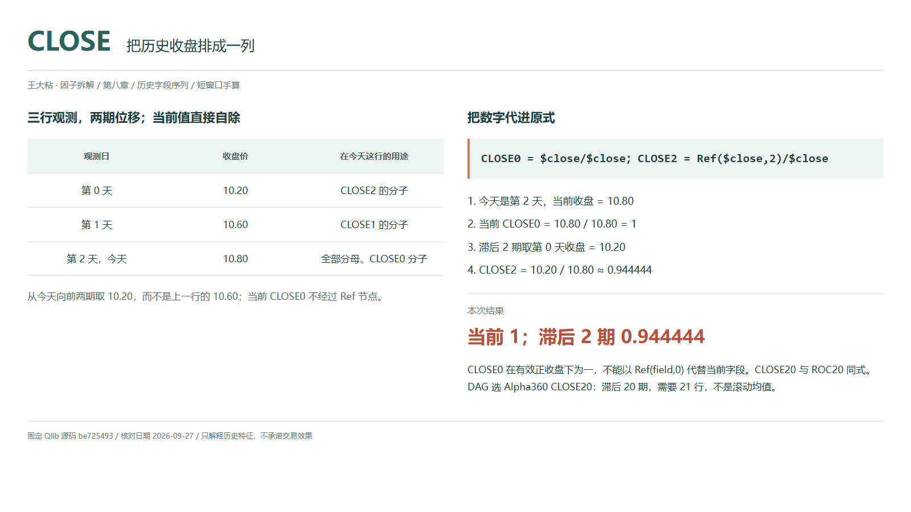
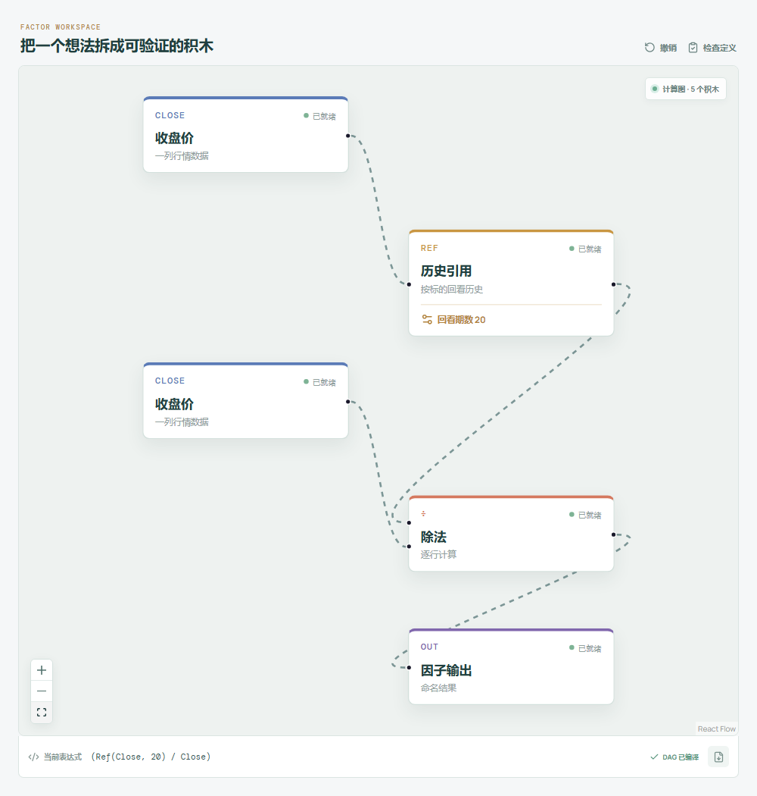

# CLOSE：把历史收盘排成一列

前面已经讲过[ROC：过去价格相对今天是多少](../第三章-趋势分位与极值时点/01-ROC-过去价格相对今天是多少.md)。Alpha360 的历史 CLOSE 用的就是同一种端点比例，这里不重讲收益率换算，而是看它怎样组成一串特征。

把过去每天的收盘都放到今天这把尺子上，得到的是价格路径的离散记录。它不是六十条交易理由，也不会因为列数多就自动包含更多独立信息。



## 它到底在算什么？

```text
Alpha360 CLOSEi = Ref($close,i)/$close，i=59,...,1
Alpha360 CLOSE0 = $close/$close
```

| 观测日 | 收盘价 | 在今天这行的用途 |
| --- | ---: | --- |
| 第 0 天 | 10.20 | CLOSE2 的分子 |
| 第 1 天 | 10.60 | CLOSE1 的分子 |
| 第 2 天，今天 | 10.80 | 所有项的分母、CLOSE0 的分子 |

```text
当前 CLOSE0 = 10.80 / 10.80 = 1
滞后 CLOSE2 = 10.20 / 10.80 ≈ 0.944444
```

分子在历史上移动，分母固定为本行的今天收盘。完整序列依次是 `CLOSE59,...,CLOSE1,CLOSE0`，共六十个位置；最远是五十九期前，不包含 `CLOSE60`。

有效正收盘下，`CLOSE0` 恒等于一。源码直接自除，不能改成 `Ref($close,0)/$close`，因为 Qlib 的零参数引用返回加载序列首值。

## 为什么有人会这样设计？

单独一项只看两端，但把各个滞后位置放在一起，模型才有机会比较过去路径的形状。例如首尾一样，中间先冲高再回落与平缓上行，可以有不同的序列。

Alpha360 合起来是开、高、低、收、VWAP、成交量六字段乘六十位置的特征堆叠，不是三百六十套押注理论。价格统一除以当前收盘，成交量另用当前量归一化；尺度统一也不代表各列统计独立。

## 它什么时候容易骗人？

**列名不同，信息可能相同。** 同口径下 `CLOSE20` 与 Alpha158 的 `ROC20` 完全同式。把两列同时加入模型，不是获得两份独立证据，还要检查重复特征。

**滞后不是滚动窗口。** `CLOSE20` 取二十期前一个观测，需要覆盖 21 行，不是二十日均价。整组六十位置需要覆盖六十行，缺历史时不能用零或最近值冒充。

**分母也在改变读数。** 今天收盘变动，会让今天这一行全部历史价格比例一起变化。先分清历史价格变化和共同分母的作用。

价格应有效且为正；当前收盘缺失或为零时不能把 `CLOSE0` 强行填成一。复权要一致，跳空要核实，日历缺口不可随手删掉。最终收盘只有日终可用，信号时点必须随后安排。

## 在因子工坊里怎么拆？



选择 **Alpha360 CLOSE20**，一路收盘经过回看期数 20 的历史引用后接分子，另一路当前收盘直接接分母，最后接输出。它与 ROC20 的图结构相同，这是定义重叠，不是截图选错。

图中回看 20 期，改为 2 才对应手算。当前 `CLOSE0` 移除历史引用，两路都直接接收盘。

## 自己动手改一下

把第 1 天收盘从 10.60 改为 10.70。`CLOSE2` 和 `CLOSE0` 不变，但 `CLOSE1` 从 `10.60/10.80≈0.981481` 变成 `10.70/10.80≈0.990741`。这说明单个滞后不看中途，整串字段却可以记录中间位置的变化。

---

原始表达式来源：Microsoft Qlib Alpha360。源码核对日期：2026-09-27。

固定版本：`be725493eb1a6bbb42bf11b37aa7669f59610ff1`。

- [Alpha360 六字段与 CLOSE 序列：loader.py](https://github.com/microsoft/qlib/blob/be725493eb1a6bbb42bf11b37aa7669f59610ff1/qlib/contrib/data/loader.py#L16-L58)
- [Alpha158 ROC 的同式定义：loader.py](https://github.com/microsoft/qlib/blob/be725493eb1a6bbb42bf11b37aa7669f59610ff1/qlib/contrib/data/loader.py#L149-L153)
- [Ref 的零参数与移位实现：ops.py](https://github.com/microsoft/qlib/blob/be725493eb1a6bbb42bf11b37aa7669f59610ff1/qlib/data/ops.py#L781-L824)

项目地址：[王大粘 · 因子工坊](https://github.com/superalp1985/-)

本文只讨论因子定义与研究方法，不构成投资建议。
