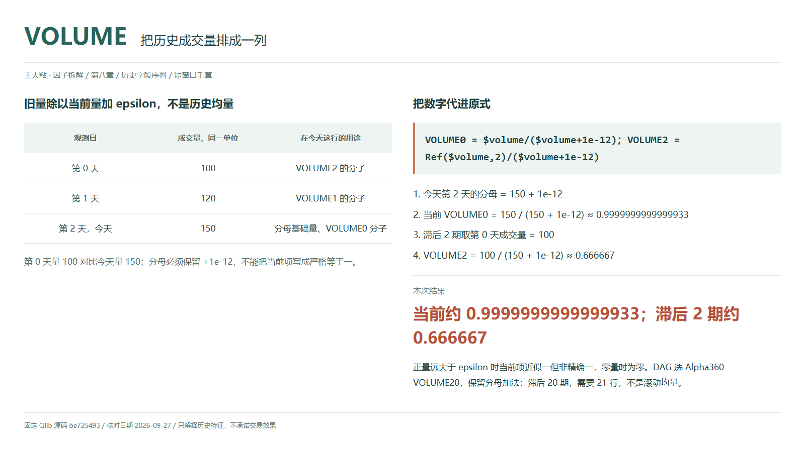
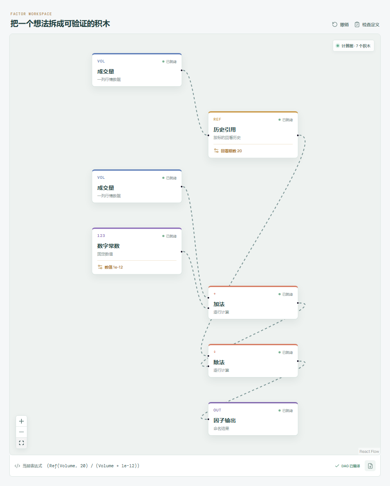

# VOLUME：把历史成交量排成一列

“今天成交量比前几天大”，可以指比昨天大，也可以指比某段均量大。Alpha360 的 VOLUME 只保留一个历史位置与今天的比例，不先把历史成交量揉成平均数。

分子是旧量，分母是今天的量。读数小，可能只是今天更活跃，并不等于资金流入，更不自动意味着价格应该上涨。



## 它到底在算什么？

```text
Alpha360 VOLUMEi = Ref($volume,i)/($volume+1e-12)，i=59,...,1
Alpha360 VOLUME0 = $volume/($volume+1e-12)
```

| 观测日 | 成交量，同一单位 | 在今天这行的用途 |
| --- | ---: | --- |
| 第 0 天 | 100 | VOLUME2 的分子 |
| 第 1 天 | 120 | VOLUME1 的分子 |
| 第 2 天，今天 | 150 | 分母基础量、VOLUME0 的分子 |

```text
当前 VOLUME0 = 150 / (150 + 1e-12) ≈ 0.9999999999999933
滞后 VOLUME2 = 100 / (150 + 1e-12) ≈ 0.666667
```

旧量约为今天的三分之二，不是“成交量下降了三分之一”的时间方向。当前正量在数学上除以更大的分母，结果略小于一；量远大于 epsilon 时才近似一，不能写成严格恒等。显示精度可能把差异舍掉。

当前量为零时，`VOLUME0=0/(0+1e-12)=0`。零滞后直接取量，不能用 `Ref($volume,0)`：指定 Qlib 实现会取加载序列首值。

## 为什么有人会这样设计？

原始成交量受标的规模和交易单位影响，直接并排比较容易混入量级差异。用当前量作参照，模型可以看到近期放量或缩量在各个历史位置留下的相对形状。

它仍不是换手率，没有除以流通股本，也不是主动买卖差额。Alpha360 是六字段乘六十位置的特征堆叠，成交量是其中一族，不是六十套独立的量价策略。

## 它什么时候容易骗人？

**epsilon 只缓解除零，不负责判断行情有效。** 今天量为零、历史量为正时，历史项会非常大；这可能是停牌、无成交或数据问题，不能把巨大读数直接当成极强信号。

**同一单位不等于同一统计口径。** 股与手不能混用，拆股后的量调整、集合竞价范围、分钟与日线频率都要一致。即使整列统一换单位，固定 epsilon 也不随量缩放，因此只在它可忽略时近似尺度不变。负成交量应视为异常；缺失记录不是零成交量，不能填零混为一谈。

**滞后量不是均量。** `VOLUME20` 取二十期前一个观测，不是二十日平均，需要 21 行定位。删掉缺口或停牌行会改变回看位置，应沿用明确的交易日历。

全日成交量要到日终才完整。价格跳空本身不会进入这条公式，也不能代替对量数据及复权口径的核查。

## 在因子工坊里怎么拆？



选择 **Alpha360 VOLUME20**，成交量经历史引用，回看期数设为 20，接除法分子；当前成交量与常数 `1e-12` 先相加，再接分母与输出。图中的加法节点不能省略。

回看改为 2 核对手算；当前 `VOLUME0` 移除分子上的引用，但分母的 epsilon 必须保留。

## 自己动手改一下

先把第 1 天量改成 130，`VOLUME2` 不变。再把今天量改成零，当前项变零，历史项变成 `100/1e-12=100000000000000`。这不是发现机会，而是提醒你把无成交状态单独标记并检查处理规则，不能只靠分母里的小常数。

---

原始表达式来源：Microsoft Qlib Alpha360。源码核对日期：2026-09-27。

固定版本：`be725493eb1a6bbb42bf11b37aa7669f59610ff1`。

- [VOLUME 正滞后与零滞后的实际表达式：loader.py](https://github.com/microsoft/qlib/blob/be725493eb1a6bbb42bf11b37aa7669f59610ff1/qlib/contrib/data/loader.py#L52-L56)
- [Ref 的零参数与移位实现：ops.py](https://github.com/microsoft/qlib/blob/be725493eb1a6bbb42bf11b37aa7669f59610ff1/qlib/data/ops.py#L781-L824)

源码概述将最新归一化量简写为一；本文按实际带 `1e-12` 的可执行表达式区分近似值与精确值。

项目地址：[王大粘 · 因子工坊](https://github.com/superalp1985/-)

本文只讨论因子定义与研究方法，不构成投资建议。
