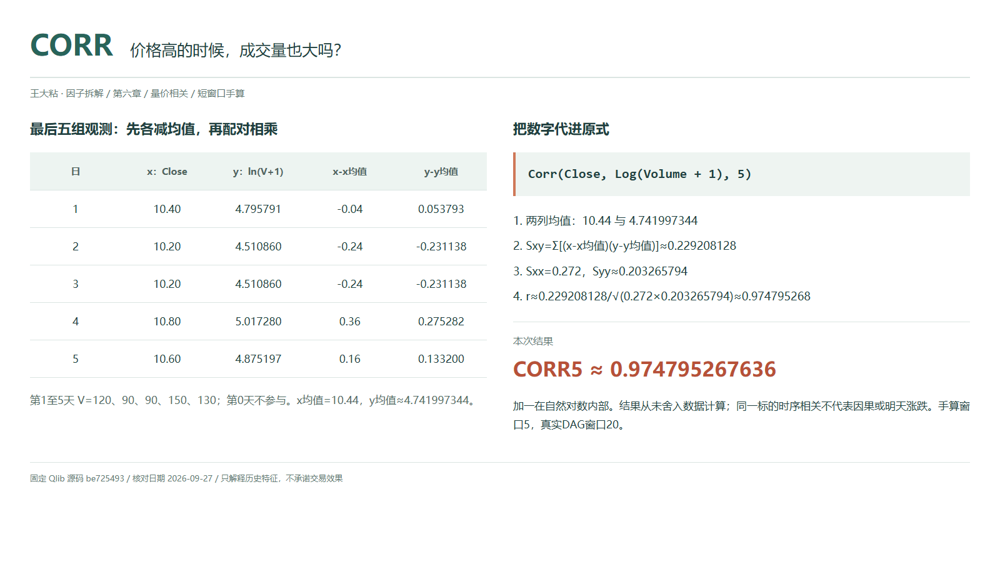
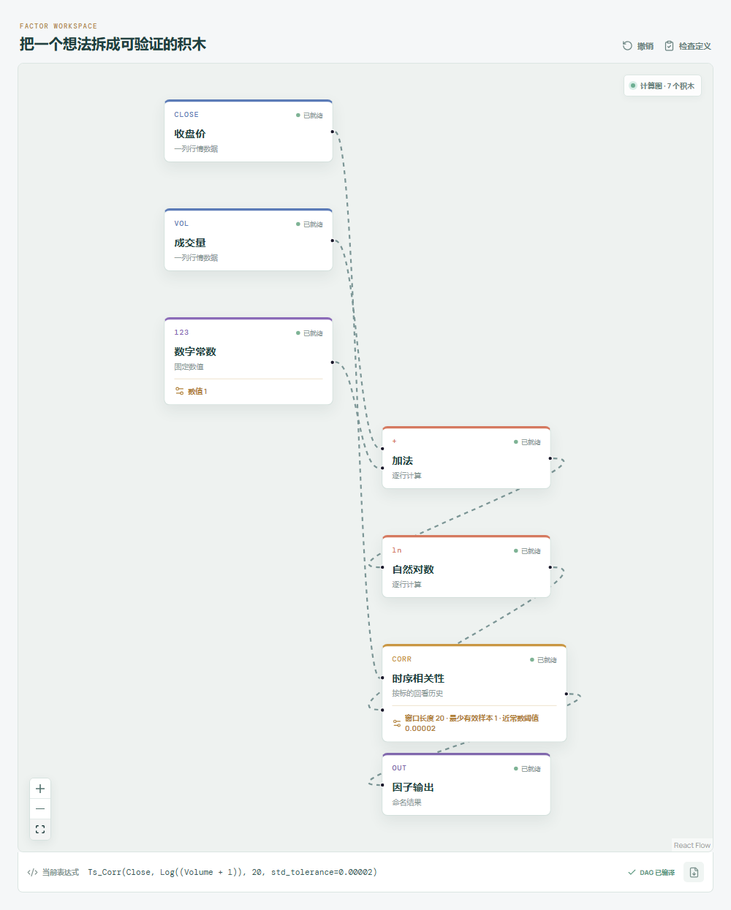

# CORR：价格高的时候，成交量也大吗？

看到价格和成交量一起抬升，很容易说一句“量价配合”。但这句话可能指当天一起涨，也可能指价格较高的日子成交量较大。Qlib Alpha158 的 CORR 回答的是后一个问题：一只股票在最近一段时间里，价格水平与对数成交量是否同高同低？



## 它在算什么？

原式必须保留对数里面的加一：

```text
CORR_n = Corr($close,Log($volume+1),n)
x = 当天收盘价
y = ln(当天成交量 + 1)
r = Σ[(x-x均值)(y-y均值)] / √[Σ(x-x均值)² × Σ(y-y均值)²]
```

这是同一标的、窗口内按日期配对的 Pearson 时序相关，不是同一天把不同股票放在一起的截面相关。正值表示两列相对各自均值的偏离大体同向，负值表示大体反向，接近零只说明线性关系弱，不等于完全无关。

取本章第 1 至第 5 天，成交量依次为 `120、90、90、150、130`。第 0 天不参与 CORR5。下面先算自然对数，再给两列各减去自己的均值：

| 日 | x：收盘价 | y：ln(V+1) | x-x均值 | y-y均值 |
| --- | ---: | ---: | ---: | ---: |
| 1 | 10.40 | 4.795791 | -0.04 | 0.053793 |
| 2 | 10.20 | 4.510860 | -0.24 | -0.231138 |
| 3 | 10.20 | 4.510860 | -0.24 | -0.231138 |
| 4 | 10.80 | 5.017280 | 0.36 | 0.275282 |
| 5 | 10.60 | 4.875197 | 0.16 | 0.133200 |

```text
x均值 = 10.44；y均值 ≈ 4.741997343729
交叉离差和 ≈ 0.229208128014
x离差平方和 = 0.272；y离差平方和 ≈ 0.203265793680
CORR5 ≈ 0.229208128014 / √(0.272 × 0.203265793680)
      ≈ 0.974795267636
```

第 4 天两列都高于均值，乘积为正；第 2、3 天都低于均值，乘积也为正。不是“每一天都上涨”才会有正相关。表格只为展示而舍入，结果用 Python 按未舍入数据复算。

## 为什么这样设计？

价格水平保留了窗口中的高低位置；对数压缩成交量的数量级差异，减少大成交量在数值尺度上的突出程度。加一使非负成交量在零值处也能计算：`ln(0+1)=0`。它不是把 `ln(V)` 算完再加一，两种写法并不等价。

这个数适合描述历史量价状态，却不能证明成交量推动价格，也没有回答量先动还是价先动，更不能推出明天上涨。两条水平序列若都随时间上移，即使没有稳定经济关系，也可能出现趋势造成的伪相关。

## 什么时候会失真？

单日异常价格或异常成交量仍可能明显拉动 Pearson 相关，对数不等于异常值免疫。统一复权、成交量单位并核查停牌和数据错误，比给高相关贴上“强势”标签更重要。即使整列统一换单位，`ln(kV+1)` 也不等于 `ln(V+1)` 加一个常数，因此 CORR 不严格保持不变，零量或小量时尤其要留意。

常数序列没有可定义的相关系数。所核对 Qlib 还会检查两侧各自窗口的样本标准差：`np.isclose(std,0,atol=2e-5)` 命中就置为 `NaN`，近常数也不能硬算。这里检查的是收盘与 `ln(V+1)` 各自的窗口，不是仅在配对后剩余的数据上重算标准差；缺失分布不同时要分清这两步。阈值是绝对数值，换尺度可能改变是否被置空。

源码的 `min_periods=1` 只是预热下限；相关仍至少需要两组有效配对，且两列都有变化。缺失时按同一日期成对排除，不能分别删空后错位拼接；只有两组的读数尤其脆弱。最终收盘与全天量都参与计算，日终数据可用前不能使用这个读数。

## 在画布中拆开 CORR20



```text
收盘价 ----------------------> 时序相关性：序列 A
成交量 -> 加法（常数 1）-> 自然对数 -> 时序相关性：序列 B
时序相关性（窗口 20）-> 因子输出
```

工坊表达式写作 `Ts_Corr(Close, Log((Volume + 1)), 20, std_tolerance=0.00002)`。`Ts_Corr` 对应原式的 `Corr`，字段 `Close`、`Volume` 分别对应 `$close`、`$volume`；这里的改名不改变公式。

Qlib 导入的相关节点显式设置 `min_samples=1`、`std_tolerance=2e-5`。通用相关积木的近常数阈值默认是 `0`，手搭时必须改成 Qlib 口径；不能把“只排除严格常数”当成相同边界。展开时也要确认“加一”在自然对数之前。

## 自己动手改一下

把相关节点的窗口改成 5，保留 `min_samples=1` 和 `std_tolerance=2e-5`，先核对上面的结果，再把成交量直接接入序列 B，绕过加法和对数。本例变成：

```text
Corr(Close,Volume,5) = 26.8 / 27.2 ≈ 0.985294117647
```

两次都很高，却不是同一个指标。对数是非线性变换，会改变 Pearson 相关，不能因为保留大小顺序就当它没作用。

---

原始表达式来源：Microsoft Qlib Alpha158。源码核对日期：2026-09-27。

固定提交：`be725493eb1a6bbb42bf11b37aa7669f59610ff1`。

- [CORR 字段与原式：loader.py](https://github.com/microsoft/qlib/blob/be725493eb1a6bbb42bf11b37aa7669f59610ff1/qlib/contrib/data/loader.py#L221-L224)
- [自然对数：ops.py](https://github.com/microsoft/qlib/blob/be725493eb1a6bbb42bf11b37aa7669f59610ff1/qlib/data/ops.py#L167-L182)
- [逐标的配对滚动与近常数检查：ops.py](https://github.com/microsoft/qlib/blob/be725493eb1a6bbb42bf11b37aa7669f59610ff1/qlib/data/ops.py#L1415-L1498)

[本章数据与目录](README.md) · [下一篇：CORD](02-CORD-价格变化与成交量变化同步吗.md)

本文只讨论因子定义与研究方法，不构成投资建议。
