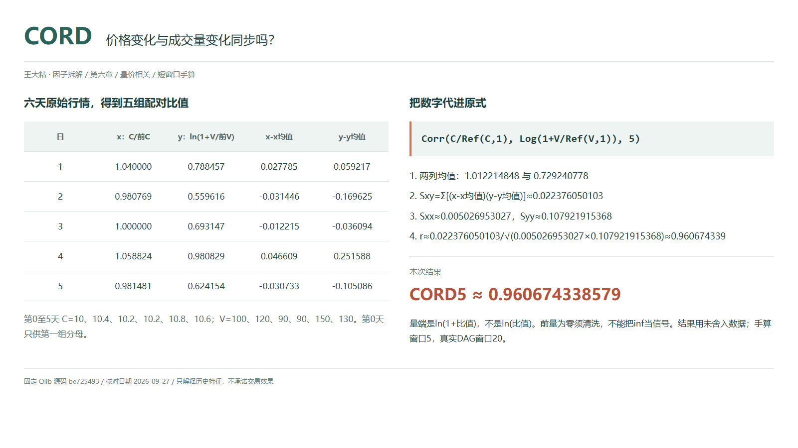
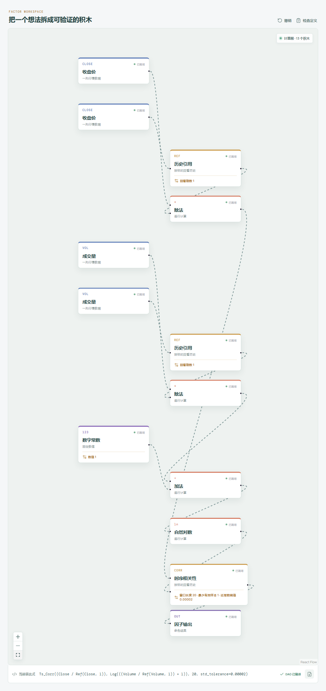

# CORD：价格变化与成交量变化同步吗？

CORR 看价格和成交量的水平。若想问“价格相对上一天变化较大时，成交量的相对变化是否也较大”，Qlib Alpha158 另有 CORD。它先把两列变成前后比值，再计算同一股票最近一段时间的配对 Pearson 相关。



## 先把两个输入认清

```text
CORD_n = Corr($close/Ref($close,1),Log($volume/Ref($volume,1)+1),n)
x_t = C_t / C_(t-1)
q_t = V_t / V_(t-1)
y_t = ln(1 + q_t)
```

价格端没有减一；它是比值，不是通常的百分比收益率。但 Pearson 会减去各自均值，所以把所有 x 减一，中心化偏差不变，相关系数也不变。

成交量端不能照此随意改写：原式是 `ln(1+比值)`，不是 `ln(比值)`，也不是 `ln(1+成交量pct_change)`。后者等于 `ln(比值)`。对数里面移一个常数是非线性变化，不受上述平移不变性保护。

## 用五组观测算一次

第 0 至第 5 天收盘价为 `10、10.4、10.2、10.2、10.8、10.6`，成交量为 `100、120、90、90、150、130`。最后五组是第 1 至第 5 天；第 0 天只给第一组提供分母。

例如第 1 天：`x=10.4/10=1.04`，`y=ln(1+120/100)=ln(2.2)`。两列各减均值后计算：

| 日 | x：价格比值 | y：ln(1+量比) | x-x均值 | y-y均值 |
| --- | ---: | ---: | ---: | ---: |
| 1 | 1.040000 | 0.788457 | 0.027785 | 0.059217 |
| 2 | 0.980769 | 0.559616 | -0.031446 | -0.169625 |
| 3 | 1.000000 | 0.693147 | -0.012215 | -0.036094 |
| 4 | 1.058824 | 0.980829 | 0.046609 | 0.251588 |
| 5 | 0.981481 | 0.624154 | -0.030733 | -0.105086 |

```text
x均值 ≈ 1.012214848332；y均值 ≈ 0.729240778189
Sxy = Σ[(x-x均值)(y-y均值)] ≈ 0.022376050103
Sxx = Σ(x-x均值)² ≈ 0.005026953027
Syy = Σ(y-y均值)² ≈ 0.107921915368
CORD5 = Sxy / √(Sxx × Syy) ≈ 0.960674338579
```

第 3 天价格、成交量都没变，输入却是 `1` 和 `ln(2)`，不是两个零。表内数字为展示值，最终结果用 Python 从原始数据高精度计算。

## 为什么用变化，又不能迷信变化？

比值把关注点从绝对水平移到相邻观测的相对变化，减少只看共同趋势的干扰，但不保证消除伪相关。对量比取对数压缩尺度，也不会消除异常值的影响。

这是每只股票自己的时间序列统计，不是股票之间的截面相关。正值只说明窗口里两列偏离各自均值的方向较一致，不能推出每次放量都上涨；也不能证明因果、领先方向或下一天涨跌。

## 什么时候会失真？

若昨天成交量为零，量比先发生无效除法，后面的加一救不了它。必须核查停牌和缺失、清洗无效值，不能把无穷大裁成一个“大信号”。今天量为零且昨天量为正时则得到 `ln(1)=0`，要区分两种情况；价格分母也须有效。

Qlib 的 `min_periods=1` 不代表一组就能算相关：至少两组有效配对且两列有变化。任一侧各自窗口的样本标准差被 `np.isclose(std,0,atol=2e-5)` 判为近零，会置 `NaN`；检查对象是价格比值与 `ln(1+量比)`，不是原始价格和量，也不是仅配对样本的标准差。缺失按同一日期成对处理；先保留时间对齐再做历史引用，勿先删行造成跨缺口的假日变化。当天最终收盘和全天量尚不可用时，不能提前使用日终结果。

## 在画布中拆开 CORD20



```text
Close / Ref(Close,1) ----------------------> 时序相关性：序列 A
Volume / Ref(Volume,1) -> 加 1 -> 自然对数 -> 时序相关性：序列 B
时序相关性（窗口 20）-> 因子输出
```

两个历史引用都回看 1 期，不是 20 期。画布显示：

```text
Ts_Corr((Close / Ref(Close, 1)), Log(((Volume / Ref(Volume, 1)) + 1)), 20, std_tolerance=0.00002)
```

`Ts_Corr` 对应 Qlib 的 `Corr`，`Close`、`Volume` 对应 `$close`、`$volume`。Qlib 导入显式设置 `min_samples=1`、`std_tolerance=2e-5`；通用相关积木的近常数阈值默认 `0`，手搭时要相应调整。复核手算只将窗口改为 5，保留这两个参数；完整的 20 组比值则需要 21 条对齐行情。

## 自己动手改一下

先在价格比值后接“减一”：本例仍为 `0.960674338579`。再恢复价格端，只绕过成交量支路的“加一”，让量比直接取对数：结果约为 `0.963635154812`，已经不是原 CORD。

这两次改动正好区分“整列平移”和“改变非线性变换”。不要只看结果相近就判断公式相同。

---

原始表达式来源：Microsoft Qlib Alpha158。源码核对日期：2026-09-27。

固定提交：`be725493eb1a6bbb42bf11b37aa7669f59610ff1`。

- [CORD 字段与原式：loader.py](https://github.com/microsoft/qlib/blob/be725493eb1a6bbb42bf11b37aa7669f59610ff1/qlib/contrib/data/loader.py#L225-L228)
- [自然对数：ops.py](https://github.com/microsoft/qlib/blob/be725493eb1a6bbb42bf11b37aa7669f59610ff1/qlib/data/ops.py#L167-L182)
- [除法与历史引用：ops.py](https://github.com/microsoft/qlib/blob/be725493eb1a6bbb42bf11b37aa7669f59610ff1/qlib/data/ops.py#L418-L435)、[Ref 的 shift 实现](https://github.com/microsoft/qlib/blob/be725493eb1a6bbb42bf11b37aa7669f59610ff1/qlib/data/ops.py#L781-L824)
- [逐标的配对滚动与近常数检查：ops.py](https://github.com/microsoft/qlib/blob/be725493eb1a6bbb42bf11b37aa7669f59610ff1/qlib/data/ops.py#L1415-L1498)

[本章数据与目录](README.md) · [上一篇：CORR](01-CORR-价格高的时候成交量也大吗.md)

本文只讨论因子定义与研究方法，不构成投资建议。
