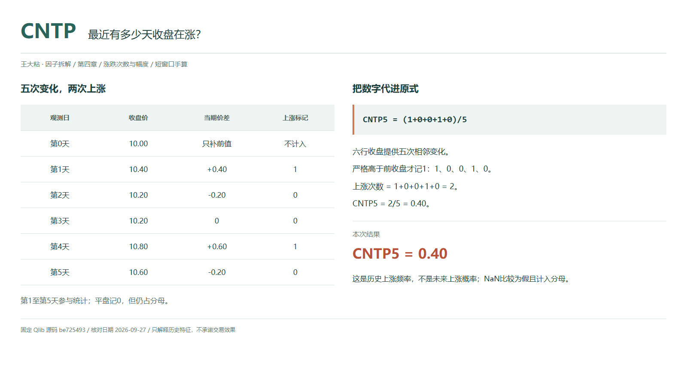
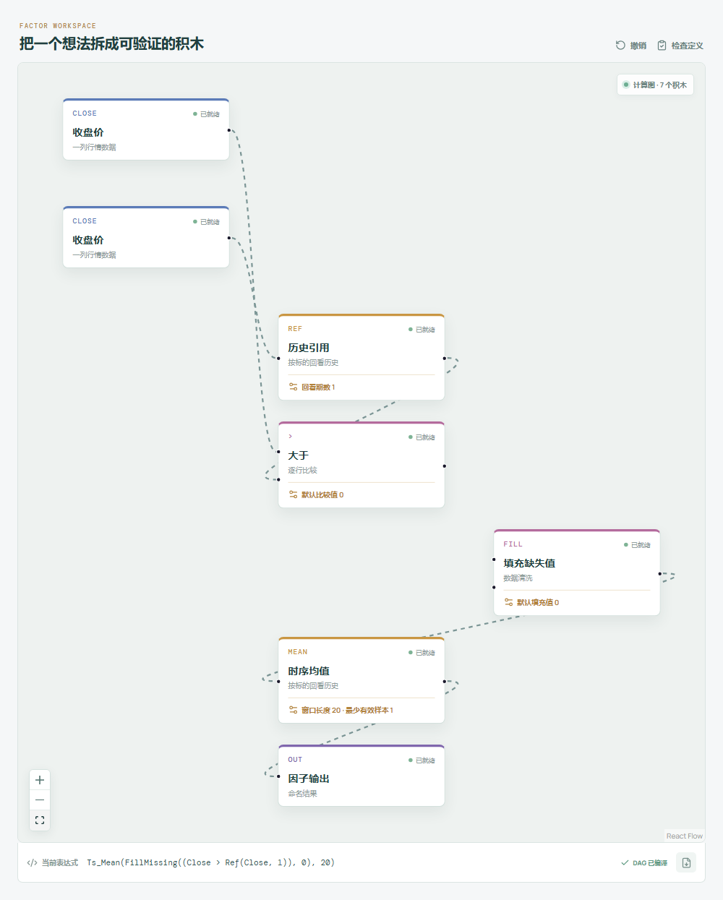

# CNTP：最近有多少天收盘在涨？

“最近涨得挺多。”这句话可能说的是涨价次数多，也可能说的是累计涨幅大。两件事听起来接近，算出来却未必一致。

Qlib Alpha158 的 CNTP 只回答前一个问题：窗口里有多少个收盘价，高于各自的上一期收盘价？涨一点和涨很多，都只记一次。



## 它到底在算什么？

Qlib 原始表达式是：

```text
CNTP_n = Mean($close>Ref($close,1),n)
```

先比较，再求均值。条件成立记为 1，不成立记为 0。这不是拿今天收盘跟窗口均价比较，也不是看当天收盘是否高于开盘。

本章统一用下面六行数据。第 0 天只提供前值，第 1 至第 5 天组成五期变化窗口：

| 观测日 | 收盘价 | 比前一天上涨？ |
| --- | ---: | ---: |
| 第 0 天，前值 | 10.00 | 不计入 |
| 第 1 天 | 10.40 | 1 |
| 第 2 天 | 10.20 | 0 |
| 第 3 天 | 10.20 | 0 |
| 第 4 天 | 10.80 | 1 |
| 第 5 天，今天 | 10.60 | 0 |

```text
五次价差 = +0.40、-0.20、0、+0.60、-0.20
上涨标记 = 1、0、0、1、0
CNTP_5 = (1+0+0+1+0)/5 = 0.40
```

也就是五次比较中有两次上涨，占 40%。第 3 天平盘，不算上涨，但仍占分母中的一个位置。五次比较需要六个收盘价，不能只有五行价格，却声称已经观察到五次变化。

## 为什么要只数次数？

有时我们关心上涨是否经常发生，不想让某一次大涨决定全部印象。CNTP 给每个观测同样的一票，因此它描述的是出现频率，不是资金收益。

这也解释了本章看似矛盾的结果：上涨和下跌各两次，次数打平，但上涨价差合计 1.00，下跌价差的绝对值只有 0.40，最后价格仍从 10.00 到了 10.60。次数没有算错，只是没有记录每一步有多大。

## 它什么时候容易骗人？

**上涨日多，不等于这段时间赚钱。** 多次小涨可以被一次大跌抵消。CNTP 也不保留这些上涨日的排列顺序，连着涨和散着涨可能得到同一个数，更不能把历史占比叫作明天上涨的概率。

**缺数据可能被算成“没有上涨”。** 官方比较使用 NumPy 语义：遇到 `NaN`，大于比较返回假。这个假进入均值后按 0 处理，仍计入分母，并不会自动剔除那次比较。它与真实平盘在此处都记 0，含义却不同。

**名字里的 20 不保证已经有二十次有效比较。** Qlib 的 `Mean` 使用 `min_periods=1`，短历史也会输出，分母是已有的比较结果数，而不是固定除以 20。研究时应另行检查历史完整性，不能看到非空数值就认定预热结束。

各期价格须来自同一标的、同一复权口径。今天的最终收盘参与计算，信号要等它可用，不能倒用到今天更早的成交时点。

## 在因子工坊里怎么拆？



把收盘价分两路：一路保持当期值，另一路接历史引用，回看 1 期。两路进入“大于”比较，当前值在左，历史值在右；比较结果先接“填充缺失值”，填充值设为 `0`，再接窗口为 20 的时序均值与输出。

这里的 `fill_missing(0)` 填的是比较结果：工坊比较遇到缺失会传出空值，把它转为 0，才能匹配 Qlib 缺失比较为假且仍计入均值分母的口径。不能把填充移到价格字段前面，那会制造并不存在的涨跌。

Qlib 写 `$close`、`Mean`，画布写 `Close`、`Ts_Mean`。核对的是计算含义，不要求表达式文本逐字相同。注意这里需要布尔比较节点，不是后面幅度因子使用的“逐行取大”。对齐官方预热口径时，均值的最少有效样本为 1。

## 自己动手改一下

把问题改成“大于或等于前收盘”：保留“大于”分支，另用同一对收盘输入搭一条“等于”分支，两个比较结果接“或者”（逻辑或）。工坊没有独立的 `>=` 积木，用这三个已有积木组合条件。

手动连线时，将“或者”接“条件选择”的条件端，真值、假值分别接常数 `1`、`0`，把布尔条件转成数值序列；再接 `fill_missing(0)` 和窗口为 5、`min_samples=1` 的时序均值。不要把数值型填充节点直接接回逻辑或的布尔端口。缺失输入会沿组合条件传到填充节点，最后才按 0 计入。

平盘也会记 1，本例变成 `3/5=0.60`。缺失比较仍按假处理，不参与“平盘”的解释。

它现在统计的是“不下跌占比”，不是原版上涨占比。保留旧结果并排看，再给新表达式换个名字：一个等号，就把第 3 天的归属改了。

---

原始表达式与算子来源：Microsoft Qlib Alpha158。源码核对日期：2026-09-27。

固定提交：`be725493eb1a6bbb42bf11b37aa7669f59610ff1`。

- [CNTP 原式：loader.py](https://github.com/microsoft/qlib/blob/be725493eb1a6bbb42bf11b37aa7669f59610ff1/qlib/contrib/data/loader.py#L229-L232)
- [严格大于比较：ops.py](https://github.com/microsoft/qlib/blob/be725493eb1a6bbb42bf11b37aa7669f59610ff1/qlib/data/ops.py#L478-L495)
- [滚动预热、Ref 与 Mean：ops.py](https://github.com/microsoft/qlib/blob/be725493eb1a6bbb42bf11b37aa7669f59610ff1/qlib/data/ops.py#L713-L844)

本文只讨论因子定义与研究方法，不构成投资建议。
