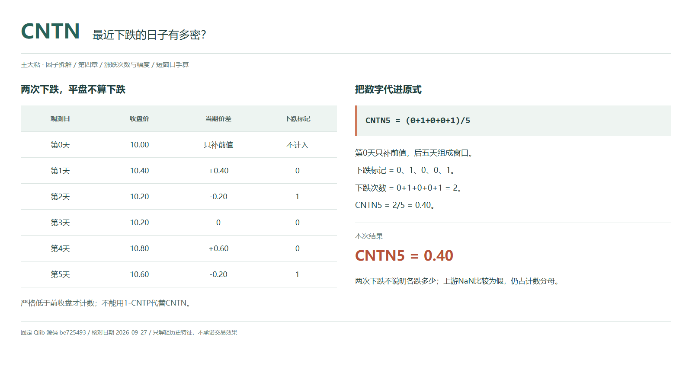
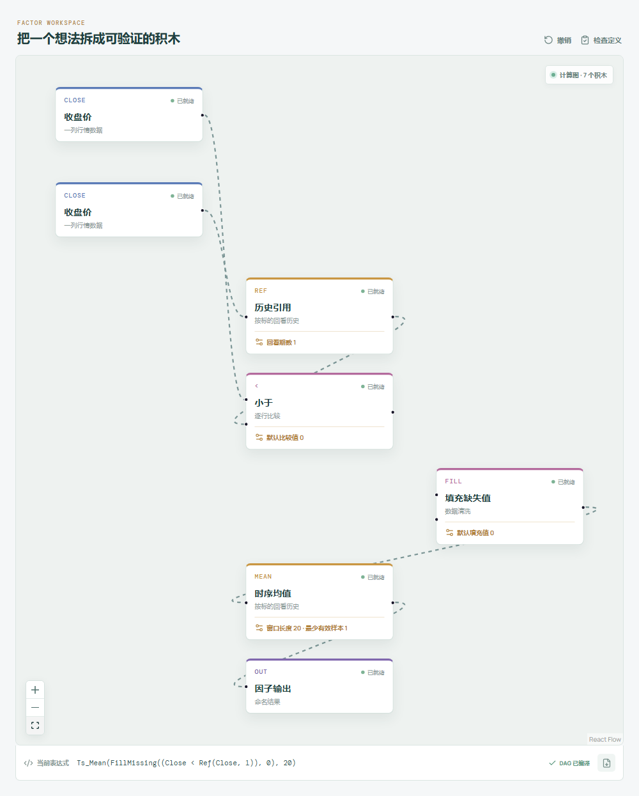

# CNTN：最近下跌的日子有多密？

一段上涨的行情里，也可能隔三差五出现回落。只看起点和终点，我们知道最后涨了，却不知道中间有多少天收盘在往下走。

CNTN 把这些日子数出来。它不问每次跌了多少，也不问跌的时候有没有放量，只看相邻两期收盘价的大小关系。



## 它到底在算什么？

Qlib Alpha158 的原式是：

```text
CNTN_n = Mean($close<Ref($close,1),n)
```

`Ref` 往前取同一标的一个观测位置。当前收盘更低，记 1；更高或相等，记 0。这里按对齐的日线理解“天”，不是直接往日历上减一天。

| 观测日 | 收盘价 | 比前一天下跌？ |
| --- | ---: | ---: |
| 第 0 天，前值 | 10.00 | 不计入 |
| 第 1 天 | 10.40 | 0 |
| 第 2 天 | 10.20 | 1 |
| 第 3 天 | 10.20 | 0 |
| 第 4 天 | 10.80 | 0 |
| 第 5 天，今天 | 10.60 | 1 |

```text
五次价差 = +0.40、-0.20、0、+0.60、-0.20
下跌标记 = 0、1、0、0、1
CNTN_5 = (0+1+0+0+1)/5 = 0.40
```

第 0 天不在计数窗口里，但没有它，就无法判断第 1 天是否下跌。完整的五次变化仍然需要六行价格。

## 为什么还要单独看下跌次数？

CNTN 提供的是回落的频率。两段走势即使有相同的端点，也可能一段经常小幅回落，另一段只有一次明显下挫。这个差别在单个区间收益率里看不见。

不过，“回落频繁”并不自动等于“跌得更重”。本例上涨和下跌各两次，但两次上涨合计 1.00，两次下跌幅度合计 0.40。次数势均力敌，幅度却偏向上涨；后面的 SUMN 才会进一步计量下跌走过的距离。

## 它什么时候容易骗人？

**不要用 `1-CNTP` 代替 CNTN。** 本例上涨占比 0.40，剩下的 0.60 中既有下跌，也有平盘。严格小于和严格大于在相等时都为假，因此两个占比之和只有 0.80，不必等于 1。

**下跌一次有多严重，这里完全不记录。** 把最后一天从 10.60 改成 10.40，下跌次数没有变，CNTN 还是 0.40。若只盯着这个数，就会漏掉回落幅度扩大的事实。

**缺失也不是下跌。** 官方对 `NaN` 做小于比较会得到假，随后以 0 进入均值，仍占分母。价格缺失越多，读数可能越低，却不能解释为回落减少。

Qlib 的滚动均值允许 `min_periods=1`，窗口未满也能输出。先确认有效价格覆盖了所需比较，再讨论二十期频率。输入应保持同源、同标的、同复权口径；使用今天收盘的读数，不能当作收盘前已经知道的信号。

## 在因子工坊里怎么拆？



当期收盘放在“小于”节点左侧，历史引用 1 期的收盘放在右侧。比较结果先接“填充缺失值”，填充值设为 `0`，再送入窗口 20 的时序均值，最后输出。若左右接反，得到的就是上涨占比。

`fill_missing(0)` 只把缺失比较结果转成假，以匹配 Qlib 的计数分母；它不是给缺失收盘价补零。把填充放到价格输入上会制造虚假涨跌。

画布使用 `Close`、`Ref` 和 `Ts_Mean`，官方原式使用 `$close`、`Ref` 和 `Mean`，不要按名称差异判断公式变了。与官方预热一致时，均值最少有效样本为 1；检查本文算例则把窗口改为 5。

## 自己动手改一下

把问题收窄为“单次收盘价下降超过 0.25 的日子有多少”：

```text
Mean((Ref($close,1)-$close)>0.25,n)
```

先用前收盘减当前收盘，再用现有“大于”节点比较是否严格大于 0.25。手动连线时，比较结果先接“条件选择”的条件端，真值、假值分别接常数 `1`、`0`，转成数值序列后接 `fill_missing(0)`，再求五期均值，`min_samples=1`。本例两次下降都是 0.20，新结果为 0，原 CNTN 仍是 0.40。

若另想把平盘纳入“不上涨占比”，用“小于”和“等于”两路比较接“或者”，再依次接上述条件选择、缺失填充和均值，本例为 `3/5=0.60`。这不依赖独立的 `<=` 积木，也不把缺失价格当成零。

这个门槛是绝对价差，不是百分比。同一个 0.25 放到不同价格水平上，含义会不同；改完需单独命名，不能继续冒充原版 CNTN。

---

原始表达式与算子来源：Microsoft Qlib Alpha158。源码核对日期：2026-09-27。

固定提交：`be725493eb1a6bbb42bf11b37aa7669f59610ff1`。

- [CNTN 原式：loader.py](https://github.com/microsoft/qlib/blob/be725493eb1a6bbb42bf11b37aa7669f59610ff1/qlib/contrib/data/loader.py#L233-L236)
- [严格小于比较：ops.py](https://github.com/microsoft/qlib/blob/be725493eb1a6bbb42bf11b37aa7669f59610ff1/qlib/data/ops.py#L518-L535)
- [滚动预热、Ref 与 Mean：ops.py](https://github.com/microsoft/qlib/blob/be725493eb1a6bbb42bf11b37aa7669f59610ff1/qlib/data/ops.py#L713-L844)

本文只讨论因子定义与研究方法，不构成投资建议。
