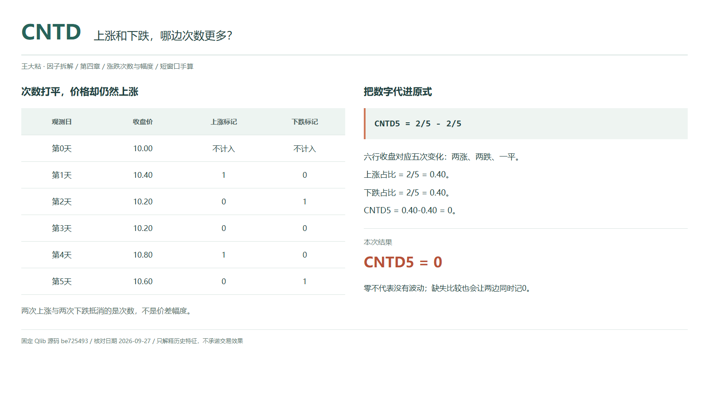
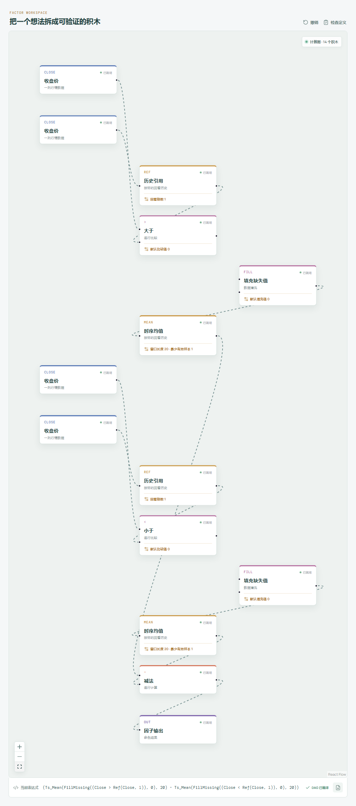

# CNTD：上涨和下跌，哪边次数更多？

如果已经知道上涨占比和下跌占比，把两者相减，就能得到一个带正负号的数。上涨更常见时为正，下跌更常见时为负，次数相等时为零。

这就是 Qlib Alpha158 的 CNTD。它很适合概括“哪边发生得多”，但不要顺手把这个问题换成“最终涨了还是跌了”。



## 它到底在算什么？

官方原式保留两条独立的计数分支：

```text
CNTD_n = Mean($close>Ref($close,1),n)-Mean($close<Ref($close,1),n)
```

仍用第 0 至第 5 天的六行收盘价。第 0 天只给第一次比较提供前值，不计入五期均值。

| 观测日 | 收盘价 | 上涨标记 | 下跌标记 |
| --- | ---: | ---: | ---: |
| 第 0 天，前值 | 10.00 | 不计入 | 不计入 |
| 第 1 天 | 10.40 | 1 | 0 |
| 第 2 天 | 10.20 | 0 | 1 |
| 第 3 天 | 10.20 | 0 | 0 |
| 第 4 天 | 10.80 | 1 | 0 |
| 第 5 天，今天 | 10.60 | 0 | 1 |

```text
上涨占比 = 2/5 = 0.40
下跌占比 = 2/5 = 0.40
CNTD_5 = 0.40-0.40 = 0
```

满窗口且口径一致时，也可以读作“上涨次数减下跌次数，再除以窗口长度”。平盘对分子贡献 0，但没有从分母里消失。

## 为什么要合成一个差值？

单看上涨占比，难以区分剩余日子主要是下跌还是平盘。把下跌占比减掉，可以用一个带方向的数字描述次数上的偏向，取值在 -1 到 1 之间。

代价是信息又少了一层。两涨两跌一次平盘，与五次都平盘，都可能得到 0。前者有反复，后者没有收盘价变化，CNTD 却无法分辨。

本例尤其能说明这一点：次数差为 0，价格仍由 10.00 升到 10.60。原因是两次上涨合计 1.00，大于两次下跌的总幅度 0.40。次数相等，不代表每次运动的距离相等。

## 它什么时候容易骗人？

**零不是“没有行情”。** 它只表示统计到的涨跌次数相同。读数接近零，既可能来自平盘，也可能来自频繁的大幅往返，不能据此判断波动很小。

**正数也不是趋势证明。** 多次小涨之后一次大跌，次数仍可能偏正。这个因子不保存发生顺序，也不计较最后一次变化有多大。

**缺失会制造貌似中性的结果。** Qlib 中，与 `NaN` 的大于、小于比较都为假；两个假都以 0 参加各自均值，并保留在分母里。因此两边一起变小甚至同时为零，可能是数据问题，不是多空平衡。

两个 `Mean` 都是 `min_periods=1`，短历史会先给结果。完整二十次比较需要二十一行连续、有效的同源收盘价；不要把已有几行算出的值当作完整二十期统计。价格口径保持一致，最终读数也只能在当期收盘可用后使用。

## 在因子工坊里怎么拆？



先各做一条比较分支：当前收盘大于前收盘、当前收盘小于前收盘。每条比较后都接填充值为 `0` 的“填充缺失值”，再接窗口 20、最少有效样本 1 的时序均值，最后把“上涨均值减下跌均值”送往输出。

两处 `fill_missing(0)` 处理的是比较结果，匹配 Qlib 缺失比较为假、仍占分母的语义。不能改成在比较前把缺失价格补零，也不能只保留一侧填充。

画布字段名为 `Close`，时序均值叫 `Ts_Mean`，不是照抄原式的文本。两条分支应取同一列行情、相同窗口，减法顺序不可交换，也不要在末尾重复除以 20。

## 自己动手改一下

先不改公式，把六个收盘全部设为 10.00。CNTD 仍是 0，但原来的上涨、下跌占比各为 0.40，现在都成了 0。

接着分别把两条计数分支的均值接到因子输出，运行并记录结果，再恢复最终差值的连接进行对照。这样无需发明更复杂的指标，就能区分“次数打平”和“根本没有变化”。改回原数据，再对照幅度差 SUMD，会看到同一段行情可以次数中性、幅度偏正。

---

原始表达式与算子来源：Microsoft Qlib Alpha158。源码核对日期：2026-09-27。

固定提交：`be725493eb1a6bbb42bf11b37aa7669f59610ff1`。

- [CNTD 原式：loader.py](https://github.com/microsoft/qlib/blob/be725493eb1a6bbb42bf11b37aa7669f59610ff1/qlib/contrib/data/loader.py#L237-L240)
- [大小比较实现：ops.py](https://github.com/microsoft/qlib/blob/be725493eb1a6bbb42bf11b37aa7669f59610ff1/qlib/data/ops.py#L478-L535)
- [滚动预热与 Mean：ops.py](https://github.com/microsoft/qlib/blob/be725493eb1a6bbb42bf11b37aa7669f59610ff1/qlib/data/ops.py#L713-L844)

本文只讨论因子定义与研究方法，不构成投资建议。
