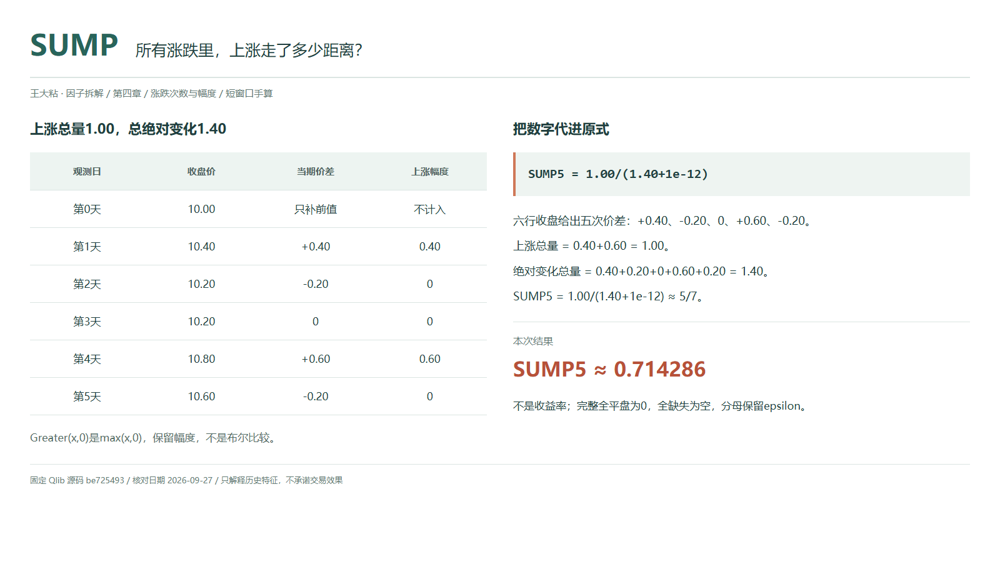
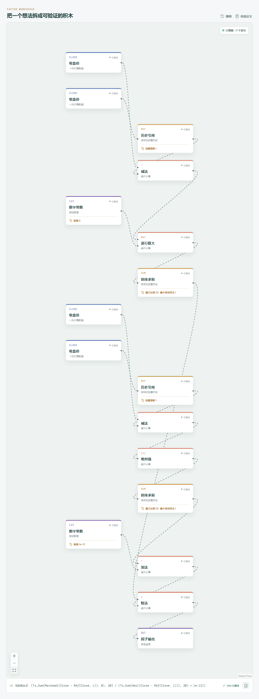

# SUMP：所有涨跌里，上涨走了多少距离？

两天上涨、两天下跌，听起来像打了平手。但如果上涨分别走了 0.40 和 0.60，下跌各走了 0.20，显然不能只按次数投票。

SUMP 开始认真计量每一步的大小。它把上涨价差加起来，再除以全部价差的绝对值之和，回答的是“这段收盘路径中，有多少距离来自上涨”。



## 它到底在算什么？

Qlib Alpha158 的原式是：

```text
SUMP_n = Sum(Greater($close-Ref($close,1),0),n)/(Sum(Abs($close-Ref($close,1)),n)+1e-12)
```

先认清 `Greater`：它在官方源码里调用 `np.maximum`，是两个数取较大值，不是布尔“大于”。因此 `Greater(0.40,0)` 返回 0.40，不是 1；负价差与 0 比较后才变成 0。

| 观测日 | 收盘价 | 当期价差 | 保留的上涨价差 |
| --- | ---: | ---: | ---: |
| 第 0 天，前值 | 10.00 | 不计入 | 不计入 |
| 第 1 天 | 10.40 | +0.40 | 0.40 |
| 第 2 天 | 10.20 | -0.20 | 0 |
| 第 3 天 | 10.20 | 0 | 0 |
| 第 4 天 | 10.80 | +0.60 | 0.60 |
| 第 5 天，今天 | 10.60 | -0.20 | 0 |

五次变化用六行收盘，第 0 天只补前值：

```text
上涨总量 = 0.40+0.60 = 1.00
绝对变化总量 = 0.40+0.20+0+0.60+0.20 = 1.40
SUMP_5 = 1.00/(1.40+1e-12) ≈ 5/7 ≈ 0.714286
```

结果约为 71.43%，说的是上涨价差在总绝对价差中的份额，不是账户赚了 71.43%。这里加的是价格差，不是每日百分比收益。

## 为什么比次数多看一层？

计数让每一天权重相同；SUMP 则让大幅变化贡献更多。本例 CNTP 只有 0.40，SUMP 却超过一半，因为两次上涨虽然不占天数多数，合起来走得更远。

这种分歧很有信息：它区分了“经常上涨”和“上涨时幅度较大”。但总绝对价差只看相邻收盘，不包含盘中走过的全部路径，也不能解释为市场全部成交的盈亏。

## 它什么时候容易骗人？

**一次大涨就可能主导窗口。** SUMP 高不意味着上涨持续，更不意味着下一次还会上涨。异常价格或不一致的复权口径，也可能制造一笔很大的正价差。

**别把它直接叫作标准 RSI。** 官方注释说的是相似；这里使用有限窗口的价差求和，没有 Wilder 平滑，数值也没有自动乘 100。

**不要删除分母里的小常数。** `1e-12` 让全平盘窗口得到 `0/(0+1e-12)=0`。有变化时，SUMP 与 SUMN 之和是 `总量/(总量+1e-12)`，通常接近 1，但不严格等于 1；全平盘时两者都是 0。

Qlib 的 `Sum` 使用 `min_periods=1`，允许短历史，跳过 `NaN`；全缺失则为空值，不是零。两类情况必须分开。价格应同源对齐，今天收盘也必须等到可用后才能进入计算。

## 在因子工坊里怎么拆？



先用收盘减去历史引用 1 期的收盘。价差一路接“逐行取大”，另一个输入必须是常数 0，再接窗口 20 的时序求和；另一路取绝对值、求和，再加 `1e-12` 作为分母。

画布用 `Close`、`Ts_Sum`、`Maximum` 等名称，对应官方字段、时序求和及取大操作，不承诺文本一样。常数 0 不能漏接，也不能用“大于”比较代替取大；各求和节点的最少有效样本按官方设为 1。

## 自己动手改一下

把两处求和窗口一起改为 3，历史引用仍是 1。此时取第 3 至第 5 天的变化 `0、+0.60、-0.20`，需要第 2 天的收盘作前值。

新值为 `0.60/(0.80+1e-12)≈0.75`。今天价格没变，比例改变是因为更早的变化离开了窗口，不是因为今天忽然涨得更多。

---

原始表达式与算子来源：Microsoft Qlib Alpha158。源码核对日期：2026-09-27。

固定提交：`be725493eb1a6bbb42bf11b37aa7669f59610ff1`。

- [SUMP 原式：loader.py](https://github.com/microsoft/qlib/blob/be725493eb1a6bbb42bf11b37aa7669f59610ff1/qlib/contrib/data/loader.py#L241-L248)
- [Greater 取大实现：ops.py](https://github.com/microsoft/qlib/blob/be725493eb1a6bbb42bf11b37aa7669f59610ff1/qlib/data/ops.py#L438-L455)
- [滚动预热与 Sum：ops.py](https://github.com/microsoft/qlib/blob/be725493eb1a6bbb42bf11b37aa7669f59610ff1/qlib/data/ops.py#L713-L864)

本文只讨论因子定义与研究方法，不构成投资建议。
