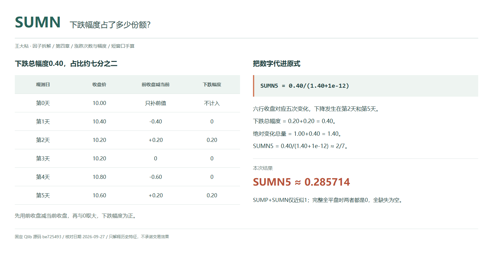
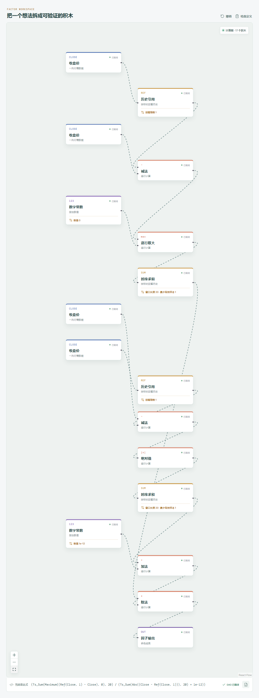

# SUMN：下跌幅度占了多少份额？

看到一个名字带 N 的因子，很容易以为结果应该是负数。SUMN 不是这样：它先把下跌价差转成正的幅度，再计算这部分在所有收盘变化中的占比。

因此，数值越大，表示下跌幅度所占份额越多，不是说这个数字本身代表亏损率。



## 它到底在算什么？

Qlib Alpha158 的原式为：

```text
SUMN_n = Sum(Greater(Ref($close,1)-$close,0),n)/(Sum(Abs($close-Ref($close,1)),n)+1e-12)
```

分子先用前收盘减当前收盘。下跌时差值为正，上涨时为负，再用 `Greater(x,0)` 保留正值。这个算子实际是 `np.maximum`，不是返回真假的比较。

| 观测日 | 收盘价 | 前收盘减当前收盘 | 保留的下跌幅度 |
| --- | ---: | ---: | ---: |
| 第 0 天，前值 | 10.00 | 不计入 | 不计入 |
| 第 1 天 | 10.40 | -0.40 | 0 |
| 第 2 天 | 10.20 | +0.20 | 0.20 |
| 第 3 天 | 10.20 | 0 | 0 |
| 第 4 天 | 10.80 | -0.60 | 0 |
| 第 5 天，今天 | 10.60 | +0.20 | 0.20 |

第 1 至第 5 天是窗口，第 0 天补前值。六行收盘才能得到五次变化。

```text
下跌总幅度 = 0.20+0.20 = 0.40
绝对变化总量 = 0.40+0.20+0+0.60+0.20 = 1.40
SUMN_5 = 0.40/(1.40+1e-12) ≈ 2/7 ≈ 0.285714
```

它约为 28.57%。这不是跌了 28.57%，也不是五天中有这么多天收跌；下跌天数的占比 CNTN 是 0.40。

## 为什么下跌次数和份额不一样？

次数统计给两次上涨、两次下跌同样的权重；幅度统计中，上涨总量是 1.00，下跌总量只有 0.40。下跌虽然发生了两次，却只占总绝对变化的一小部分。

SUMN 因而可以补充“回落有多频繁”的描述。但它仍不知道你在哪天买入，也不知道盘中最低价，更不是最大回撤。连续亏损、持仓收益和收盘变化的份额，是不同的问题。

## 它什么时候容易骗人？

**份额低，不代表下跌幅度小。** 分母也会受上涨影响。若上涨总量很大，下跌即使不小，占比仍可能较低；不要用一个比例替代对原始价差的检查。

**`SUMN=1-SUMP` 不是严格恒等式。** 官方注释给了这个简写，但执行公式保留了 epsilon。准确关系是：

```text
SUMP+SUMN = 总绝对价差/(总绝对价差+1e-12)
```

总量明显大于 epsilon 时才近似为 1。完整全平盘窗口中，两项分子都为 0，结果都为 0，不能把 SUMN 算成 1。

**缺失与平盘不能混在一起。** 官方 `Sum` 跳过 `NaN`，最少有效样本为 1；全缺失窗口为空值，不会因为分母加了 epsilon 就变成 0。部分缺失或预热未满时也可能有结果，需另查覆盖情况。

各期输入须同源、同标的、同复权口径。使用了今天的最终收盘，就只能在该价格可用后计算，不能假定更早已经知道结果。

## 在因子工坊里怎么拆？



分子从“历史引用 1 期减当前收盘”开始，接逐行取大、常数 0，再接窗口 20 的求和。分母用价差的绝对值求和，加 `1e-12`，最后相除。

最值得检查的是分子减法方向和常数 0。画布中 `Close`、`Ts_Sum`、`Maximum` 对应 Qlib 的字段、求和和 `Greater`，不要把取大错接成布尔比较。求和最少有效样本设为 1 才与官方默认预热一致。

## 自己动手改一下

只把第 5 天收盘从 10.60 改成 10.40。下跌仍有两次，CNTN 不变；下跌总幅度从 0.40 变成 0.60，总绝对变化从 1.40 变成 1.60。

于是 SUMN 变成 `0.60/(1.60+1e-12)≈0.375`。次数没变而幅度占比变大，正是同时保留这两类描述的理由。

---

原始表达式与算子来源：Microsoft Qlib Alpha158。源码核对日期：2026-09-27。

固定提交：`be725493eb1a6bbb42bf11b37aa7669f59610ff1`。

- [SUMN 原式及互补关系注释：loader.py](https://github.com/microsoft/qlib/blob/be725493eb1a6bbb42bf11b37aa7669f59610ff1/qlib/contrib/data/loader.py#L249-L257)
- [Greater 取大实现：ops.py](https://github.com/microsoft/qlib/blob/be725493eb1a6bbb42bf11b37aa7669f59610ff1/qlib/data/ops.py#L438-L455)
- [滚动预热与 Sum：ops.py](https://github.com/microsoft/qlib/blob/be725493eb1a6bbb42bf11b37aa7669f59610ff1/qlib/data/ops.py#L713-L864)

本文只讨论因子定义与研究方法，不构成投资建议。
