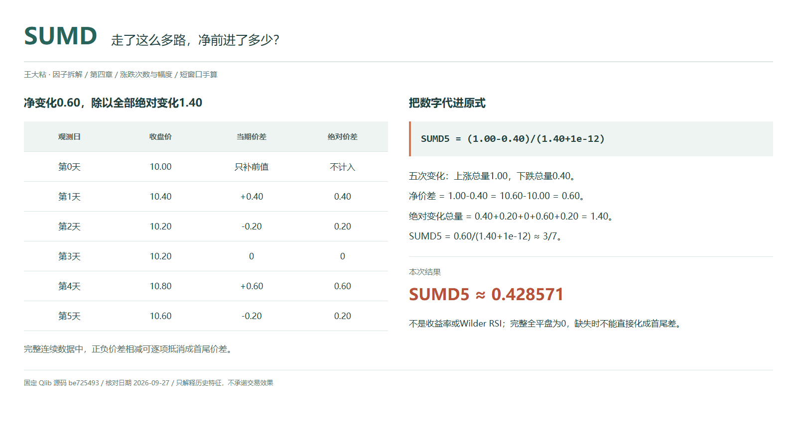
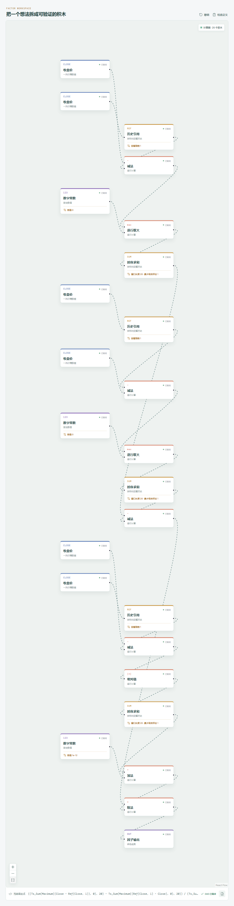

# SUMD：走了这么多路，净前进了多少？

从 10.00 到 10.60，可以慢慢往上走，也可以涨一段、跌一段，最后仍停在同一个地方。端点一样，中途往返的程度却不同。

SUMD 把上涨总量减去下跌总量，再除以全部绝对变化。它留下方向，也让我们看到：相对于走过的收盘价差总量，净变化占了多大一部分。



## 它到底在算什么？

Qlib Alpha158 的原式是：

```text
SUMD_n = (Sum(Greater($close-Ref($close,1),0),n)-Sum(Greater(Ref($close,1)-$close,0),n))/(Sum(Abs($close-Ref($close,1)),n)+1e-12)
```

两个 `Greater` 都是 `np.maximum`，保留的是正向、负向的价差幅度，不是涨跌标记。下跌总量本身为正，在分子中被减去。

| 观测日 | 收盘价 | 当期价差 | 绝对价差 |
| --- | ---: | ---: | ---: |
| 第 0 天，前值 | 10.00 | 不计入 | 不计入 |
| 第 1 天 | 10.40 | +0.40 | 0.40 |
| 第 2 天 | 10.20 | -0.20 | 0.20 |
| 第 3 天 | 10.20 | 0 | 0 |
| 第 4 天 | 10.80 | +0.60 | 0.60 |
| 第 5 天，今天 | 10.60 | -0.20 | 0.20 |

第 0 天只补前值，五期变化窗口是第 1 至第 5 天：

```text
上涨总量 = 1.00，下跌总量 = 0.40
净变化 = 1.00-0.40 = 0.60
绝对变化总量 = 1.40
SUMD_5 = 0.60/(1.40+1e-12) ≈ 3/7 ≈ 0.428571
```

约 0.428571 不是赚了 42.86%。本例端点收益率是 `10.60/10.00-1=6%`，使用的分母完全不同。

## 为什么能看出往返？

对完整、连续、同口径的价格序列，正负价差相减就是全部价差之和，中间价格会逐项抵消：

```text
Σ(C_t-C_(t-1)) = C_今天-C_窗口前一期
SUMD_n = 首尾净价差/(总绝对价差+1e-12)
```

分子只剩端点，分母仍记录每一步。端点净变化相同，中途来回越多，总绝对价差越大，结果的绝对值就越小。

次数却不遵循这个逻辑。本例两涨两跌，CNTD 为 0；上涨总量大于下跌总量，所以 SUMD 为正。一个给每次变化一票，一个按价差大小计量，并不矛盾。

## 它什么时候容易骗人？

**绝对值大，不等于收益高。** 很小但同向的连续变化，也能给出接近 1 或 -1 的结果。它不是每日收益率求和，也不是采用 Wilder 平滑的 RSI。

**零有两种常见来源。** 涨跌总幅度抵消会得到 0；完整全平盘时，分子、总绝对价差都为 0，保留 `1e-12` 后结果仍是 0，不是未定义。仅靠 SUMD 分不清这两种路径。

**缺失会打断端点化简。** `Sum` 跳过 `NaN`，全缺失返回空值；只剩部分价差时，不能继续把分子当作整个窗口的首尾差。`min_periods=1` 也允许短历史输出，需另外检查预热。

输入价格须同源、同复权并按时间对齐。今天最终收盘参与两路计算，不能把收盘后才完整的信号倒用到此前。

## 在因子工坊里怎么拆？



搭两条幅度分支：当期减前期、前期减当期，各自与常数 0 逐行取大，再做窗口 20 的求和。两路结果按“上涨减下跌”接入分子。

分母独立用当期价差取绝对值、窗口 20 求和，再加 `1e-12`。所有历史引用均为 1，求和最少有效样本为 1。画布的 `Close`、`Ts_Sum`、`Maximum` 是相应操作的命名，文本不必与 Qlib 原式一致；不要漏掉取大分支的常数 0。

## 自己动手改一下

把六个收盘改成 `10.00、10.12、10.24、10.36、10.48、10.60`。首尾不变，中间改为五次连续上涨。

净变化仍为 0.60，总绝对变化也降到 0.60，于是结果为 `0.60/(0.60+1e-12)`，接近 1 但不严格等于 1。和原来的约 0.428571 并排看，变化来自往返减少，不是端点收益增加。

---

原始表达式与算子来源：Microsoft Qlib Alpha158。源码核对日期：2026-09-27。

固定提交：`be725493eb1a6bbb42bf11b37aa7669f59610ff1`。

- [SUMD 原式：loader.py](https://github.com/microsoft/qlib/blob/be725493eb1a6bbb42bf11b37aa7669f59610ff1/qlib/contrib/data/loader.py#L258-L266)
- [Greater 取大实现：ops.py](https://github.com/microsoft/qlib/blob/be725493eb1a6bbb42bf11b37aa7669f59610ff1/qlib/data/ops.py#L438-L455)
- [滚动预热与 Sum：ops.py](https://github.com/microsoft/qlib/blob/be725493eb1a6bbb42bf11b37aa7669f59610ff1/qlib/data/ops.py#L713-L864)

本文只讨论因子定义与研究方法，不构成投资建议。
